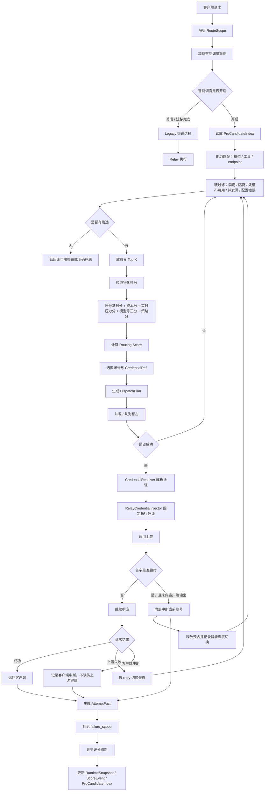
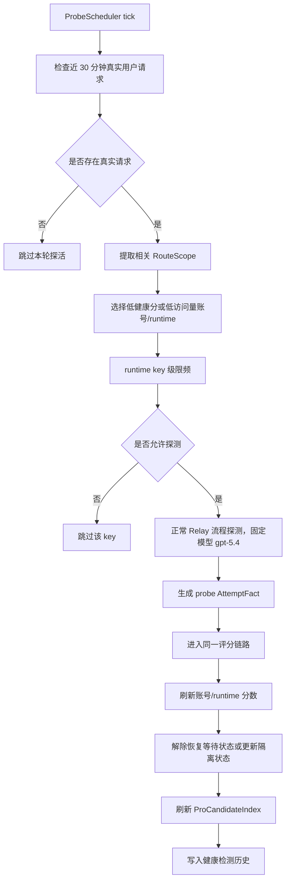

# C2C 一期：统一资源模型、账号级调度与评分底座

本文是总需求文档中“一期：统一资源模型、账号级调度与评分底座”的独立实施方案。总需求文档见：[C2C 供应渠道账号平台与智能调度解耦方案](./c2c-supplier-account-plan.md)。

一期先把现有渠道管理升级为统一资源账号底座，并完成 OpenAI/Codex 多账号导入、账号级智能调度、账号级评分、账号级探活和高性能候选索引。C2C 供应商平台、供应商授权、结算提现、多池子晋级策略放到二期。

## 1. 核心结论

- 一期先做 `platform_owned` 平台自营资源底座，不做供应商注册、供应商授权、收益、提现和结算闭环。
- 现有 `model.Channel` 不废弃，一期继续作为管理员入口和执行绑定；调度视角通过兼容适配升级为 `SupplyChannel`。
- 一个渠道下的单 key、多 key、OAuth JSON、token-key 都要展开成独立 `AccountIdentity`，不能再藏在渠道内部随机/轮询。
- 账号身份和资源绑定解耦：`AccountIdentity` 表示上游账号是谁，`ResourceAccountBinding` 表示账号挂在哪个资源/渠道下。
- 一期导入去重按 `channel_id + brand + credential_subject_fingerprint`，但账号身份本身按 `provider + brand + credential_subject_fingerprint`。
- 智能调度直接选择账号和 `CredentialRef`，relay 执行必须使用 `DispatchPlan` 中的 credential。
- 评分体系复用现有最新评分引擎，不新增第二套账号评分；只把 `RuntimeKey`、候选对象、评分事件下沉到账号维度。
- 一期只有一个生产候选池：`Pro`。这里的 `Pro` 不是高等级池，而是“可生产调度候选池”。
- 新账号只要启用、凭证有效、能力匹配、未隔离，就可以进入 Pro，并使用冷启动默认分和保守并发。
- 模型级 runtime 评分只在最终 Top-K 排序阶段作为低权重修正项参与；前置候选索引和过滤不依赖模型级质量分。
- 成本分只表示平台/上游运营成本，不包含 C 端用户分组倍率、模型倍率、套餐、折扣。
- 成本分后台物化，只在运营成本配置、账号成本覆盖、渠道/账号启停、相关候选集合变化时刷新，不因单次用户请求动态变化。
- 请求链路只读取 Pro 候选索引和物化评分，不全量扫描账号，不现场重算全量评分。

## 2. 一期范围

包含：

- 渠道列表新增“账号管理”入口，进入当前渠道下的账号管理列表页。
- 单 key 渠道展示一个默认账号，多 key 渠道展示多个账号。
- OpenAI/Codex 渠道支持多账号批量导入、追加导入、去重、导入结果回显。
- API key、OAuth JSON、token-key 等凭证统一抽象为 `AccountIdentity + CredentialRef`。
- 账号级候选、账号级 `RuntimeSnapshot`、账号级评分变更记录、账号级健康检测记录。
- relay 使用调度计划中的固定 credential，去掉渠道内部随机/轮询作为正式运行逻辑。
- 调度详情展示渠道、账号、当前调用工具、过滤条件、评分拆解、渠道切换原因。
- 首字延迟过高时，在未向客户端输出前允许内部中断当前账号/渠道并智能切换。

不包含：

- C2C 供应商注册、供应商登录、供应商授权、供应商渠道自助管理。
- 供应商收益、提现、结算闭环、账本导出。
- 用户端供应资源授权、暂停、恢复、收益查看。
- `checkup -> alpha -> pro` 多池子晋级策略。
- 普通终端用户查看或管理账号短指纹、raw key、供应商身份。
- 修改 C 端用户 API、模型列表、账单展示和销售侧扣费规则。

## 3. 核心对象

- `SupplyChannel`：现有 `model.Channel` 的兼容升级视角，表示一个可被调度的供应资源容器。
- `AccountIdentity`：上游大模型品牌账号身份，是评分、探活、隔离、调度的最小账号对象。
- `ResourceAccountBinding`：账号挂载到哪个资源/渠道下。一期可由 `channel_id + brand + credential_subject_fingerprint` 表达，二期升级为独立绑定关系。
- `CredentialRef`：执行凭证引用，只包含 resolver、账号、版本和指纹信息，不包含 raw credential。
- `ExecutionCredential`：relay 执行前才解析出的真实凭证，例如 API key、OAuth access token、JSON auth、session token。
- `RuntimeKey`：调度评分最小运行键，扩展为 `channel/resource + account + requested_model + upstream_model + group + endpoint + tools`。
- `RouteScope`：一次请求的候选范围，包含 `model + group + endpoint + required_tools`。
- `ProCandidateIndex`：一期唯一生产候选索引，存放可调度账号候选和物化评分摘要。

账号类型需要可扩展：

- `api_key`：普通上游 API key。
- `oauth_account`：OAuth 授权账号，例如 Codex/OpenAI OAuth。
- `json_auth`：JSON 授权凭证。
- `token_key`：token-key 模式，本质也是一种账号身份。
- `session_cookie`：后续浏览器态/session 类资源。
- `composite`：需要多个凭证字段组合才能执行的账号。

## 4. 账号身份与绑定

账号身份和资源绑定必须解耦，避免二期 C2C 接入时把账号天然绑定死在某个渠道或资源下。

一期兼容键：

```text
phase1_channel_account_binding_key =
  channel_id + ":" +
  brand + ":" +
  credential_subject_fingerprint
```

长期目标键：

```text
account_identity_key =
  provider + ":" +
  brand + ":" +
  credential_subject_fingerprint

resource_account_binding_key =
  resource_id + ":" +
  account_id
```

字段规则：

- `channel_id`：一期执行绑定，来自现有 `model.Channel.ID`。
- `resource_id`：资源 ID，一期可由 `platform:channel:{channel_id}` 生成，二期切换为 C2C 供应渠道、平台自营资源或合作方资源 ID。
- `brand`：大模型品牌或生态，例如 `codex`、`openai`、`claude`、`gemini`。
- `provider`：凭证和账号来源，例如 `codex`、`openai_oauth`、`manual_api_key`、`xautojs`。
- `account_id`：账号身份 ID，来自 `account_identity_key`，不随绑定资源变化。
- `credential_subject_fingerprint`：账号主体指纹，用于识别“这是不是同一个上游账号”。
- `credential_fingerprint`：凭证版本指纹，用于识别“这份可执行凭证是否变化”。

主体指纹来源优先级：

1. 上游账号稳定 ID，例如 OAuth subject、JWT subject、upstream account id。
2. 授权账号稳定声明，例如 issuer + subject、provider + account id。
3. 规范化长期 credential 指纹，例如去掉 access token、expires_at、临时 session 后的 refresh credential 指纹。
4. 无法解析时标记为 `unresolved_subject`，只能作为单账号兜底，不允许批量静默合并。

导入去重处理：

- 新增时先查 `channel_id + brand + credential_subject_fingerprint`。
- 已存在且 credential 版本相同：返回 `duplicate_skipped`。
- 已存在但 credential 版本不同：按导入模式返回 `duplicate_skipped` 或更新 credential version。
- 主体相同但 brand/provider 冲突：返回 `conflict`。
- 主体无法解析的条目，不参与跨条目合并，只能生成带告警的兜底账号。

二期绑定处理：

- 新增账号时先按 `provider + brand + credential_subject_fingerprint` 查找或创建 `AccountIdentity`。
- 供应渠道接入时创建 `ResourceAccountBinding`，把 `resource_id` 绑定到已有或新建 `account_id`。
- 同一个 `resource_id + account_id` 只能存在一个有效绑定。
- 凭证刷新只更新 `CredentialRef` 或 credential secret version，不改变 `AccountIdentity`，也不改变已有绑定。

## 5. 账号导入与管理

导入入口：

- 渠道列表操作列新增“账号管理”按钮，建议使用图标按钮加 tooltip，避免操作列变宽。
- 页面路由建议为 `/console/channel/:id/accounts` 或 `/console/channel/accounts?channel_id=:id`。
- 账号管理页提供“导入账号”入口。
- 支持批量粘贴和文件上传，初期以文本粘贴为主。
- 支持 JSON 数组、按行 JSON、单个 JSON auth、Open Codex / Codex OAuth credential 文本。
- 导入模式默认“只导入新增”，重复账号跳过；可选“更新已有凭证”。

导入解析：

- 后端按条目拆分，逐条解析，不因为某一条失败导致整批失败。
- 每条凭证解析出 `brand`、`provider`、`account_type`、`credential_type`、`credential_subject_fingerprint`、`credential_fingerprint`。
- Codex JSON auth 优先解析稳定账号主体，例如 upstream account id、JWT subject、授权账号标识。
- access token、expires_at、临时 session 字段不参与主体指纹。
- refresh token、账号主体、issuer、client id 等长期身份信息可参与不可逆 HMAC 输入，但 raw value 不落日志、不返回前端。

导入结果：

- 每条返回 `row_index`、`status`、`brand`、`account_type`、`short_fingerprint`、`reason`。
- `status` 包括 `created`、`updated`、`duplicate_skipped`、`invalid`、`conflict`。
- `duplicate_skipped` 表示同一渠道同一品牌下已经存在同一账号凭证身份。
- `conflict` 表示主体相同但凭证类型、provider 或关键归属不一致，需要人工确认。
- 前端导入完成后刷新账号列表和候选索引状态，不展示 raw credential。

账号列表：

- 单 key 渠道也展示默认账号，`credential_index = 0`。
- 多 key 渠道每条 key 展示为一个账号。
- 列表展示账号序号、品牌、账号类型、凭证类型、短指纹、唯一性状态、状态、禁用原因、最近成功、最近失败、最近探活、当前评分、操作。
- 支持筛选品牌、账号类型、状态、短指纹、评分状态。
- 支持启用、禁用、删除/归档、手动探活、查看评分变更记录。
- 删除账号默认归档，保留历史评分事件和 runtime snapshot 查询能力。

## 6. 调度主流程



调度规则：

- `DispatchPlan` 是唯一执行凭证来源。
- relay 不允许在执行阶段再根据 channel 配置随机或轮询选 key。
- provider adapter 如果仍依赖 `ContextKeyChannelKey`，由 `RelayCredentialInjector` 写入 plan credential。
- 智能调度关闭时必须走显式 legacy fallback，并在调度详情标记 `legacy_channel_key_selection`。
- legacy fallback 只用于迁移期保底，不作为一期验收能力。
- retry 优先选择同模型、同分组、同 endpoint 的其他账号候选；可以同渠道换账号，也可以跨渠道换账号。
- 首字超时透明切换只允许在未向客户端输出任何内容前发生；已输出后不能静默切换。
- 首字超时切换记录标记为“智能调度”，原因标记为 `first_byte_timeout`。

## 7. Pro 候选索引

一期只有 `ProCandidateIndex`，不做 `checkup/alpha/provisional_pro` 多池子晋级。

Pro 的语义：

- `Pro` 是生产可调度候选池，不是高等级池。
- 新账号只要启用、凭证有效、能力匹配、未隔离，就可以进入 Pro。
- 新账号进入 Pro 时使用冷启动默认分、保守并发和更低探索概率。
- 探活成功、账号启用、成本配置变化、候选集合变化都可以触发 Pro 索引刷新。

索引组织：

- 主索引按 `group + endpoint_type + required_tools + provider/brand` 分桶。
- 模型能力用 bitmap/set 过滤，避免按 `账号 × 模型 × 分组` 全量展开。
- 单次请求只取有界 Top-K，建议默认 Top-K 64，探索候选 4-8。
- 调度详情展示候选上限建议 32，避免接口体积膨胀。
- 账号被禁用、凭证失效、硬隔离时即时从可调度索引中剔除或标记不可选。
- 候选索引使用 RCU/copy-on-write 刷新，避免全局大锁包住完整调度流程。
- 索引项必须是轻量结构，只保留调度所需 ID、能力 bitmap、物化分、状态位、并发摘要，不持有 raw credential、大 JSON、完整渠道对象或完整评分历史。
- 索引桶内按物化 routing base score 预排序，请求时只做硬过滤、Top-K 最终评分和实时压力修正。
- 索引刷新采用事件驱动增量刷新为主，定时全量校准为辅；全量校准必须在后台执行并原子替换快照。

请求热路径禁止：

- 禁止扫描全量账号。
- 禁止扫描全量 runtime snapshot。
- 禁止依赖 DB/Redis 全量查询。
- 禁止现场重算全量成本分。
- 禁止把渠道内部随机/轮询作为正式账号选择策略。

## 8. 面向对象与性能边界

一期实现要按对象职责封装，避免把导入、调度、评分、凭证解析、Redis 缓存、DB 查询混在一个过程函数里。

核心对象建议：

- `AccountRegistry`：负责账号身份、绑定、导入去重、账号状态读取，不参与请求评分计算。
- `CredentialVault`：负责 raw credential 加密存储、版本管理和脱敏展示，不进入调度热路径。
- `CredentialResolver`：负责执行前解析 `CredentialRef`，处理 OAuth refresh、缓存和刷新锁。
- `CandidateIndexStore`：负责 Pro 候选索引构建、增量刷新、RCU 快照读取。
- `RuntimeSnapshotStore`：负责账号/runtime 快照读取和写入，不在热路径提供全量扫描接口。
- `ScoreEngine`：复用现有评分项，消费 attempt fact，输出账号级/runtime 级物化评分。
- `CostScoreMaterializer`：负责成本分后台物化，只响应成本配置和候选集合变化。
- `ProbePlanner`：负责近 30 分钟真实流量门槛、低健康分恢复、低访问量激活和 runtime key 限频。
- `DispatchPlanner`：只编排一次请求的候选读取、硬过滤、Top-K、最终评分和 `DispatchPlan` 生成。

封装要求：

- 每个对象暴露清晰接口，不直接跨层读取其他对象内部 map、锁或 DB 模型。
- 热路径对象只接收轻量 DTO，例如 `RouteScope`、`CandidateRef`、`ScoreSnapshot`、`CredentialRef`。
- DB model、前端 response、调度内部对象分开定义，避免为展示字段把大对象带入热路径。
- `DispatchPlan` 中只携带执行必要引用和解释摘要，不携带 raw credential 和完整账号历史。
- 评分事件使用 append-only fact，评分结果使用 materialized snapshot，不能在请求中回放历史事件。

内存要求：

- 10 万账号场景下，内存常驻数据只能包含账号轻量索引、状态位、能力 bitmap、物化分和少量时间戳。
- raw credential、完整 JSON auth、完整 score event 历史、完整请求日志不得常驻内存。
- 模型级 runtime 按需稀疏物化，只保存有真实请求、探活、异常、隔离或近期调度价值的 key。
- 候选解释列表必须按请求截断，不能把完整候选桶返回给前端。
- 大 map 更新使用 copy-on-write 或分片锁，避免长时间持有全局锁。
- 后台批任务要分批处理账号和 runtime，避免一次加载全量数据导致内存尖峰。

Redis 要求：

- Redis 只用于分布式协调和短期热数据，不作为请求热路径全量候选来源。
- 可放入 Redis 的数据包括：账号硬状态版本、候选索引版本号、分布式 OAuth refresh lock、探活 runtime key 限频、异步评分队列。
- 不允许在单次请求中从 Redis 拉取大列表、全量候选、全量 snapshot 或完整 score event。
- Redis key 必须带资源/账号/runtime 维度和 TTL，避免长期堆积。
- Redis 不可用时，已加载的本地 Pro 索引应继续服务；写入类事件进入本地降级队列或标记待补偿。

数据库要求：

- DB 是事实和物化结果的持久化来源，不是调度热路径的候选扫描来源。
- 查询必须按 `channel_id/resource_id/account_id/runtime_key_hash/updated_at` 等索引字段命中，不做无界分页和模糊全表扫描。
- 列表页分页查询账号，不一次返回渠道下所有账号的完整评分历史。
- score event、attempt fact、health probe history 使用按时间分页和必要归档策略，避免单表无限增长影响查询。
- runtime snapshot 只持久化有价值的稀疏 key，冷账号不预建 snapshot 行。
- 成本分物化、候选索引重建、历史清理使用后台任务分批执行，并记录进度和失败重试。
- 所有迁移兼容 SQLite、MySQL、PostgreSQL，不依赖单数据库特性。

## 9. 评分架构

一期不新增第二套账号评分模型，而是把账号作为更细粒度的 `RuntimeKey` 接入现有评分引擎。

账号级 runtime key：

```text
runtime_key =
  requested_model +
  upstream_model +
  channel_id +
  resource_id +
  brand +
  account_id +
  credential_subject_fingerprint +
  group +
  endpoint_type +
  capability_fingerprint
```

评分作用域：

- `resource/channel`：渠道配置、基础连通性、共享代理、共享 base_url、共享能力门控。
- `account`：账号凭证、认证状态、账号级成功率、账号级限流、账号级体验质量。
- `model_runtime`：`account + requested_model + upstream_model + endpoint + tools + group` 下的真实运行表现。
- `cost`：平台/上游运营成本物化分。
- `policy`：分组优先级、策略权重、探索比例和业务路由偏好。

组合规则：

- 账号级分数是主干，包含成功率、上游错误率、首包、完整耗时、吞吐、空输出、流中断、认证状态、隔离状态。
- 模型级 runtime 分数只在最终 Top-K 排序阶段做低权重修正，默认权重建议 `10%~15%`。
- 模型级 runtime 样本不足时使用账号级先验或中性值，不强扣分。
- 模型能力、工具能力、endpoint 支持是硬过滤，不属于低权重评分。
- 渠道级分数只做硬门控、共享风险和冷启动先验，不能覆盖账号级分数。
- 账号 A 的失败、慢首包、空输出、流中断只影响账号 A 和对应 runtime。
- 账号 B 不因为同渠道账号 A 的体验变差而降分。
- base_url、代理、渠道配置等共享故障才可以影响渠道作用域和该渠道下相关账号门控。

更新链路：

- 用户请求完成后写入 `AttemptFact` 和账号维度摘要。
- 后台评分任务消费 `AttemptFact`，调用现有 `RuntimeHealthMonitor -> CandidateScoringService`。
- 探活请求和真实请求使用同一条评分链路。
- 探活不更新真实访问字段，但更新目标账号/runtime 健康评分。
- 普通失败、慢响应、空输出、流中断走 EWMA 平滑更新，不直接把整个渠道打低。
- 认证失败、凭证格式错误、账号被上游明确拒绝、余额不足、配置错误等硬不可用状态可以同步更新账号状态和可调度索引。

## 10. 故障作用域

所有 `AttemptFact` 必须携带 `failure_scope`，用于区分账号问题、渠道问题、上游问题、系统问题和客户端问题。

- `account`：账号认证失败、账号限流、账号余额不足、账号被封、单账号空输出、单账号流中断。
- `resource`：共享 base_url、代理、渠道配置、渠道级连接异常。
- `provider`：上游供应商区域性故障或模型服务异常，只做观测和临时保护。
- `system`：本系统内部超时、队列、网关执行错误。
- `client`：客户端中断、客户端取消，不降低上游账号健康分。

处理规则：

- `account` 只更新目标账号和对应 runtime。
- `resource` 可以更新渠道门控和该渠道相关账号的共享风险状态。
- `provider` 优先进入观测和临时保护，不直接把单个账号永久打低。
- `system` 不应作为上游账号质量扣分依据。
- `client` 只更新客户端终端相关统计，不降低上游账号健康分。
- 首字延迟过高由系统内部中断当前渠道并切换时，标记原因 `first_byte_timeout`，类型为“智能调度”。

## 11. 成本评分

成本分只表示平台/上游运营成本，不表示 C 端用户扣费成本。

成本输入：

- 渠道/账号/上游模型的运营成本资料。
- 输入 token 成本、输出 token 成本、缓存成本、按次成本。
- 账号级成本覆盖。
- 相关候选集合中的最低参考值或基准参考值。

不进入成本分：

- C 端用户分组倍率。
- C 端模型倍率。
- 用户折扣。
- 套餐价格。
- 销售侧计费策略。

刷新触发：

- 运营成本配置变化。
- 账号成本覆盖变化。
- 渠道启用、禁用、删除、归档。
- 账号启用、禁用、删除、归档。
- 相关候选集合新增或移除。
- 能力配置变化导致相关候选范围变化。

刷新规则：

- 成本分后台物化，不在用户请求链路里现场重算。
- 运营成本和候选集合未变时，成本分不因单次请求成功或失败变化。
- 同批相关候选中更便宜账号新增、删除或变更后，后台刷新该 RouteScope 下相关候选成本分。
- 调度详情展示“成本分”和“参考成本”，避免把评分值误认为真实扣费。
- 未配置成本时保持兜底：成本优先策略使用较低默认分，其他策略使用中性默认分。

## 12. 探活流程



探活规则：

- 探活不是独立候选池，只负责验证、恢复和刷新评分。
- 没有近 30 分钟真实用户流量时不做全渠道巡检。
- 探测范围限定在近 30 分钟真实请求涉及的模型、分组、endpoint、工具相关渠道/账号。
- 低健康分恢复探测和低访问量激活探测都按账号 runtime key 执行。
- 探活和真实请求使用同一评分体系。
- 固定 `gpt-5.4` 探活只代表账号基础连通性；具体模型差异依赖真实请求和模型 runtime 修正。
- 系统检查只需要检测渠道里的一个代表模型，不需要把渠道下所有模型全量探测。

## 13. 执行凭证链路

执行凭证必须固定，避免智能调度选中的账号和 relay 实际使用的账号不一致。

要求：

- `DispatchPlan` 携带 `ResourceRef`、`AccountIdentity`、`CredentialRef`。
- `CredentialResolver` 只在 relay 执行前解析 raw credential。
- `RelayCredentialInjector` 将 plan credential 写入 relay 上下文。
- provider adapter 不得再次调用 `GetNextEnabledKey()` 覆盖调度结果。
- shadow 只用于验证和对比，不作为长期运行路径。
- OAuth JSON 凭证解析、刷新、解密要有缓存和刷新锁，避免并发请求重复刷新同一凭证。
- raw key 只能在执行前解析，不进入日志、score event、API 响应。

## 14. 推荐接口与字段

推荐核心结构：

```go
type ResourceRef struct {
    ResourceID         string
    ResourceType       string // platform_owned / supplier_owned / partner_owned
    ExecutionBindingID int    // current channel_id in phase 1
    Provider           string
    Brand              string
}

type AccountIdentity struct {
    AccountID                    string
    AccountType                  string // api_key / oauth_account / json_auth / token_key / composite
    Brand                        string
    Provider                     string
    CredentialIndex              int
    CredentialSubjectFingerprint string
    CredentialFingerprint        string
    AccountIdentityKey           string
    AccountUniqueKey             string
    DisplayName                  string
    Status                       string
}

type CredentialRef struct {
    ResourceID                   string
    AccountID                    string
    CredentialIndex              int
    CredentialSubjectFingerprint string
    CredentialFingerprint        string
    Resolver                     string
}
```

核心接口调整：

- `RuntimeKey` 增加 `resource_id`、`account_id`、`account_type`、`brand`、`credential_index`、`credential_subject_fingerprint`、`credential_fingerprint`。
- `DispatchPlan` 增加 `ResourceRef`、`AccountIdentity`、`CredentialRef`、`SwitchReason`。
- `Candidate` 增加资源来源、执行绑定、账号身份、credential 引用、候选池标记。
- `CandidateExplanation`、观测 API、评分变更 API 增加账号短指纹、资源类型、过滤条件、当前调用工具。
- 新增渠道账号列表接口，按 `channel_id` 返回账号/key 列表、状态、短指纹、评分摘要和最近探活/请求时间。
- `model_gateway_runtime_snapshots`、`model_gateway_score_events` 增加账号维度字段，历史空值兼容。

DB 兼容要求：

- 新字段需要兼容 SQLite、MySQL、PostgreSQL。
- 不依赖 partial index。
- 历史 runtime key hash 不强制重算。
- 旧 score event 保持可查询，只是没有账号维度。
- `channel_id` 继续保留为执行绑定，不作为未来资源主键。
- raw credential 单独加密存储，只通过 `CredentialRef` 解析。
- JSON 编解码继续使用 `common.*` 包装函数。

## 15. 现有代码改造点

- `pkg/modelgateway/core.RuntimeKey` 增加账号字段，并更新 normalize、hash、JSON 持久化逻辑。
- `pkg/modelgateway/core.DispatchPlan`、`Candidate`、`CandidateExplanation` 增加资源、账号、credential 引用字段。
- `pkg/modelgateway/integration.ModelCandidatePoolBuilder` 从按 channel 生成候选，改为通过账号 registry 展开账号候选。
- 当前 snapshot store 的 `ListCandidates` 全量扫描不能作为正式热路径，需要由 `ProCandidateIndex` 替代。
- `pkg/modelgateway/integration.ChannelSelectionWrapper` 避免用全局大锁包住完整智能调度流程。
- `middleware/distributor` 和 relay 上下文从 plan credential 注入 `ContextKeyChannelKey`。
- provider adapter 禁止在智能调度 active 路径再次调用 `GetNextEnabledKey()`。
- `model_gateway_runtime_snapshots`、`model_gateway_score_events` 添加账号维度字段，保留 `channel_id` 作为执行绑定。
- 观测接口和前端调度详情同步展示账号维度，并支持按账号查询评分事件。
- 现有 multi-key 的 `multi_key_mode` 只作为历史展示字段，不再参与新智能调度决策。
- 现有 key 禁用/启用状态迁移为账号状态；删除 key 等价于删除或归档对应账号身份。

## 16. UI 与观测

渠道账号管理：

- 渠道列表操作列新增“账号管理”。
- 账号管理页展示渠道名称、渠道 ID、资源类型、账号列表。
- 单 key 渠道也能进入账号管理页，展示默认账号。
- OpenAI/Codex 渠道支持批量导入、追加导入、只导入新增、更新已有凭证。
- 列表展示品牌、账号类型、凭证类型、短指纹、状态、禁用原因、最近成功、最近失败、最近探活、当前评分。

调度详情：

- 展示渠道 ID、账号短指纹、品牌、凭证类型、当前调用工具、过滤条件。
- 展示 Routing Score、账号分、成本分、实时压力分、模型修正分、策略分。
- 展示命中候选池 `Pro`，并说明一期 `Pro` 是生产候选池。
- 展示渠道切换记录，类型标记“智能调度”，原因包括首字超时、上游失败、并发预占失败、隔离过滤。

评分与健康检测：

- 评分变更记录支持按账号和 runtime 查询，并展示变更原因。
- 健康检测页面包含待检查队列、历史记录、探活原因、探活模型、结果、影响的账号/runtime。
- 探活原因包括低健康分恢复、低访问量激活、手动探活。
- 客户端相关文案统一使用“客户端中断”“客户端请求”“客户端请求时间”。

安全展示：

- 普通终端用户不可见 raw key、完整凭证、账号短指纹、供应商身份。
- 管理端只展示短指纹，不展示 raw credential。
- score event、日志、回放导出不得包含 raw credential。

## 17. 性能要求

- 请求链路只读 `ProCandidateIndex` 和物化评分。
- 请求链路只读本地内存快照，不依赖 DB/Redis 读取候选。
- Pro 索引项必须控制字段数量和对象大小，不持有 raw credential、完整 channel、完整账号详情。
- 不为冷账号预建大量 DB 行。
- 只持久化有真实样本、探活样本、隔离状态或被调度过的账号 snapshot。
- 模型级 runtime 按需稀疏物化，不为 `账号数 × 模型数 × 分组数` 全量展开。
- 单次调度只对有界 Top-K 做最终评分。
- 评分刷新通过异步任务和批量后台任务完成。
- 候选索引使用 RCU/copy-on-write 方式刷新。
- 10 万账号规模下，热路径不得依赖 DB/Redis 全量查询或 snapshot 全量扫描。
- OAuth token refresh 使用单账号刷新锁，避免并发风暴。
- 调度详情候选展示要有上限，避免接口响应过大。
- 后台全量校准、成本分刷新、索引重建必须可分批、可限速、可观测、可重试。
- Redis/DB 降级时，调度热路径优先使用最后一次有效本地索引，避免系统整体不可用。

## 18. 实施拆解

一期建议按“契约先行、底座并行、链路合拢、灰度验证”的方式拆分。所有任务先基于公共类型和接口契约开发，避免前端、调度、relay、评分互相等待。

### 18.1 里程碑顺序

1. M0：公共契约冻结
   - 冻结 `ResourceRef`、`AccountIdentity`、`CredentialRef`、账号维度 `RuntimeKey`、`failure_scope`、导入结果 DTO、调度详情 DTO。
   - 增加数据库字段和兼容迁移，但不切换真实调度路径。
   - 完成空实现或 adapter stub，让并行任务可以编译。

2. M1：账号底座与页面可用
   - 完成账号 registry、导入解析、账号列表 API 和前端页面。
   - 单 key、多 key、OpenAI/Codex JSON/OAuth 能展示为账号。
   - relay 仍可走旧路径，但账号数据已经可观测。

3. M2：智能调度账号化灰度
   - 完成 Pro 候选索引、账号级 candidate、账号级 `DispatchPlan`。
   - relay 固定 plan credential，在 shadow 或小流量 active 下验证“选中账号 = 实际执行账号”。

4. M3：评分探活账号化
   - 账号级 snapshot、score event、probe history、成本分物化、`failure_scope` 全链路可用。
   - 探活成功能刷新 Pro 索引，低健康分和低访问量逻辑按账号 runtime key 生效。

5. M4：性能与回归收口
   - 10 万账号模拟、候选索引 benchmark、DB/Redis 降级、OAuth refresh 并发锁、首字切换边界全部通过。
   - 移除 active 路径中的随机/轮询 key 选择，legacy fallback 只保留显式迁移兜底。

### 18.2 并行任务包

| 任务包 | 主要产出 | 可并行依赖 | 合入门槛 |
| --- | --- | --- | --- |
| A. 公共契约与迁移 | 公共类型、DTO、DB 字段、常量、迁移兼容 | 无，必须最先 | `go test` 编译通过，历史数据可读 |
| B. 账号注册与导入 | `AccountRegistry`、OpenAI/Codex 解析器、导入去重、凭证存储 | 依赖 A，可与 C/D/E/F 并行 | 单 key、多 key、JSON/OAuth、token-key 都能生成账号 |
| C. 渠道账号管理前端 | 渠道入口、账号列表、导入页、操作按钮、i18n | 依赖 A 的 API 契约，可用 mock 并行 | 页面可分页、可导入、可显示短指纹和状态 |
| D. Pro 候选索引 | `CandidateIndexStore`、轻量索引项、RCU 快照、增量刷新 | 依赖 A，可用假账号源并行 | 10 万账号模拟不全量扫描，索引刷新不阻塞热路径 |
| E. 调度账号化 | account candidate、Top-K 最终评分、账号级 `DispatchPlan`、legacy 标记 | 依赖 A/D，可先接 mock index | shadow 下候选解释和选择账号稳定 |
| F. relay 凭证固定 | `CredentialResolver`、`RelayCredentialInjector`、provider adapter 禁止二次选 key | 依赖 A/B，可与 E 并行 | 实际执行 credential 与 plan 一致 |
| G. 评分与成本物化 | 账号级 snapshot/event、`failure_scope`、模型低权重修正、成本分物化 | 依赖 A，可用 attempt fact mock 并行 | 同渠道账号互不污染，成本分不随请求动态变 |
| H. 探活账号化 | `ProbePlanner`、近 30 分钟流量门槛、runtime key 限频、健康检测队列/历史 | 依赖 A/G，可先 mock relay | 探活只影响目标账号/runtime，并能刷新 Pro 索引 |
| I. 调度观测与切换记录 | 调度详情、评分变更、健康检测、渠道切换记录、过滤条件展示 | 依赖 A/C/E/G/H | 管理员能解释候选、过滤、切换、评分变化 |
| J. 性能与可靠性验证 | benchmark、10 万账号模拟、DB/Redis 降级、OAuth refresh 锁、回归测试 | 贯穿所有任务 | 性能验收和兼容验收全部通过 |

### 18.3 任务包细化

A. 公共契约与迁移：

- 扩展 `RuntimeKey`、`DispatchPlan`、`Candidate`、`CandidateExplanation`，增加资源、账号、credential 引用字段。
- 增加 `failure_scope`、`SwitchReason`、账号导入结果、账号列表、账号评分摘要 DTO。
- `model_gateway_runtime_snapshots`、`model_gateway_score_events` 增加账号维度字段，保留历史空值兼容。
- 迁移必须兼容 SQLite、MySQL、PostgreSQL，不依赖 partial index。
- 提供 stub adapter，让旧 channel 数据能生成默认 `ResourceRef + AccountIdentity + CredentialRef`。

B. 账号注册与导入：

- 实现 `AccountRegistry`，支持从单 key、多 key、OAuth JSON、token-key 生成账号。
- 实现 OpenAI/Codex 多账号导入解析，支持 JSON 数组、按行 JSON、单个 JSON auth。
- 实现 `channel_id + brand + credential_subject_fingerprint` 去重。
- raw credential 加密存储，API 只返回短指纹和导入状态。
- 删除默认归档，保留评分和历史查询能力。

C. 渠道账号管理前端：

- 渠道列表增加“账号管理”入口。
- 新增账号管理页面，支持分页、筛选、导入、只导入新增、更新已有凭证。
- 单 key 渠道展示默认账号，多 key 渠道展示多账号。
- 操作支持启用、禁用、删除/归档、手动探活、查看评分记录。
- 前端文案走 i18n，普通终端用户不可见账号短指纹。

D. Pro 候选索引：

- `CandidateIndexStore` 使用轻量索引项和 RCU/copy-on-write 快照。
- 主索引按 `group + endpoint_type + required_tools + provider/brand` 分桶。
- 模型能力使用 bitmap/set 过滤，不展开 `账号 × 模型 × 分组`。
- 索引刷新支持账号状态、成本配置、能力配置、探活结果、评分变更事件。
- Redis/DB 不可用时，热路径继续使用最后一次有效本地索引。

E. 调度账号化：

- `CandidatePoolBuilder` 改为读取 Pro 索引里的账号候选。
- 请求热路径只做硬过滤、Top-K、实时压力修正、模型低权重修正。
- `DispatchPlan` 固定 `ResourceRef + AccountIdentity + CredentialRef`。
- legacy fallback 只在智能调度关闭或迁移兜底时显式使用，并写入调度详情。
- 首字超时切换只允许未输出前执行。

F. relay 凭证固定：

- `CredentialResolver` 根据 `CredentialRef` 解析执行凭证。
- OAuth refresh 使用单账号刷新锁和缓存，避免并发风暴。
- `RelayCredentialInjector` 写入 relay 上下文，兼容现有 `ContextKeyChannelKey`。
- provider adapter 在智能调度 active 路径禁止调用 `GetNextEnabledKey()` 覆盖 plan credential。
- 增加执行前后校验，记录 plan credential 与实际 credential 短指纹。

G. 评分与成本物化：

- `AttemptFact` 增加 `failure_scope`，区分 `account/resource/provider/system/client`。
- 真实请求和探活复用同一评分链路。
- 账号分为主干，模型 runtime 只做最终低权重修正并按需稀疏物化。
- 成本分由 `CostScoreMaterializer` 后台刷新，只响应运营成本和候选集合变化。
- 客户端中断只更新客户端终端统计，不降低上游账号健康分。

H. 探活账号化：

- `ProbePlanner` 先检查近 30 分钟真实用户请求，没有真实流量则跳过。
- 低健康分恢复、低访问量激活都按账号 runtime key 选择。
- runtime key 级限频，探测模型固定 `gpt-5.4`。
- 探活结果写入健康检测历史，并刷新账号/runtime 分数和 Pro 索引。
- 探活不更新真实访问字段。

I. 调度观测与切换记录：

- 调度详情展示账号短指纹、当前调用工具、过滤条件、命中 Pro、评分拆解。
- 评分变更记录支持按账号和 runtime 查询。
- 健康检测页面展示待检查队列、历史、探活原因、探活模型和结果。
- 渠道切换记录标记“智能调度”，原因包括首字超时、上游失败、并发预占失败、隔离过滤。
- 候选解释和调度详情必须截断，避免大响应。

J. 性能与可靠性验证：

- 保留并扩展 `tmp/c2c-phase1-sim`，用于 1 万/10 万账号离线模拟。
- 增加 Go benchmark，验证 Pro 索引读取、Top-K 最终评分、索引刷新耗时。
- 增加 DB/Redis 降级测试，验证热路径使用最后一次有效本地索引。
- 增加 OAuth refresh 并发测试，验证同账号只有一个刷新者。
- 增加跨数据库迁移测试，覆盖 SQLite、MySQL、PostgreSQL。

### 18.4 并行开发约束

- A 任务包合入前，其他任务只能基于临时 branch/mock DTO 开发；A 合入后必须统一 rebase 到公共契约。
- D/E/F/G 是高冲突区，禁止多人同时修改同一个核心函数；通过新增对象和 adapter 方式分层合入。
- 前端 C 可以先基于 mock API 并行，但字段名和状态枚举必须跟 A 保持一致。
- B/F 都涉及 credential，必须约定 `CredentialRef` 和 secret version 语义，避免导入和执行各自生成不同指纹。
- G/H 都写评分事件和 snapshot，必须共用 `AttemptFact` 和 `failure_scope`，避免探活另起一套评分链路。
- 每个任务包都必须提供最小回归测试和观测字段，不能只提交实现不提交可验证入口。
- 合入顺序推荐：A -> B/D/G 并行 -> C/F/H 并行 -> E/I 合拢 -> J 收口。

## 19. 验收标准

功能验收：

- 渠道列表存在“账号管理”入口，并能进入对应渠道账号列表页。
- 单 key 渠道展示一个默认账号。
- 多 key 渠道展示多个账号，并能看出启用/禁用状态。
- OpenAI/Codex 渠道支持一次导入多份账号凭证，并能返回新增、重复、无效、更新的明细。
- 同一渠道同一品牌下重复导入同一账号凭证，不会产生重复账号。
- API key、OAuth JSON、token-key 至少能归入统一账号抽象。
- 智能调度选中账号后，relay 使用同一个 `CredentialRef` 执行。
- provider adapter 不会覆盖调度计划中的凭证。
- retry 可以切换到同渠道下另一个可用账号。

评分验收：

- 同一个渠道下多个账号能生成多个账号级 runtime key。
- OpenAI/Codex 多账号之间的成功率、首包、流中断、空输出、隔离状态互不污染。
- 账号 A 失败只更新账号 A 的 snapshot、score event、隔离状态。
- 共享 base_url 或代理故障会触发渠道级门控。
- 探活结果只影响目标账号 runtime key。
- 历史 channel 级 snapshot 只作为冷启动 fallback。
- 模型级 runtime 样本不足时不强惩罚账号。
- 评分变更记录能解释账号级分数变化原因。
- 成本分不因单次请求动态变化，只在运营成本配置、账号成本覆盖、相关候选集合变化后刷新。
- 客户端中断不会降低上游账号健康分。

调度验收：

- 一期 `Pro` 是唯一生产候选池，新账号符合硬条件后可以进入 Pro。
- 请求热路径不调用全量 `ListCandidates`，不扫描全量账号。
- 首字超时在未输出前能内部切换，并写入智能调度切换记录。
- 已经向客户端输出后不能静默切换。
- 调度详情能展示当前调用工具、过滤条件、账号短指纹、模型修正分、成本分和参考成本。

性能验收：

- 10 万账号模拟下，单次调度候选数不超过配置上限。
- 不为冷账号预建大量 DB 行。
- 只持久化有样本、探活、隔离或被调度过的账号 snapshot。
- Pro 索引刷新不阻塞请求热路径。
- OAuth 凭证刷新不会出现同账号并发重复刷新风暴。
- 请求热路径断开 DB 或 Redis 读取候选后，仍能使用最后一次有效 Pro 索引完成调度。
- 账号列表、评分记录、探活历史均分页查询，不返回无界大列表。
- 后台全量校准和索引重建在 10 万账号模拟下不会出现明显内存尖峰。

兼容验收：

- 现有渠道列表、编辑、启用、禁用、删除等主流程可继续使用。
- 现有多 key 的导入、追加、禁用、启用、删除能力可继续在账号管理页使用。
- OpenAI/Codex 原有 JSON auth / OAuth key 形态可以通过账号 registry 兼容导入。
- 历史 snapshot、score event 不强制迁移，仍可查询。
- 新增 DB 字段兼容 SQLite、MySQL、PostgreSQL。
- 普通终端用户不可见 raw key、完整凭证、账号短指纹、供应商身份。

## 20. 二期预留

- C2C 供应商注册、供应商资源接入、OAuth 授权、收益、提现、结算。
- 多池子策略：`checkup -> alpha -> pro`。
- 供应商账号与资源通过绑定关系解耦，不改变账号身份唯一键。
- 供应商风控、资源市场、结算对账和运营审核。
- 供应商侧限额、时间窗、自用保留比例、收益展示。
