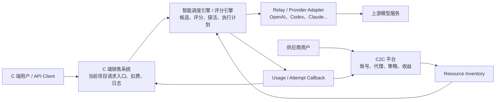

# C2C 供应渠道账号平台与智能调度解耦方案

## 1. 背景与目标

C2C 供应渠道账号功能的目标是让供应商把闲置的大模型品牌账号或剩余额度账号授权给平台，作为可调度的上游资源参与服务，同时平台按供应成本规则给供应商记录收益。

这不是一个简单的“给当前系统多建一些渠道”的功能。长期架构需要拆成三层：

```text
C2C 平台
  负责供应商、账号、凭证、代理、限额、结算、风控

智能调度引擎 / 评分引擎
  负责资源候选、账号级评分、健康状态、探活、调度决策

C 端销售系统（当前项目）
  负责终端用户、API Key、套餐/余额、用户扣费、请求入口、消费日志
```

一期可以在当前项目内落地，但代码边界、数据边界和接口语义必须按上述三层设计，避免后续 C2C 平台、调度引擎独立服务化时被 `channels`、用户扣费、供应商结算互相绑死。

核心目标：

- 供应商账号属于用户登录管理/凭证用户体系，是供应侧主体。
- 一个供应商可以创建或接入多个供应渠道。
- 一个供应渠道可以关联多个大模型品牌账号，例如 OpenAI、Codex、Claude、Gemini、token-key 等。
- 平台为渠道下的大模型品牌账号绑定稳定代理，降低同 IP 多账号风险。
- 渠道下的大模型品牌账号通过探活后进入 warmup，再逐步进入 active。
- 智能调度按“渠道 + 账号”维度评分和调度，复用同一套最新评分引擎。
- 供应商收益按供应成本规则计算，不影响 C 端用户扣费倍率。
- C2C 限额、暂停、共享时段、代理异常等只作为策略跳过，不污染质量评分。
- 请求链路不能线性扫描全部账号，必须使用后台物化评分和有界候选索引。

## 2. 核心结论

- 供应商账号是登录主体，不等于上游大模型账号。
- C2C 供应渠道是“供应资源”，不是普通管理员渠道。
- 渠道下的大模型品牌账号是调度、评分、探活、隔离的最小运行单元。
- 现有渠道管理是未来 C2C 供应渠道账号体系的前身，可以升级为“平台自营供应商/内部供应商”的资源管理入口。
- 当前项目里可以用隐藏平台渠道或执行绑定承载请求，但这只是一期兼容实现，不是 C2C 平台的领域模型。
- C 端消费和 C2C 供应商结算采用同一套账务内核，区别是账户类型、流水方向和结算规则不同。
- C2C 平台不定义 C 端用户扣费规则，C 端销售系统不定义供应商收益规则，但两者都通过统一账务内核落账。
- 智能调度引擎只认 Resource/Credential/RuntimeKey，不关心供应商收益和买家订单。
- 账号级评分不新增第二套模型，账号只是更细粒度的 `RuntimeKey`。
- 成本分不应随单次用户请求动态升降；成本分只表示平台/上游运营成本，由运营成本资料和相关候选集合后台物化刷新。
- 分组倍率、模型倍率、套餐、折扣属于 C 端销售系统计费规则，不参与成本分，也不触发成本分刷新。
- C2C policy skip 不是 upstream failure，不触发熔断、失败评分或 sticky failure。
- 硬不可用状态必须即时生效，例如凭证失效、账号禁用、余额不足、明确 401/403。

## 3. 一期范围

包含：

- 现有渠道管理升级为统一资源/账号管理底座。
- 渠道列表新增账号管理入口，渠道账号管理页面支持 Codex/OpenAI 多账号批量导入、追加导入、去重和导入结果回显。
- 单 key、多 key、OAuth JSON、token-key 等凭证统一抽象为 `AccountIdentity + CredentialRef`。
- 账号身份和资源绑定解耦：账号身份按 `provider + brand + credential_subject_fingerprint`，一期渠道导入去重按 `channel_id + brand + credential_subject_fingerprint`。
- relay 执行固定使用 `DispatchPlan` 中的 `CredentialRef`，去掉渠道内部随机/轮询作为正式运行逻辑。
- 账号级候选、账号级 runtime snapshot、账号级评分变更记录。
- 账号级探活、隔离、评分和候选索引。
- 成本分按平台/上游运营成本后台物化，不受用户侧分组倍率、模型倍率、套餐、折扣影响。
- 管理端调度详情、评分变更记录、健康检测记录支持账号维度解释。

不包含：

- 供应商注册、供应商登录、供应商授权、供应商渠道自助管理。
- 用户端授权、暂停、恢复、限额设置、收益查看。
- 自动提现接口。
- 供应商收益、提现、结算闭环和账本导出。
- C2C Availability Gate 的完整供应商策略闭环。
- 账号级、模型级、时间窗级供应商限额限流闭环。
- 非 Codex/OpenAI 的完整供应闭环。
- 普通用户直接管理管理员渠道。
- 把 C2C 多账号实现成普通渠道的随机 multi-key。
- 修改项目品牌、作者、模块归属等受保护信息。

## 4. 三层架构



### 4.1 C2C 平台

C2C 平台负责供应商侧业务：

- 供应商身份、登录凭证、用户体系绑定和授权流程。
- 供应商渠道管理，一个供应商可以拥有多个供应渠道。
- 渠道下的大模型品牌账号管理，例如 OpenAI、Codex、Claude、Gemini、token-key。
- 大模型品牌账号的 OAuth/API Key/token-key 凭证存储、刷新和脱敏展示。
- 代理池、渠道账号固定代理、代理健康。
- 渠道账号状态机：`probing`、`warmup`、`active`、`paused`、`disabled`。
- 供应商自定义共享策略：时间窗、并发、RPM、TPM、日/月额度、自用保留比例。
- 管理员硬上限和默认策略。
- C2C Availability Gate 的业务规则。
- 用量桶、供应商收益规则、冻结、冲正、导出。
- 通过统一账务内核生成供应商应付、冻结和结算流水。
- 风控事件、渠道账号异常、供应商运营后台。

C2C 平台不负责：

- C 端用户扣费规则。
- 模型请求最终路由算法。
- runtime 健康评分公式。
- 将供应商登录主体或其他供应商的渠道账号直接暴露给终端用户编辑。

### 4.2 智能调度引擎 / 评分引擎

调度引擎负责资源运行态：

- 从 C2C 平台、原生渠道、其他资源平台拉取候选。
- 将候选统一成 `ResourceRef`、`CredentialRef`、`RuntimeKey`。
- 维护账号级 `RuntimeSnapshot`、`ScoreEvent`、探活记录、隔离状态。
- 使用最新评分引擎计算 `ScoreItem`、`ScoreTotal`、`RoutingScoreTotal`。
- 建立 `CredentialCandidateIndex`，调度时只取 Top-K + 探索候选。
- 处理请求完成后的异步评分更新。
- 处理硬不可用状态的即时隔离。
- 输出调度详情、候选过滤原因、评分变更记录。

调度引擎不负责：

- 供应商收益结算。
- C 端用户套餐、余额、订单。
- 供应商 OAuth 页面。
- 管理 C2C 业务策略的最终归属。

### 4.3 C 端销售系统（当前项目）

C 端销售系统负责终端客户侧：

- API Key、用户、分组、余额、套餐、订单。
- 兼容 OpenAI/Claude/Gemini 等 API 请求入口。
- 请求鉴权、额度预扣、消费日志、用户账单。
- 通过统一账务内核生成 C 端消费、退款和冲正流水。
- 向调度引擎发起 `DispatchRequest`。
- 根据调度计划执行 relay 或调用执行 worker。
- 请求结束后上报 usage、attempt result、消费结果。

C 端销售系统不应该：

- 直接读写供应商 OAuth 凭证。
- 把供应商登录主体或供应渠道账号当成 C 端用户可见渠道。
- 在用户请求链路里现场重算全量账号评分。
- 把 C2C 限额命中当作上游失败。

## 5. 领域边界与接口

### 5.0 账号体系抽象

这里需要区分三类“账号”，避免后续架构混淆：

- `SupplierUser`：供应商登录账号，属于用户登录管理/凭证用户体系，用来登录、认证、授权、结算和管理资源。
- `SupplyChannel`：供应商创建或接入的供应渠道，一个供应商可以有多个渠道。
- `AccountIdentity`：渠道下的大模型品牌账号或 token-key，是一次上游请求最终使用的可执行身份。

本方案里参与调度评分的“账号”默认指 `AccountIdentity`，不是供应商登录账号。账号体系的核心抽象是“可执行身份”，即一次上游请求最终使用的身份、凭证和运行边界。

建议抽象名：

- `SupplierUser`：供应侧登录主体，可以复用当前用户体系，也可以后续独立成供应商用户体系。
- `Resource` / `SupplyChannel`：可被调度的资源容器，例如现有渠道、C2C 供应渠道、合作方资源池。
- `AccountIdentity`：资源下的一个可执行账号身份，用于承载独立评分、状态、限额和隔离。
- `CredentialRef`：账号身份的凭证引用，只包含序号、指纹和解析引用，不包含 raw key。
- `ExecutionCredential`：执行前才解析出的真实凭证，例如 API key、OAuth access token、JSON auth、session token。
- `RuntimeKey`：调度和评分使用的运行键，包含 resource 和 account identity 维度。

账号类型需要可扩展：

- `api_key`：普通上游 API key。
- `oauth_account`：OAuth 授权账号，例如 Codex/OpenAI OAuth。
- `json_auth`：JSON 授权凭证。
- `token_key`：token-key 模式，本质也是一种账号身份。
- `session_cookie`：后续如浏览器态/session 类供应资源。
- `composite`：需要多个凭证字段组合才能执行的账号。

设计原则：

- 账号是调度、评分、探活、隔离、限额的最小运行单元。
- 凭证只是账号的一部分，不等于账号本身。
- 同一个资源可以有多个账号；同一个账号理论上也可以有多个凭证版本。
- 一个供应商可以拥有多个资源/渠道；一个资源/渠道可以拥有多个大模型品牌账号。
- API key、多 key 的每一条 key、OAuth 账号、token-key 都统一进入账号体系。
- 上层调度只处理 `AccountIdentity` 和 `CredentialRef`，不关心具体凭证形态。
- raw credential 只允许在执行 worker/relay 前解析，不能进入 API 响应、日志、评分事件和回放导出。

### 5.1 Resource Inventory

C2C 平台向调度引擎提供可调度资源，不返回原始凭证：

```go
type ResourceInventoryProvider interface {
    ListCandidates(ctx context.Context, scope DispatchScope) ([]ResourceCandidate, error)
}

type ResourceCandidate struct {
    SupplierID       string
    ResourceID       string
    ResourceType     string
    Brand            string
    AccountID        string
    AccountType      string
    Provider         string
    UpstreamAccount  string
    SupportedModels  []string
    Groups           []string
    EndpointType     string
    CapabilityDigest string
    CostProfileRef   string
    PolicyRef        string
    ProxyRef         string
    CredentialRef    CredentialRef
}
```

约束：

- `SupplierID` 是供应商登录主体 ID；平台自营资源可以使用内部供应商 ID。
- `ResourceID` 是跨服务稳定 ID，不等同于当前项目的 `channel_id`。
- `ResourceType` 表示资源/渠道来源，例如 `platform_owned`、`supplier_owned`、`partner_owned`。
- `Brand` 表示大模型品牌或上游生态，例如 `openai`、`codex`、`claude`、`gemini`。
- `AccountID` 是资源下稳定账号 ID，一期可由 `channel_id + credential_index` 派生，后续可迁移为独立账号表主键。
- `AccountType` 表示账号实现形态，例如 `api_key`、`oauth_account`、`json_auth`、`token_key`。
- `CredentialRef` 只能是引用、序号、短指纹，不包含 raw key。
- 当前项目一期如果需要兼容 `channels`，可以在 `ResourceCandidate` 内带执行绑定 ID，但不能让上层业务依赖它。

### 5.2 Credential Resolver

只有执行 worker/relay 在真正调用上游前才能解析凭证：

```go
type CredentialResolver interface {
    Resolve(ctx context.Context, ref CredentialRef) (ExecutionCredential, error)
}
```

要求：

- 普通 API、前端、日志、评分事件永不返回 raw key、refresh token、proxy URL。
- OAuth token refresh 必须使用账号绑定代理。
- 账号指纹使用不可逆 HMAC/SHA256，避免 token 刷新后评分丢失。

### 5.3 Availability Gate

C2C 平台提供业务可用性检查：

```go
type AvailabilityGate interface {
    Check(ctx context.Context, ref ResourceRef, request RequestContext) (AvailabilityResult, error)
}
```

Gate 检查：

- 账号是否 `warmup` 或 `active`。
- 供应商是否手动暂停。
- 是否在共享时段内。
- 代理是否健康。
- 凭证是否有效。
- 并发、RPM、TPM、日/月请求、日/月 tokens、收益限额是否可用。
- 供应商自用保留策略是否满足。

Gate 结果：

- `allowed`：允许进入调度候选。
- `skipped`：策略跳过，带 skip reason。
- `lease`：选中后创建的并发/RPM/TPM 预占凭据。

策略跳过不进入评分失败样本。

### 5.4 Usage 与 Attempt 回调

请求结束后拆成两类事件：

- `AttemptResult`：给评分引擎，描述这次资源运行是否成功、错误类型、首包延迟、完整耗时、空输出、流中断、usage 等。
- `UsageSettlementEvent`：给统一账务内核，描述买家消费、供应商应付、平台成本和收益计算依据。

失败、无 usage、被策略跳过的请求不产生 C 端最终消费，也不产生供应商正向收益。预扣、退款、冲正都通过统一账务内核生成反向流水，不在 C2C 或 C 端各自手写一套账本逻辑。

## 6. 数据模型

### 6.0 统一账务内核模型

C 端消费和 C2C 供应商结算应使用同一套账务内核。C2C 不单独发明一套独立 ledger；它只是多了一类供应商账户和供应侧结算规则。

核心账户类型：

- `buyer_balance`：C 端用户余额或额度账户。
- `supplier_payable`：供应商应付账户，记录平台欠供应商的金额或额度。
- `platform_revenue`：平台收入账户。
- `platform_cost`：平台供应成本账户。
- `platform_adjustment`：运营冲正、退款、补偿账户。

核心流水类型：

- `buyer_consume`：C 端用户成功请求后的消费扣款。
- `buyer_refund`：用户退款或请求冲正。
- `supplier_accrual`：供应商请求成功后的应计收益。
- `supplier_settle`：供应商冻结期结束后的可结算收益。
- `supplier_reverse`：供应商收益冲正。
- `platform_margin`：买家消费和供应成本之间的平台毛利归集。

建议统一流水表：

- `id`
- `request_id`
- `event_id`
- `account_type`
- `account_owner_id`
- `direction`：`debit` / `credit`
- `amount`
- `currency`：可为 `quota`、`usd` 或系统内部计价单位
- `business_type`
- `business_ref_type`
- `business_ref_id`
- `status`：`pending` / `posted` / `settled` / `reversed`
- `available_at`
- `reversed_from_id`
- `metadata_json`
- `created_at`
- `updated_at`

落账原则：

- 同一个 request 的 C 端消费、供应商应付、平台成本、平台毛利可以共享 `request_id` 和 `event_id`。
- 账务内核负责幂等、冻结、解冻、冲正、审计。
- C 端销售系统只提供买家扣费规则和账户上下文。
- C2C 平台只提供供应商收益规则和资源上下文。
- 调度/评分引擎不直接写财务账，只产出 attempt/usage 事实。
- 现有 consume log 可以继续作为用户侧明细展示，但长期应视为统一账务流水的业务视图或索引，不应和供应商 ledger 形成两套事实源。

### 6.1 C2C 平台模型

#### C2CSupplier

供应商登录主体，属于用户登录管理/凭证用户体系。当前项目内可先复用 `user_id`，后续独立服务时保留稳定 supplier ID。

字段：

- `id`
- `user_id`
- `status`
- `risk_level`
- `default_limit_policy_json`
- `created_at`
- `updated_at`

#### C2CSupplyChannel

供应商名下的供应渠道，是 C2C 平台面向供应商管理资源的主要容器。一个供应商可以拥有多个供应渠道，一个供应渠道可以关联多个大模型品牌账号。

建议表名：`c2c_supply_channels`

字段：

- `id`
- `supplier_id`
- `user_id`
- `name`
- `resource_id`
- `owner_type`：`supplier_owned` / `platform_owned` / `partner_owned`
- `status`：`enabled` / `paused` / `disabled`
- `default_limit_policy_json`
- `default_share_policy_json`
- `created_at`
- `updated_at`

约束：

- `supplier_id + name` 建议唯一，便于供应商管理多个渠道。
- `resource_id` 是进入调度引擎的稳定资源 ID，不等同于当前项目的 `channel_id`。
- 平台自营渠道可以使用内部 supplier 归属，统一接入同一资源模型。

#### C2CSupplyChannelAccount

建议改名为 `C2CSupplyChannelAccount` 或 `C2CProviderAccount`，避免和供应商登录账号混淆。短期如果仍使用 `c2c_supplier_accounts` 表名，需要在代码和注释中明确它表示“渠道下的大模型品牌账号”，不是供应商登录账号。

字段：

- `id`
- `supplier_id`
- `user_id`
- `supply_channel_id`
- `brand`：`openai` / `codex` / `claude` / `gemini` / `token_key`
- `provider`：一期 `codex` / `openai_oauth`
- `upstream_account_id`
- `email`
- `display_name`
- `resource_id`
- `execution_binding_id`：一期兼容当前渠道/执行绑定，可为空
- `proxy_id`
- `status`：`probing` / `warmup` / `active` / `paused` / `disabled`
- `status_reason`
- `share_enabled`
- `cost_coefficient`
- `limit_policy_json`
- `model_limit_policy_json`
- `warmup_success_count`
- `warmup_failure_count`
- `warmup_started_at`
- `last_probe_at`
- `last_probe_success_at`
- `last_refresh_at`
- `credential_expires_at`
- `created_at`
- `updated_at`

约束：

- `supplier_id + supply_channel_id` 表示该大模型品牌账号归属哪个供应商渠道。
- `provider + upstream_account_id` 全局唯一。
- `resource_id` 全局唯一。
- `proxy_id` 默认必填，除非管理员显式允许无代理试运行。
- `execution_binding_id` 不能作为未来服务间主键。

#### C2CSupplyCredential

建议表名：`c2c_supplier_credentials`

字段：

- `id`
- `supplier_account_id`
- `credential_type`：`oauth_json` / `api_key`
- `credential_fingerprint`
- `encrypted_payload`
- `expires_at`
- `refresh_status`
- `last_refresh_at`
- `last_refresh_error`
- `created_at`
- `updated_at`

要求：

- 原始凭证加密存储。
- API 响应只返回短指纹和状态。
- 业务 JSON 编解码使用 `common.Marshal`、`common.Unmarshal`、`common.UnmarshalJsonStr`、`common.DecodeJson`。

#### C2CProxyProfile

建议表名：`c2c_proxy_profiles`

字段：

- `id`
- `name`
- `proxy_url`
- `status`：`enabled` / `disabled` / `unhealthy`
- `max_accounts`
- `current_accounts`
- `region`
- `provider`
- `health_status`
- `last_check_at`
- `last_success_at`
- `last_error`
- `created_at`
- `updated_at`

规则：

- 代理 URL 只对 root/admin 后端可见，默认脱敏。
- 默认一个代理只绑定一个 Codex/OpenAI OAuth 账号。
- 如果代理变更，关联账号进入 `paused`，重新探活通过后才能恢复。

#### C2CUsageBucket

建议表名：`c2c_usage_buckets`

用途：记录账号/模型/时间窗口用量，支撑日/月限额和审计。

字段：

- `id`
- `supplier_account_id`
- `resource_id`
- `model_name`
- `bucket_type`：`minute` / `day` / `month`
- `bucket_start`
- `request_count`
- `prompt_tokens`
- `completion_tokens`
- `total_tokens`
- `earning_quota`
- `earning_usd`
- `created_at`
- `updated_at`

索引：

- `supplier_account_id + model_name + bucket_type + bucket_start`
- `resource_id + bucket_type + bucket_start`

#### C2CEarningLedger

如果短期实现需要独立表，`c2c_earning_ledgers` 只能作为供应商收益视图或兼容明细表；权威金额状态应来自统一账务内核。长期推荐由统一流水表按 `business_type = supplier_accrual/supplier_settle` 查询生成。

兼容表字段：

字段：

- `id`
- `request_id`
- `supplier_id`
- `supplier_account_id`
- `resource_id`
- `buyer_user_id`
- `model_name`
- `prompt_tokens`
- `completion_tokens`
- `total_tokens`
- `cost_coefficient`
- `reference_cost`
- `earning_usd`
- `earning_quota`
- `status`：`pending` / `settled` / `reversed`
- `available_at`
- `reversed_from_id`
- `reason`
- `metadata_json`
- `created_at`
- `updated_at`

规则：

- `request_id + supplier_account_id` 唯一，保证幂等。
- 失败、0 tokens、不完整 usage 不产生正向收益。
- 退款、usage 修正或运营冲正写负向 `reversed` 记录，不直接改历史账本。
- 默认冻结期 24 小时，冻结后由任务转为 `settled`。

#### C2CGlobalSetting

可存储在 options/config 体系中。

建议字段：

- `enabled`
- `default_cost_coefficient`：默认 `0.04`
- `default_warmup_limits`
- `default_active_limits`
- `warmup_success_threshold`：默认 `50`
- `warmup_max_failure_rate`：默认 `0.05`
- `warmup_min_duration_minutes`：默认 `30`
- `earning_freeze_hours`：默认 `24`
- `proxy_required`：默认 `true`
- `max_accounts_per_user`

### 6.2 调度/评分引擎模型

#### RuntimeKey

现有 runtime key：

```text
requested_model + upstream_model + channel_id + group + endpoint_type + capability_fingerprint
```

扩展为账号级：

```text
requested_model
+ upstream_model
+ execution_binding_id
+ group
+ endpoint_type
+ capability_fingerprint
+ credential_index
+ credential_fingerprint
+ resource_id
```

说明：

- `execution_binding_id` 一期可映射当前 `channel_id`。
- `resource_id` 用于未来脱离当前渠道表后的稳定识别。
- 没有账号维度的历史数据继续兼容，可作为冷启动 fallback。

#### RuntimeSnapshot

需要支持账号维度和真实访问字段：

- `runtime_key_hash`
- `runtime_key`
- `resource_id`
- `credential_index`
- `credential_fingerprint`
- `score_total`
- `routing_score_total`
- `score_breakdown_json`
- `routing_score_breakdown_json`
- `score_items_json`
- `sample_count`
- `real_sample_count_30m`
- `last_real_attempt_at`
- `last_real_success_at`
- `last_real_failure_at`
- `last_probe_at`
- `last_probe_success_at`
- `last_probe_failure_at`
- `isolation_status`
- `isolation_reason`

探活结果可以更新健康分，但不能更新真实访问字段。

#### CredentialCandidateIndex

账号候选索引按请求路由维度组织：

```text
requested_model + group + endpoint_type + required_tools
```

索引项保存：

- `resource_id`
- `execution_binding_id`
- `credential_index`
- `credential_fingerprint`
- `materialized_score_total`
- `materialized_routing_score_total`
- `sample_count`
- `status`
- `last_used_at`
- `last_success_at`
- `last_failure_at`
- `cost_reference`
- `cost_score`
- `group_priority_score`

索引更新来源：

- 渠道账号新增、删除、禁用、启用。
- 凭证刷新或失效。
- 运营成本配置变化。
- 分组策略变化，只影响策略分、候选可用性或路由权重，不触发成本分刷新。
- 后台评分更新。
- 探活结果更新。
- 认证/余额/硬错误即时状态更新。

## 7. 账号生命周期

状态：

- `probing`：授权完成但未通过探活，不参与正式调度。
- `warmup`：探活成功后的低流量试运行状态。
- `active`：正式参与调度。
- `paused`：供应商手动暂停、代理异常、共享时段外、管理员临时暂停。
- `disabled`：凭证失效、重复账号、管理员禁用、严重风控异常。

状态流转：

```text
oauth_completed -> probing
probing + probe_success -> warmup
probing + probe_failed -> probing
warmup + stable_enough -> active
warmup + high_failure_rate -> paused
active + supplier_pause -> paused
active + proxy_unhealthy -> paused
paused + probe_success/manual_resume -> warmup
any + credential_invalid/admin_disable -> disabled
```

warmup 默认限制：

- `max_concurrency = 1`
- `rpm = 2`
- `tpm = 20000`
- `daily_tokens = 200000`

active 晋级条件：

- warmup 连续或累计成功请求数不少于 50。
- warmup 失败率低于 5%。
- warmup 运行时间不少于 30 分钟。
- 最近一次探活成功。
- 代理健康。

## 8. OAuth、凭证与代理

一期复用现有 Codex/OpenAI OAuth 能力：

- `service.CreateCodexOAuthAuthorizationFlow`
- `service.ExchangeCodexAuthorizationCodeWithProxy`
- `service.RefreshCodexOAuthTokenWithProxy`
- `service.ExtractCodexAccountIDFromJWT`
- `service.ExtractEmailFromJWT`
- `relay/channel/codex.OAuthKey`

新增 C2C OAuth 入口：

- `POST /api/c2c/codex/oauth/start`
- `POST /api/c2c/codex/oauth/complete`

处理要求：

- OAuth start 时预分配代理并记录到 session/flow。
- OAuth complete 时使用同一个代理交换 token。
- 从 access token 提取 `account_id` 和 email。
- 校验 `provider + account_id` 是否已存在。
- 保存供应渠道账号和凭证记录。
- 生成 `ResourceRef` 和 `CredentialRef`。
- 当前项目一期可以创建隐藏执行绑定，用于复用现有 relay adaptor。
- 凭证 refresh 必须继续使用账号绑定代理。

安全要求：

- 普通用户接口永不返回 access token、refresh token、proxy URL、channel key。
- 管理端展示敏感信息必须脱敏。
- root 级别查看敏感信息也应留下审计日志。

## 9. 调度流程

### 9.1 请求主流程

```text
C 端用户请求
  -> C 端销售系统鉴权、额度预扣
  -> 构造 DispatchRequest
  -> 调度引擎读取 Resource Inventory
  -> C2C Availability Gate 过滤策略不可用资源
  -> CredentialCandidateIndex 取 Top-K + 探索候选
  -> 最新评分引擎选择 routing_score_total 最高候选
  -> 生成 DispatchPlan(resource + credential + execution binding)
  -> Relay 使用 plan 中固定 credential 请求上游
  -> 请求结束写 AttemptResult
  -> 异步更新 RuntimeSnapshot / ScoreEvent / CandidateIndex
  -> usage 回调 C 端销售系统和 C2C 平台
  -> C2C 平台写用量桶和收益账本
```

关键行为：

- 智能调度 active 模式下，选中账号必须固定到 relay，不允许再随机/轮询换 key。
- shadow 模式只记录建议资源，不改变实际执行。
- retry 时允许同一执行绑定切换到另一个账号，但不能重复选择已经失败的账号 runtime key。
- C2C 限额触顶后，应跳过该资源并继续选择其他资源。

### 9.2 与当前 channels 的关系

现有渠道管理不废弃，而是作为未来供应商渠道账号体系的兼容入口和升级来源。长期看，当前管理员创建的渠道可以被视为平台自营资源；C2C 供应商创建的渠道可以被视为外部供应商资源。两类资源进入调度引擎后，都应该统一成 `ResourceRef`、`CredentialRef` 和账号级 `RuntimeKey`。

建议资源类型：

- `platform_owned`：平台自营渠道，由管理员维护，来源是现有渠道管理。
- `supplier_owned`：C2C 供应商渠道，由供应商创建或授权，管理员审核和风控。
- `partner_owned`：后续企业/代理商资源，可以复用供应商渠道账号体系但使用不同结算策略。

一期为了复用现有 adaptor，可以保留执行绑定：

- `execution_binding_id` 可映射为当前 `channel_id`。
- `ChannelTypeCodex`、OAuth refresh、proxy、并发控制可以继续复用。
- C2C 供应渠道账号不可被普通供应商直接作为管理员 channel 编辑。
- C2C 平台的主键和调度引擎的 `resource_id` 不依赖 `channel_id`。
- 现有渠道可以逐步补充 `resource_id`、`owner_type`、`supplier_id`、`brand`、`credential_fingerprint` 等字段，平滑迁移到供应商渠道账号资源模型。

后续服务化时：

- C2C 平台提供资源和凭证解析接口。
- 现有渠道管理升级为 C2C 平台里的“平台自营账号/资源”管理页，而不是继续作为调度引擎的唯一资源表。
- 调度引擎生成执行计划。
- Relay/worker 根据 provider adaptor 执行，不再需要为每个渠道账号创建一个管理员渠道。

## 10. 评分体系

账号级评分复用同一套最新评分引擎，不新增第二套账号评分。

继续使用的 ScoreItem：

- `completion_rate`：完成率分。
- `upstream_error_rate`：上游错误率分。
- `ttft_latency`：首包速度分。
- `duration_latency`：完整耗时分。
- `throughput`：吞吐速度分。
- `empty_output_rate`：空输出率分。
- `stream_interrupted_rate`：流中断率分。
- `concurrency_load`：并发负载分。
- `queue_pressure`：队列压力分。
- `first_byte_backlog`：首包积压分。
- `cost`：成本分。
- `group_priority`：分组分。

评分原则：

- 账号只是更细粒度的 runtime key。
- 探活和真实请求采用同一评分体系，不允许写两套健康评分代码。
- 请求完成后异步更新 snapshot 和 score event。
- 调度时读取物化分数，只叠加少量实时压力修正。
- 硬不可用状态即时写入索引，不等待异步评分。

成本分原则：

- 成本分来自资源运营成本 profile 和相关候选集合的后台物化结果。
- 成本分只表示平台/上游运营成本，不表示 C 端用户扣费成本。
- 运营成本配置未变、候选集合未变时，不应因单次用户请求动态加减成本分。
- 如果同一模型、endpoint、能力范围内的相关候选新增、删除、运营成本变化，后台重算该范围候选的成本分。
- 分组倍率、模型倍率、用户折扣、套餐价格、销售侧计费策略不参与成本分，也不触发成本分刷新。
- 供应商 `cost_coefficient` 用于平台供应成本和收益账本，不改变 C 端用户扣费。

## 11. 探活与恢复

探活分三类：

- 绑定后探活：渠道下的大模型品牌账号授权完成后验证凭证、代理、基础模型可用性。
- 低健康分恢复探测：资源曾经可用但 runtime 分低，需要验证是否恢复。
- 低访问量激活探测：系统有真实流量，但相关账号样本太少，需要激活评分。

后台探活规则：

- 只有近 30 分钟内存在真实 C 端数据请求时，后台恢复/激活探活才运行。
- 没有真实流量时不做全量巡检。
- 探测范围限定在近 30 分钟真实请求涉及的模型/分组相关资源。
- 系统探测只需要检测渠道账号里的一个代表模型，Codex/OpenAI 渠道账号默认使用 `gpt-5.4`。
- 探测请求走正常流程和同一评分体系，但不更新真实访问字段。
- 探活候选也必须走有界 Top-K，不扫描全量账号。

探活结果：

- 探活成功更新对应账号级 runtime snapshot。
- 探活失败只影响对应账号，不拖低同执行绑定下其他账号。
- 明确凭证失效、权限不足、账号不可用时即时隔离或禁用。

## 12. Availability Gate 与限额限流

### 12.1 配置合成

限额策略来源：

1. 系统默认 C2C 设置。
2. 管理员账号级/模型级硬上限。
3. 供应商自定义共享上限。

合成规则：

- 管理员硬上限永远优先。
- 供应商只能收紧，不能放宽管理员上限。
- 缺省值使用系统默认。
- warmup 状态使用 warmup 默认限制，即使供应商设置更宽也不能放宽。

### 12.2 支持维度

账号级：

- `max_concurrency`
- `rpm`
- `tpm`
- `daily_requests`
- `daily_tokens`
- `monthly_tokens`
- `daily_earning_quota`
- `monthly_earning_quota`
- `share_windows`
- `reserve_ratio`
- `manual_pause`

模型级：

- `model`
- `rpm`
- `tpm`
- `daily_tokens`
- `monthly_tokens`
- `daily_earning_quota`
- `enabled`

自用保护：

- `reserve_ratio` 表示供应商渠道账号保留比例。
- 默认平台最多使用供应商配置容量的 70%，即默认保留 30% 给供应商自用。
- 例如供应商设置日共享 1,000,000 tokens，`reserve_ratio = 0.3`，平台可用上限为 700,000 tokens。

### 12.3 原子预占

Redis 启用：

- 分钟级 RPM/TPM 使用 Lua 脚本原子检查和预占。
- 并发 lease 使用 Redis key 计数。
- 请求结束后根据实际 usage 回填 token 差额。

Redis 未启用：

- 单节点使用进程内锁和内存计数。
- 日/月桶仍写 DB。
- 多节点部署时分钟级限流只能近似，需要在管理端标记风险。

预占规则：

- 选择候选前先检查硬性日/月限额。
- 选中候选时创建并发/RPM/TPM lease。
- 请求失败释放并发，不产生收益。
- 请求成功按实际 tokens 更新用量桶。
- 实际 tokens 超过预估时不回滚成功请求，但会压缩后续可用额度。

### 12.4 Skip Reason

建议 reason：

- `c2c_limit_exceeded`
- `c2c_supplier_paused`
- `c2c_proxy_unhealthy`
- `c2c_credential_invalid`
- `c2c_outside_share_window`
- `c2c_warmup_cap`
- `c2c_account_isolated`
- `c2c_model_disabled`
- `c2c_reserve_ratio_exceeded`

这些原因只表示策略或容量跳过：

- 不降低质量分。
- 不触发熔断。
- 不记录为上游失败。
- 不影响 sticky failure。
- 可进入观测面板展示为 C2C 跳过原因。

## 13. 统一消费结算、收益与成本

### 13.1 一套账务，两类业务规则

C 端消费和 C2C 供应商结算采用同一套账务内核：

- C 端销售系统负责买家侧计费规则，例如模型倍率、分组倍率、用户余额、套餐、预扣和退款。
- C2C 平台负责供应侧收益规则，例如 `cost_coefficient`、冻结期、供应商状态、收益限额。
- 统一账务内核负责幂等落账、冻结/解冻、冲正、审计、报表归集。
- 调度/评分引擎只提供 usage 和资源事实，不参与金额规则判断。

一次成功请求至少可以形成三类财务视图：

- 买家消费：用户账户扣费。
- 供应商应付：如果命中 C2C 供应资源，给供应商记一笔 pending 收益。
- 平台毛利：买家消费减供应成本，作为平台经营分析口径。

### 13.2 供应商收益语义

- `cost_coefficient = 0.04` 表示供应商收益按系统模型参考成本的 4% 计算。
- 该倍率不改变 C 端用户侧扣费倍率。
- 该倍率用于平台供应成本测算和供应商收益账本；是否进入智能调度成本分，只能作为供应侧运营成本 profile 的一部分，不能和用户侧分组倍率混用。

### 13.3 统一落账路径

1. 成功请求产生 usage fact。
2. 调度/relay 上报 `UsageSettlementEvent`。
3. C 端销售系统提供买家计费上下文，生成 `buyer_consume`。
4. C2C 平台提供供应商收益上下文，生成 `supplier_accrual`。
5. 统一账务内核按同一 `request_id/event_id` 幂等落账。
6. 写入或更新 C2C 用量桶。
7. 供应商收益先为 `pending`。
8. 冻结期后由统一账务任务转为 `settled` 或可提现。

短期兼容：

- 现有 consume log 可以继续写，用于 C 端用户明细。
- `C2CEarningLedger` 可以作为供应商明细视图或冗余索引。
- 但最终金额状态、冲正关系、冻结/解冻应逐步收敛到统一账务流水，避免两边账不一致。

建议复用 `pkg/modelgateway/cost` 的系统倍率 profile 计算：

- `Source = system_ratio`
- `CostCoefficient = C2C cost coefficient`
- `TokenMultiplier = 1`
- `RechargeMultiplier = 1`

### 13.4 异常处理

- upstream 无 usage：不产生最终消费，也不产生供应商收益。
- 请求失败：释放预扣或写退款/冲正流水，不产生供应商正向收益。
- C2C policy skip：不产生供应商收益。
- 用户退款或系统冲正：统一账务内核写反向流水，供应商侧按规则写 `supplier_reverse`。
- 同 request_id 重放：忽略或返回已有账本。

## 14. API 设计

### 14.1 C2C 用户接口

- `GET /api/c2c/accounts`
- `POST /api/c2c/codex/oauth/start`
- `POST /api/c2c/codex/oauth/complete`
- `POST /api/c2c/accounts/:id/probe`
- `POST /api/c2c/accounts/:id/pause`
- `POST /api/c2c/accounts/:id/resume`
- `PUT /api/c2c/accounts/:id/limits`
- `GET /api/c2c/earnings/summary`
- `GET /api/c2c/earnings/ledger`

### 14.2 C2C 管理员接口

- `GET /api/c2c/admin/accounts`
- `PUT /api/c2c/admin/accounts/:id`
- `POST /api/c2c/admin/accounts/:id/probe`
- `POST /api/c2c/admin/accounts/:id/disable`
- `GET /api/c2c/admin/proxies`
- `POST /api/c2c/admin/proxies`
- `PUT /api/c2c/admin/proxies/:id`
- `DELETE /api/c2c/admin/proxies/:id`
- `GET /api/c2c/admin/ledger`
- `POST /api/c2c/admin/ledger/:id/reverse`
- `GET /api/c2c/admin/settings`
- `PUT /api/c2c/admin/settings`
- `GET /api/c2c/admin/export/ledger`

### 14.3 调度引擎内部接口

- `POST /internal/dispatch/plan`
- `POST /internal/dispatch/attempts`
- `GET /internal/resources/candidates`
- `POST /internal/resources/:id/availability/check`
- `POST /internal/resources/:id/availability/lease`
- `POST /internal/resources/:id/availability/release`
- `POST /internal/credentials/resolve`
- `POST /internal/usage/settlement`

一期同进程实现时可以是 Go interface，不必先做 HTTP，但接口语义要按未来服务化设计。

## 15. 前端设计

用户侧页面：

- 入口建议放在个人中心/财务区域：`账号供应` 或 `供应商中心`。
- 授权 Codex/OpenAI 账号。
- 查看账号状态、代理状态摘要、今日用量、收益。
- 暂停/恢复共享。
- 设置保守限额和共享时段。
- 查看收益明细。

管理侧页面：

- 入口建议放在管理员区域：`C2C 渠道账号池`。
- 渠道账号池列表。
- 代理池管理。
- 默认成本倍率。
- warmup 晋级阈值。
- 默认限额模板。
- 异常账号和代理健康。
- 账本查询和导出。

调度观测页面：

- 候选卡展示资源来源、执行绑定、账号序号、账号短指纹。
- 明确展示 `物化评分`、`实时压力修正`、`过滤条件`、`当前调用工具`。
- 评分变更记录支持账号维度。
- C2C skip reason 和 upstream failure 分开展示。

视觉要求：

- 遵循 `docs/classic-visual-style.md`。
- 使用紧凑表格、状态标签、指标 tile、抽屉式详情。
- 表单使用 Semi Design 控件。
- 图标优先使用 lucide。
- 所有文案使用 `useTranslation()` 和 i18n locale 文件。

## 16. 观测与运维

新增观测指标：

- C2C 总账号数、warmup 数、active 数、paused 数。
- 今日 C2C 请求数、tokens、供应成本、待结算收益。
- C2C 跳过原因分布。
- 代理健康分布。
- warmup 晋级/失败数。
- 账号维度最近错误。
- 供应商维度收益排行。
- 账号级 runtime 健康分布。
- 低健康分待探测队列、低访问量激活队列、探活历史。

日志/trace：

- dispatch meta 记录 C2C gate 结果。
- attempt result 记录 `resource_id`、`credential_fingerprint`、skip reason、upstream error type。
- consume log 的 `other` 中可记录脱敏的 `c2c_supplier_account_id`、`c2c_resource_id`、`c2c_cost_coefficient`。
- 用户侧普通日志不暴露供应商身份。
- 管理端日志可按 resource/account 关联。

告警：

- 代理连续失败。
- OAuth refresh 失败。
- warmup 失败率过高。
- 单个渠道账号频繁 401/403。
- C2C 渠道账号命中日/月限额。
- 同供应商大面积渠道账号异常。

## 17. 数据库与兼容性

实现要求：

- 新表加入 `model/main.go` AutoMigrate。
- 所有 DB 操作优先使用 GORM。
- JSON 字段使用 `TEXT` 存储，保证 SQLite、MySQL、PostgreSQL 兼容。
- 不使用数据库专用 JSONB、数组、`ALTER COLUMN` 等不可移植能力。
- 需要 raw SQL 时遵守现有跨库分支模式。
- 所有 JSON marshal/unmarshal 使用 `common.*` 包装函数。

迁移策略：

- 新增表对旧版本无破坏。
- C2C 功能默认关闭。
- 开启后才创建供应商登录主体、供应渠道和渠道账号资源。
- 已有 Codex/OpenAI 渠道不自动迁移为 C2C 供应渠道账号。
- 一期执行绑定可复用 channels，但不要建立未来无法拆分的强业务依赖。

## 18. 安全与风控

安全要求：

- C2C OAuth 凭证仅后端存储。
- 普通用户不可查看 channel key、proxy URL、access token、refresh token。
- 同一个上游账号只能被一个供应商绑定。
- 代理变更必须重新探活。
- 供应商暂停应立即让账号退出调度。
- 凭证 refresh 失败达到阈值后进入 `disabled`。
- root/admin 查看敏感字段需要审计。

风控策略：

- 新账号只进入 warmup，不直接 full active。
- warmup 失败率过高自动暂停。
- 401/403 视为凭证/权限问题，不进入队列等待。
- 429/容量类可以按账号短暂降权或隔离，但 C2C 自身限额命中不作为质量失败。
- 高频异常账号可由管理员批量暂停。
- 单个渠道账号异常默认只影响当前账号，不拖低同渠道/同供应商其他账号。

## 19. 部署演进

### Phase 1：同仓同进程，边界先行

- C2C 平台、调度引擎、C 端销售系统仍在当前项目内。
- 用 Go interface 表达资源、凭证、availability、usage 回调边界。
- C2C 供应渠道账号可以创建隐藏执行绑定，复用当前 relay adaptor。
- 现有渠道管理继续可用，并开始作为 `platform_owned` 资源接入统一资源模型。
- 前端先在当前管理端和用户中心新增页面。

### Phase 2：模块拆分

- C2C 平台逻辑收敛到独立 package/domain。
- 调度评分逻辑收敛到 `pkg/modelgateway` 相关模块。
- C 端销售系统只通过接口调用，不直接访问 C2C 凭证表。
- 建立统一账务内核，承接 C 端消费、供应商应付、平台成本、冲正和冻结结算。
- 建立事件表或任务队列承接 attempt、usage、settlement。
- 渠道管理页面逐步抽象为“资源/账号管理”，同一套页面可区分平台自营、供应商、合作方资源。

### Phase 3：服务拆分

- C2C 平台独立服务：供应商、账号、代理、结算。
- 调度/评分引擎独立服务：候选、评分、探活、运行态。
- C 端销售系统独立服务：买家、扣费、API 入口。
- 通过内部 API 或消息队列传递 inventory、dispatch plan、attempt result、settlement event。
- 当前渠道表降级为销售系统兼容配置或执行绑定缓存，权威资源归属迁移到 C2C 平台。

## 20. 实施阶段

### 一期：统一资源模型、账号级调度与评分底座

详细一期需求、目标、任务点、验收、产品/运营/技术评审和技术架构见独立文档：[C2C 一期：统一资源模型、账号级调度与评分底座](./c2c-phase1-unified-resource-account-dispatch-plan.md)。

一期先把现有渠道管理升级为统一资源账号模型，并完成账号级智能调度、评分、探活和候选索引底座。C2C 不在这一期作为业务闭环上线，但一期产物必须能支撑二期 C2C 直接接入。

核心交付：

- 将现有 `model.Channel` 通过兼容适配包装成 `platform_owned` 的 `SupplyChannel`。
- 将单 key、多 key、OAuth JSON、token-key 等统一抽象为 `AccountIdentity + CredentialRef`。
- Codex/OpenAI 渠道支持多账号批量导入、追加导入、去重、导入结果回显和账号管理列表。
- 一期导入去重按 `channel_id + brand + credential_subject_fingerprint`；账号身份本身按 `provider + brand + credential_subject_fingerprint`，二期通过 `ResourceAccountBinding` 做资源与账号绑定，不把账号唯一键升级成 resource 作用域。
- 渠道列表新增“账号管理”入口，并提供渠道账号管理列表页。
- 去掉渠道内部随机/轮询作为正式运行逻辑，由智能调度直接选择账号和 credential。
- `RuntimeKey`、`RuntimeSnapshot`、`ModelGatewayScoreEvent`、探活和隔离扩展到账号维度。
- relay 使用 `DispatchPlan` 中选中的 credential，避免执行阶段二次 `GetNextEnabledKey()` 覆盖调度结果。
- Codex 多账号按账号级物化评分参与智能调度，评分体系复用现有最新评分引擎，不新增第二套账号评分。
- 一期只有一个生产候选池 `Pro`；`Pro` 表示可生产调度候选池，不是高等级池，新账号满足启用、凭证有效、能力匹配、未隔离即可进入，并使用冷启动默认分和保守并发。
- 账号级分数是主干，模型级 runtime 评分只在最终 Top-K 排序阶段做低权重修正；模型能力、工具能力、endpoint 支持仍是硬过滤。
- 所有评分事实携带 `failure_scope`，区分 `account/resource/provider/system/client`，避免同渠道不同账号互相污染。
- 首字延迟过高时，只能在未向客户端输出前内部中断并切换，切换记录标记为“智能调度”和具体原因。
- 运营成本、能力配置继承渠道/账号维度；分组只作为策略权重，不进入成本分；质量、健康、探活、隔离按账号独立更新。
- 成本分由平台/上游运营成本和相关候选集合后台物化，运营成本或候选集合不变时不因单次请求动态升降。
- 候选索引按 `group + endpoint_type + required_tools + provider/brand` 分桶，模型能力用 bitmap/set 过滤，避免大账号池请求链路全量扫描。
- 实现按 `AccountRegistry/CredentialResolver/CandidateIndexStore/RuntimeSnapshotStore/ScoreEngine/CostScoreMaterializer/ProbePlanner/DispatchPlanner` 等对象封装，热路径只读轻量内存快照；Redis 只做锁、版本、限频、队列等短期协调，DB 只做事实和物化结果持久化，不参与请求时全量候选扫描。
- 一期按公共契约、账号导入、前端管理、Pro 索引、调度账号化、relay 凭证固定、评分成本、探活、观测、性能验证拆成并行任务包，先冻结公共 DTO 和迁移，再分支开发，最后在调度链路合拢。

### 二期：C2C 供应渠道账号最小闭环

目标：在一期资源和评分底座上接入 C2C 供应商、供应渠道和渠道下的大模型品牌账号，让渠道账号能安全进入系统并以低流量 warmup 方式参与调度。

范围：

- C2C 基础表结构。
- 供应商登录主体模型。
- 供应渠道模型。
- 渠道下的大模型品牌账号模型。
- Codex/OpenAI OAuth 授权。
- 固定代理分配。
- 凭证加密存储和脱敏展示。
- 绑定后探活。
- `probing`、`warmup`、`paused`、`disabled` 基础状态机。
- C2C 供应渠道账号接入 `supplier_owned` 资源。
- 管理端渠道账号池基础列表。
- 用户端授权、暂停、恢复、基础收益展示。

验收标准：

- 供应商可以在供应渠道下绑定一个 Codex/OpenAI OAuth 大模型品牌账号。
- 系统能分配固定代理并完成探活。
- 凭证、代理、token 不在普通接口和日志中明文暴露。
- 探活成功后渠道账号进入 warmup，但默认只允许低流量。
- C2C 供应渠道下的大模型品牌账号可以作为 `supplier_owned` 资源被一期调度底座识别。

### 三期：限额限流、自用保护与统一账务

目标：让 C2C 资源可控地承载真实流量，并和 C 端消费使用同一套账务内核。

范围：

- C2C Availability Gate。
- 并发/RPM/TPM。
- 日/月 tokens 和收益成本限额。
- 共享时段。
- 自用保留比例。
- Redis 原子预占。
- 统一账务流水表或账务内核接口。
- C 端 `buyer_consume`、`buyer_refund` 接入统一账务。
- C2C `supplier_accrual`、`supplier_settle`、`supplier_reverse` 接入统一账务。
- 成本倍率 profile。
- usage settlement event。
- pending/settled/reversed。
- 后台冻结期任务。
- 管理端导出。

验收标准：

- C2C policy skip 不触发失败评分或熔断。
- 同一 request_id 能同时串起买家消费、供应商应付、平台成本和毛利。
- 用户退款或系统冲正能联动生成供应商反向流水。
- 重放 settlement event 不会重复落账。

### 四期：运营化与服务化准备

目标：形成可运营、可审计、可拆分的 C2C 平台能力。

范围：

- 管理端渠道账号池增强。
- 代理池健康。
- C2C skip reason 观测。
- warmup 晋级配置。
- 异常账号批量操作。
- 供应商收益排行和风险概览。
- 账号级评分变更记录。
- 内部接口替换直接表访问。
- 渠道管理页面逐步抽象为“资源/账号管理”。
- C2C 平台、调度引擎、C 端销售系统的服务边界压实。

验收标准：

- 管理员能按供应商、资源、账号、代理、模型、分组排查问题。
- C2C 资源可以独立暂停、恢复、冲正、导出。
- 当前项目内的直接表访问已收敛到接口层，具备后续服务拆分条件。

## 21. 推荐默认值

系统默认：

- `enabled = false`
- `default_cost_coefficient = 0.04`
- `earning_freeze_hours = 24`
- `proxy_required = true`
- `max_accounts_per_user = 5`

warmup：

- `max_concurrency = 1`
- `rpm = 2`
- `tpm = 20000`
- `daily_tokens = 200000`
- `warmup_success_threshold = 50`
- `warmup_max_failure_rate = 0.05`
- `warmup_min_duration_minutes = 30`

active：

- `max_concurrency = 1`
- `rpm = 6`
- `tpm = 100000`
- `daily_tokens = 1000000`
- `reserve_ratio = 0.3`

代理：

- `max_accounts = 1`
- 代理不健康连续 3 次后暂停关联账号。

调度：

- 单次候选上限：64。
- 探索账号：4-8。
- 候选解释展示上限：32。
- 只持久化有样本或被探活过的账号 snapshot。
- 冷账号不预建 DB 行。

## 22. 测试计划

一期后端单测：

- Codex/OpenAI 多账号导入能逐条返回 `created`、`updated`、`duplicate_skipped`、`invalid`、`conflict`。
- 一期渠道导入去重使用 `channel_id + brand + credential_subject_fingerprint`。
- 账号身份键使用 `provider + brand + credential_subject_fingerprint`，不绑定到某一个 resource。
- 单 key、多 key、OAuth JSON、token-key 能生成稳定 `AccountIdentity + CredentialRef`。
- 多账号会生成多个账号级 runtime key。
- 智能调度选中账号后，relay 使用同一个 plan credential 执行，不会被 `GetNextEnabledKey()` 覆盖。
- retry 可以切换到同渠道下另一个可用账号。
- 认证失败、凭证不可用等硬状态立即更新当前账号状态和可调度索引。
- 账号 A 失败只更新账号 A snapshot、score event 和隔离状态，不影响账号 B。
- 探活结果只影响目标账号 runtime key。
- 近 30 分钟无真实流量时，后台探活不运行。
- 有真实流量时，低健康分和低访问量账号会进入待检查队列。
- 10 万账号模拟下，单次调度候选数不超过上限。
- 运营成本配置、账号成本覆盖和相关候选集合变化会后台刷新成本分，单次请求不会动态改变成本分。
- 分组倍率、模型倍率、套餐价格、销售折扣不触发成本分刷新。

一期集成测试：

- 一期执行绑定能复用当前 Codex/OpenAI relay。
- 账号管理页导入的多个 Codex/OpenAI 账号能作为独立候选参与智能调度。
- 调度详情能看出当前候选的资源、账号、过滤条件和调用工具。
- 评分变更记录能按账号查询。
- 兼容历史 channel 级 snapshot 和 score event 查询。

一期前端测试：

- `bun run i18n:sync`
- `bun run build`
- 渠道列表存在账号管理入口。
- Codex/OpenAI 账号管理页支持批量导入、追加导入、导入结果明细展示。
- 账号管理列表可按渠道、品牌、账号类型、状态、短指纹、评分状态筛选。
- 调度详情能看出当前候选的资源、账号、过滤条件和调用工具。

二期及后续测试：

- OAuth start/complete 使用固定代理。
- 探活成功创建 C2C account 和 resource。
- 代理变更后账号暂停并要求重新探活。
- warmup 晋级条件正确。
- 并发、RPM、TPM、日/月限额命中后跳过。
- 自用保留比例生效。
- Redis Lua 预占并发不穿透。
- 无 Redis 单节点内存限流有效。
- 成本倍率 `0.04` 计算收益正确。
- request_id 幂等。
- 冲正账本写负向记录。
- C2C skip reason 不触发渠道熔断和失败评分。
- 同一 request_id 能同时生成买家消费、供应商应付、平台成本/毛利流水。
- 用户退款或系统冲正能联动生成供应商反向流水。
- 重放 `UsageSettlementEvent` 不会重复落账。
- C2C 资源参与智能调度。
- C2C 限额触顶后普通渠道仍可被选择。
- Codex/OpenAI credential auto-refresh 使用绑定代理。
- consume log、attempt result、earning ledger 能通过 request_id 对齐。

回归测试：

```bash
go test ./pkg/modelgateway/...
go test ./controller -run 'TestModelGateway|TestObservability|TestConfig'
git diff --check
```

## 23. 关键实现注意事项

- 不要把 C2C 多账号实现为单个 channel 的随机 multi-key。multi-key 无法满足账号级代理、限额、收益和审计。
- 不要让普通用户直接创建或编辑 channel。
- 不要把 C2C 限流当作 upstream failure。
- 不要在用户请求链路里扫描全部渠道账号或现场重算全量评分。
- 不要让探活和真实请求使用两套评分代码。
- 不要在无 Redis 多节点部署下承诺严格分钟级限流。
- 不要把供应成本倍率用于 C 端用户扣费。
- 不要在 UI 中暴露平台代理 URL。
- 不要让未来服务化边界依赖当前项目的 `channel_id`。
- 所有新增 JSON marshal/unmarshal 使用 `common.Marshal`、`common.Unmarshal`、`common.UnmarshalJsonStr`、`common.DecodeJson`。
