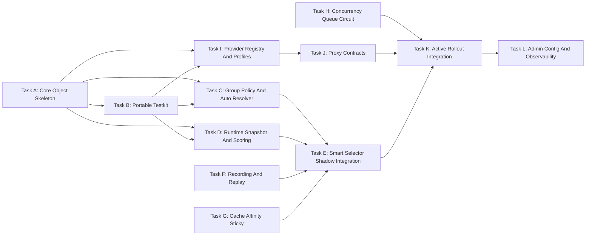

# 按分组启用的智能调度与模型代理整合方案

## 1. 背景与目标

当前项目已经具备比较完整的 AI API 网关能力，包括多上游渠道、模型映射、计费、重试、失败避让、并发冷却、性能聚合、Codex 兼容模式、`auto` 分组调度、`channel_affinity` 缓存亲和等能力。现阶段不建议直接全局替换现有主链路，而是新增一个相对独立、可插拔的智能调度与模型代理模块，在分组维度按策略开启。

本方案目标是建立：

```text
分组策略解析 -> 智能调度引擎 -> 模型代理中转 -> 上游渠道商 -> 异步观测记录
```

并与现有链路融合为：

```text
现有 middleware/controller/relay 主链路
  -> 分组策略判断 off/shadow/active
  -> off: 完全走现有渠道选择逻辑
  -> shadow: 现有逻辑真实选路，新智能调度只旁路评分记录
  -> active: 智能调度选择渠道，失败或不支持时回退现有逻辑
```

核心目标：

- 建立独立、可插拔的智能调度标准模块，默认不影响现有分组。
- 建立独立、可插拔的模型代理中转标准模块，先服务 Codex-compatible 模型扩展。
- 智能调度按分组策略开启，支持 `off`、`shadow`、`active` 三种模式。
- 兼容现有 `auto` 分组调度，默认保持当前顺序选择语义。
- 在策略开启时支持 `auto` 分组融合评分，以及非 `auto` 分组的跨分组候选融合。
- 跨分组融合必须受现有用户可用分组约束，不突破 `GetUserUsableGroups`、`GetUserAutoGroup`、`group_special_usable_group` 规则。
- 支持按 `模型 + 渠道 + 分组 + endpoint + 能力指纹` 进行多维度动态调度。
- 调度综合考虑渠道成功率、用户响应速度、渠道负载、渠道成本、分组优先级、同用户轻锁定。
- 只做 cache-aware 调度，不在网关层自建 prompt cache、semantic cache 或跨渠道 KV cache。
- 将渠道并发量、熔断、冷却、队列等待纳入统一调度模型，解决高并发下直接失败或无序重试的问题。
- 将标准 OpenAI Codex、MiMo、DeepSeek V4 Pro 纳入首批标准大模型 profile，统一支持 Codex `/v1/responses` 能力。
- 为后续更多标准大模型预留 profile 注册、能力声明、协议代理和调度评分扩展点。
- 所有调度选择、代理转换、上游尝试都可观测、可解释、可回放。

## 2. 总体架构

新增 `pkg/modelgateway` 作为相对独立的智能调度与模型代理模块，按职责拆为：

```text
pkg/modelgateway/
  core/        # 统一执行上下文、尝试上下文、结果、错误、生命周期
  policy/      # 分组策略解析、auto 分组解析、跨分组候选约束
  scheduler/   # 候选枚举、能力匹配、动态评分、轻锁定、冷却隔离、队列选择
  proxy/       # 协议桥接与模型代理中转
  provider/    # 上游渠道商 profile，描述能力、模型版本、协议特性
  recording/   # attempt 级记录、实时聚合、score breakdown、请求摘要
  integration/ # 对接现有 service.CacheGetRandomSatisfiedChannel 与 relay 链路
  testkit/     # 便携测试夹具、场景 runner、mock/fake、golden 断言
  testdata/    # 调度、auto 分组、profile、proxy 的可复用测试用例
```

与现有主链路的融合原则：

- `middleware/distributor.go`：保留当前职责。初始选路处增加智能选择器包装调用；分组策略为 `off` 或智能选择器不支持时继续调用现有 `service.CacheGetRandomSatisfiedChannel`。
- `controller/relay.go`：保留当前重试、计费、日志与响应主流程。重试选路处复用同一个智能选择器包装调用，避免初始选路和 retry 选路出现两套策略。
- `service/channel_select.go`：现有 `CacheGetRandomSatisfiedChannel`、`GetChannelFailoverPlan`、`GetConcurrencyLimitFailoverPlan` 继续作为兼容基线和 fallback。智能调度不直接删除这些函数。
- `service/group.go`：现有 `GetUserUsableGroups`、`GroupInUserUsableGroups`、`GetUserAutoGroup` 作为分组权限与 `auto` 候选源的唯一依据。
- `service/channel_concurrency.go`：现有并发租约和冷却能力作为 V1 状态源，后续在智能调度开启的分组内逐步增强为队列等待、熔断和半开探测。
- `setting/ratio_setting/group_ratio.go`：现有计费倍率继续用于计费；新增调度分组优先级必须与计费倍率解耦。
- `relay/channel/*`：保留为低层上游传输适配层。只有 MiMo、DeepSeek V4 Pro 等需要 Codex Responses 桥接的 profile 进入 `proxy` 模块。

### 2.1 面向对象封装原则

Go 没有传统 class 关键字，本方案采用“结构体 + 接口 + 组合 + 构造函数”的面向对象写法，而不是继续堆全局函数。核心要求：

- 每个核心能力必须有一个稳定对象承载状态和依赖，例如 `SmartDispatchFacade`、`DefaultSmartChannelSelector`、`DefaultGroupPolicyResolver`、`DefaultAutoGroupResolver`。
- 外部只依赖接口，内部通过构造函数注入依赖，避免调度代码直接调用散落的全局函数。
- 现有函数能力通过 Adapter 包装成对象，例如 `LegacyChannelSelector` 包装 `service.CacheGetRandomSatisfiedChannel`。
- 不把调度规则写成巨型 if/else，评分策略、候选构建、sticky、熔断、队列、provider proxy 都拆成可替换对象。
- 对象拥有自己的职责边界、输入输出和测试面，方便后续按对象做单测。
- 核心对象必须能脱离 Gin 主链路在 `testkit` 中独立构造，便于做便携回归测试。

### 2.2 对象关系总览


对象职责：

- `SmartDispatchFacade`：对现有链路暴露的门面对象，负责 `off/shadow/active` 分流、fallback、上下文回写和记录投递。
- `GroupPolicyResolver`：把全局配置、分组配置、用户分组和请求分组解析成一个 `GroupSmartPolicy`。
- `AutoGroupResolver`：封装现有 `auto` 语义，解析当前 auto 分组、起始 index、force next、cross group retry。
- `CandidatePoolBuilder`：根据分组计划、模型、endpoint、能力要求构建候选池。
- `SmartChannelSelector`：调度选择对象，串联硬过滤、评分、sticky、并发/队列判断，输出 `DispatchPlan`。
- `ScoreCalculator`：评分策略对象，支持 `balanced`、`speed_first`、`cost_first`、`stability_first` 多态替换。
- `RuntimeSnapshotStore`：运行时快照对象，只提供本地只读数据给调度链路。
- `ConcurrencyController`：并发、队列、熔断、冷却的统一对象，只在开启策略的分组内增强。
- `StickyRouter`：同用户轻锁定和 cache-aware sticky 的对象化封装。
- `ProviderRegistry`：provider profile 注册表，负责按渠道和模型匹配 `ProviderProfile`。
- `ProxyEngine`：协议代理对象，按 profile/proxy mode 执行 `NativeProxy` 或 `ResponsesViaChatProxy`。
- `LegacyChannelSelector`：旧逻辑适配器，统一封装现有 `service.CacheGetRandomSatisfiedChannel` 作为 fallback。
- `AsyncExecutionRecorder`：异步记录对象，负责 attempt 事件落库和实时指标投递。

### 2.3 Go 对象落地骨架

```go
type SmartDispatchFacade struct {
    policyResolver GroupPolicyResolver
    autoResolver   AutoGroupResolver
    selector       SmartChannelSelector
    legacySelector LegacyChannelSelector
    recorder       ExecutionRecorder
}

func NewSmartDispatchFacade(deps SmartDispatchDeps) *SmartDispatchFacade {
    return &SmartDispatchFacade{
        policyResolver: deps.PolicyResolver,
        autoResolver:   deps.AutoResolver,
        selector:       deps.Selector,
        legacySelector: deps.LegacySelector,
        recorder:       deps.Recorder,
    }
}

func (f *SmartDispatchFacade) Select(c *gin.Context, param *service.RetryParam) (*DispatchPlan, bool, *types.NewAPIError) {
    req := NewDispatchRequestFromGin(c, param)
    policy := f.policyResolver.Resolve(c, req)
    if policy.Mode == "off" {
        return nil, false, nil
    }
    if policy.Mode == "shadow" {
        return nil, false, nil
    }
    return f.selector.Select(c, param, policy)
}
```

`middleware/distributor.go` 和 `controller/relay.go` 不直接组装调度细节，只调用门面对象：

```go
plan, handled, apiErr := modelgateway.DefaultFacade.Select(c, retryParam)
if apiErr != nil {
    return nil, "", apiErr
}
if handled {
    return plan.Channel, plan.SelectedGroup, nil
}
return service.CacheGetRandomSatisfiedChannel(retryParam)
```

### 2.4 设计模式映射

- 门面模式：`SmartDispatchFacade` 对外隐藏策略解析、候选构建、评分、fallback。
- 策略模式：`ScoreCalculator` 根据 `policy.Strategy` 切换 `BalancedScorer`、`SpeedFirstScorer`、`CostFirstScorer`。
- 适配器模式：`LegacyChannelSelector` 包装现有渠道选择函数；`ChannelAffinitySignalAdapter` 包装现有 `channel_affinity`。
- 注册表模式：`ProviderRegistry` 管理 `openai_codex`、`mimo_codex_chat`、`deepseek_v4_pro_codex_chat`。
- 模板方法：`BaseProviderProfile` 提供通用错误分类、能力匹配、usage 提取，具体 profile 覆盖差异方法。
- 组合模式：`DispatchContext` 聚合 policy、auto plan、candidate pool、snapshot、sticky decision，避免在 Gin context 里塞满临时状态。

### 2.5 专门测试用例模块

新增 `pkg/modelgateway/testkit` 和 `pkg/modelgateway/testdata`，作为智能调度和模型代理的便携测试模块。目标是后续每次开发改进都能用同一套 fixture 跑回归，降低调度策略、分组融合、provider profile、proxy 转换改动带来的隐性问题。

目录建议：

```text
pkg/modelgateway/
  testkit/
    harness.go              # 组装 SmartDispatchFacade 与核心 fake/mock 对象
    scenario_runner.go      # 执行 JSON/YAML 场景用例
    golden_assert.go        # 对 score、selected channel、context 写回做 golden 断言
    fake_snapshot_store.go  # 可控 RuntimeSnapshotStore
    fake_legacy_selector.go # 可控旧逻辑 fallback
    fake_provider.go        # 可控 ProviderProfile 与上游响应
    fake_recorder.go        # 捕获 recording 事件
    replay.go               # 将线上脱敏记录转为可回放 case
  testdata/
    dispatch/
      group_off.json
      group_shadow.json
      auto_sequential.json
      auto_fusion.json
      cross_group_fusion.json
      sticky_cache_affinity.json
      queue_circuit_cooldown.json
    proxy/
      openai_codex_responses_stream.json
      mimo_responses_via_chat.json
      deepseek_v4_reasoning.json
    golden/
      dispatch/*.golden.json
      proxy/*.golden.json
```

核心对象：

```go
type DispatchTestHarness struct {
    Facade         *SmartDispatchFacade
    SnapshotStore *FakeRuntimeSnapshotStore
    Legacy        *FakeLegacyChannelSelector
    Recorder      *FakeExecutionRecorder
    Providers     *DefaultProviderRegistry
}

type DispatchScenario struct {
    Name             string
    Request          DispatchRequestFixture
    Policy           GroupSmartPolicyFixture
    AutoGroups       []string
    UsableGroups     []string
    Channels         []ChannelFixture
    RuntimeSnapshots []RuntimeSnapshotFixture
    StickyState      *StickyFixture
    Expected         DispatchExpected
}

type DispatchExpected struct {
    Handled          bool
    SelectedChannelID int
    SelectedGroup    string
    ProviderProfile  string
    ProxyMode        string
    FallbackUsed     bool
    ContextKeys      map[string]any
    ScoreBreakdown   map[string]float64
    RecordFields     map[string]any
}
```

测试模块要求：

- 所有 scenario 都是纯文件数据，尽量不依赖真实 DB、Redis、外部 API。
- `DispatchTestHarness` 通过依赖注入装配对象，不访问全局默认实例。
- 线上问题可以脱敏导出为 replay case，只保留模型、分组、渠道、耗时、错误码、分数、上下文 key，不保存 prompt 和敏感 header。
- golden 文件只记录稳定输出：最终渠道、最终分组、是否 fallback、关键 score breakdown、上下文写回、recording 事件摘要。
- 每个新 provider profile 必须补充 proxy contract case。
- 每次调整评分权重、auto 逻辑、跨分组融合、熔断/队列策略时，必须更新或确认对应 golden。

便携测试命令建议：

```bash
go test ./pkg/modelgateway/... -run 'TestPortable'
go test ./pkg/modelgateway/... -run 'TestDispatchScenarios'
go test ./pkg/modelgateway/... -run 'TestProxyContracts'
```

## 3. 核心接口

### 3.1 SmartDispatchFacade

```go
type SmartDispatchFacadeInterface interface {
    Select(c *gin.Context, param *service.RetryParam) (*DispatchPlan, bool, *types.NewAPIError)
    Shadow(c *gin.Context, param *service.RetryParam, actual *model.Channel, actualGroup string)
    Report(c *gin.Context, result *AttemptResult)
}
```

`Select` 返回值中的 `bool` 表示智能调度是否接管本次选择：

- `false`：调用方继续执行现有 `service.CacheGetRandomSatisfiedChannel`。
- `true`：使用 `DispatchPlan.Channel` 和 `DispatchPlan.SelectedGroup`。

该接口不负责替代整个 relay 执行链路，只负责“选哪个渠道、用哪个 profile、是否需要排队/熔断/降权”。

推荐实现类：

```go
type SmartDispatchFacade struct {
    policyResolver GroupPolicyResolver
    autoResolver   AutoGroupResolver
    selector       SmartChannelSelector
    legacySelector LegacyChannelSelector
    recorder       ExecutionRecorder
}
```

它是唯一被现有 `middleware/controller` 直接调用的对象。其它调度对象都通过它间接工作。

### 3.2 DefaultGroupPolicyResolver

```go
type GroupPolicyResolver interface {
    Resolve(c *gin.Context, req *DispatchRequest) GroupSmartPolicy
}

type GroupSmartPolicy struct {
    RequestedGroup       string
    UserGroup            string
    Mode                 string // off | shadow | active
    Strategy             string // balanced | speed_first | cost_first | stability_first
    AutoMode             string // auto_sequential | auto_fusion
    CrossGroupFusion     bool
    CandidateGroups      []string
    CacheAffinityEnabled bool
    QueueEnabled         bool
    CircuitBreakerEnabled bool
}
```

策略解析优先级：

1. 请求实际分组策略。
2. 用户分组 + 请求分组的组合策略。
3. 全局默认策略。
4. 未命中时固定为 `off`。

推荐实现类：

```go
type DefaultGroupPolicyResolver struct {
    settings SchedulerSettingsProvider
}
```

`DefaultGroupPolicyResolver` 只负责策略解析，不枚举渠道，不计算分数。

### 3.3 DefaultAutoGroupResolver

```go
type AutoGroupResolver interface {
    Resolve(c *gin.Context, req *DispatchRequest, policy GroupSmartPolicy) AutoGroupPlan
}

type AutoGroupPlan struct {
    RequestedGroup  string
    UserGroup       string
    CandidateGroups []string
    CurrentGroup    string
    StartIndex      int
    CrossGroupRetry bool
    ForceNextGroup  bool
    Mode            string // auto_sequential | auto_fusion
}
```

`AutoGroupResolver` 必须复用现有语义：

- `TokenGroup == "auto"` 时，候选分组来自 `service.GetUserAutoGroup(userGroup)`。
- 默认 `auto_sequential` 模式保持现有顺序分组选择行为。
- 继续尊重 `ContextKeyAutoGroup`、`ContextKeyAutoGroupIndex`、`ContextKeyAutoGroupRetryIndex`、`ContextKeyForceNextAutoGroup`、`ContextKeyTokenCrossGroupRetry`。
- 只有分组策略显式开启 `auto_fusion` 时，才把多个 auto 分组合并成一个候选池进行统一评分。

推荐实现类：

```go
type DefaultAutoGroupResolver struct {
    groupService GroupPermissionService
}
```

`GroupPermissionService` 是对现有 `service.GetUserUsableGroups`、`service.GetUserAutoGroup`、`service.GroupInUserUsableGroups` 的对象化包装，便于测试时替换。

### 3.4 DefaultSmartChannelSelector

```go
type SmartChannelSelector interface {
    Select(c *gin.Context, param *service.RetryParam, policy GroupSmartPolicy) (*DispatchPlan, bool, *types.NewAPIError)
}

type DispatchPlan struct {
    Channel         *model.Channel
    SelectedGroup   string
    RequestedGroup  string
    ProviderProfile string
    ProxyMode       string
    ScoreTotal      float64
    ScoreBreakdown  map[string]float64
    QueueWaitMs     int
    SelectedReason  string
}
```

调用方使用 `DispatchPlan` 后必须回写上下文：

- `SelectedGroup` 用于日志、计费倍率、quota 结算、失败记录。
- `TokenGroup == "auto"` 时，必须设置 `ContextKeyAutoGroup` 和对应 index。
- 非 `auto` 但开启跨分组融合时，必须保留原始 requested group，同时把真实执行分组写入 `UsingGroup/SelectedGroup` 相关上下文，确保 `helper.HandleGroupRatio` 和 `service.GetUserGroupRatio` 使用正确分组。
- 调用 `middleware.SetupContextForSelectedChannel` 前，必须已经确定最终渠道和最终执行分组。

推荐实现类：

```go
type DefaultSmartChannelSelector struct {
    candidateBuilder CandidatePoolBuilder
    snapshotStore    RuntimeSnapshotStore
    scorerFactory    ScoreCalculatorFactory
    stickyRouter     StickyRouter
    concurrency      ConcurrencyController
    providerRegistry ProviderRegistry
}
```

`DefaultSmartChannelSelector` 本身不保存长期统计数据，只读取 `RuntimeSnapshotStore`，把状态写入交给 `Report` 和 recorder。

### 3.5 DefaultDispatchEngine

```go
type DispatchEngine interface {
    Select(ctx context.Context, exec *ExecutionContext) (*DispatchPlan, *types.NewAPIError)
    Report(ctx context.Context, result *AttemptResult)
}
```

`Select` 只允许读取本地实时快照，不允许在主请求链路同步访问 Redis 或数据库。

`Report` 接收 attempt 结果，用于触发本地状态更新、失败降权、轻锁定清理或续期。

推荐实现类：

```go
type DefaultDispatchEngine struct {
    candidateBuilder CandidatePoolBuilder
    scorerFactory    ScoreCalculatorFactory
    snapshotStore    RuntimeSnapshotStore
    stickyRouter     StickyRouter
}
```

`DispatchEngine` 是 selector 内部的纯调度对象，便于后续从 Gin 中剥离做单元测试。

### 3.6 DefaultProxyEngine

```go
type ProxyEngine interface {
    Execute(c *gin.Context, attempt *AttemptContext) (*ProxyResult, *types.NewAPIError)
}
```

`proxy` 层负责协议中转，不负责调度决策。

推荐实现类：

```go
type DefaultProxyEngine struct {
    registry ProviderRegistry
    clients  UpstreamClientFactory
}
```

`DefaultProxyEngine` 根据 `DispatchPlan.ProviderProfile` 和 `DispatchPlan.ProxyMode` 选择具体代理对象。

### 3.7 ProviderProfile 对象族

```go
type ProviderProfile interface {
    Name() string
    Match(channel *model.Channel) bool
    Capabilities(channel *model.Channel, model string) CapabilitySet
    BuildUpstreamRequest(*AttemptContext) (*UpstreamRequest, error)
    TranslateResponse(*AttemptContext, *http.Response) (*ProxyResult, *types.NewAPIError)
    HandleUpstreamError(*AttemptContext, error) *types.NewAPIError
}
```

`HandleUpstreamError` 用于统一包装上游连接错误、超时、流式中断、特殊 header 错误信息。

推荐对象族：

```go
type BaseProviderProfile struct {
    name         string
    family       string
    capabilities CapabilitySet
}

type OpenAICodexProfile struct {
    BaseProviderProfile
}

type MiMoCodexChatProfile struct {
    BaseProviderProfile
}

type DeepSeekV4ProCodexChatProfile struct {
    BaseProviderProfile
}
```

公共能力放在 `BaseProviderProfile`，差异点由具体 profile 覆盖。

### 3.8 DefaultProviderRegistry

所有标准大模型通过 `ProviderRegistry` 注册，调度和代理层不直接写死某个模型或渠道。

```go
type ProviderRegistry interface {
    Register(profile ProviderProfile)
    Match(channel *model.Channel, model string) []ProviderProfile
    Get(name string) (ProviderProfile, bool)
}
```

首批注册 profile：

```text
openai_codex
mimo_codex_chat
deepseek_v4_pro_codex_chat
```

后续接入更多标准大模型时，新增对应 `ProviderProfile` 并声明能力即可。

推荐实现类：

```go
type DefaultProviderRegistry struct {
    profiles []ProviderProfile
}
```

注册发生在模块初始化阶段，调度和代理执行阶段只读 registry。

## 4. 调度引擎设计

### 4.0 评分时机

智能调度采用“后台预聚合 + 请求时动态评分”的组合方式。

- 后台线程或异步 worker 负责采集并刷新本地 `RuntimeSnapshotStore`，包括成功率、TTFT、TPS、并发量、队列深度、熔断状态、冷却状态、成本倍率和 cache affinity 统计。
- 用户请求进入时，`SmartChannelSelector.Select` 基于当前请求的模型、分组、endpoint、能力要求和本地快照做一次轻量动态评分。
- 请求链路内不访问数据库，不同步访问 Redis，不做复杂历史聚合。
- `shadow` 模式下也执行同样评分，但只记录智能调度建议，不改变现有真实选路。
- `active` 模式下才使用评分结果作为真实渠道选择。

这样既能让调度选择响应实时负载与失败率变化，又不会把评分计算做成全局后台固定排序，避免不同请求能力、分组、成本策略和缓存亲和被提前抹平。

### 4.1 调度最小维度

调度和统计以以下维度作为最小单元：

```text
requested_model + upstream_model + channel_id + group + endpoint_type + capability_fingerprint
```

这样可以避免只按渠道全局均值调度导致的误判。例如同一渠道的不同模型表现不同，或者同一模型在 tool call / non-tool call 场景表现不同，都可以被独立统计和降权。

### 4.2 分组候选解析

智能调度必须先解析“本次请求允许在哪些分组里选择渠道”，再枚举渠道候选。分组候选永远不能突破用户授权范围。

#### 普通分组

当 `TokenGroup != "auto"` 时，默认候选只有当前分组：

```text
candidate_groups = [requested_group]
```

如果该分组策略开启 `cross_group_fusion`，则候选分组为：

```text
candidate_groups =
  policy.candidate_groups
  ∩ service.GetUserUsableGroups(userGroup)
```

同时必须满足：

- `requested_group` 本身必须是用户可用分组，或等于用户自身分组。
- `policy.candidate_groups` 为空时，不做跨分组扩大。
- 被 `group_special_usable_group` 移除的分组不得重新进入候选。
- 选择到非 requested group 时，日志和记录必须同时保留 `requested_group` 与 `selected_group`。
- 计费结算使用最终 `selected_group` 的组间倍率，但审计记录需要保留跨分组来源。

#### auto 分组默认兼容

当 `TokenGroup == "auto"` 且策略未开启 `auto_fusion` 时，保持当前顺序选择语义：

```text
auto_groups = service.GetUserAutoGroup(userGroup)
start_index = ContextKeyAutoGroupIndex or current ContextKeyAutoGroup
按 auto_groups 顺序选择当前分组内满足条件的渠道
当前分组没有可用渠道时再进入下一个 auto 分组
```

该模式称为 `auto_sequential`，是 V1 默认模式，也是兼容基线。它应尽量复用现有 `service.CacheGetRandomSatisfiedChannel` 的行为，智能调度只做 shadow 记录或在同一分组内做排序增强。

#### auto 分组融合评分

当 `TokenGroup == "auto"` 且分组策略显式开启 `auto_fusion` 时，智能调度可以把多个 auto 分组融合为一个候选池：

```text
candidate_groups = service.GetUserAutoGroup(userGroup)
```

再按 `模型 + 渠道 + 分组 + endpoint + 能力指纹` 进行统一评分。

融合模式规则：

- 候选分组仍然只能来自 `GetUserAutoGroup(userGroup)`。
- `ContextKeyForceNextAutoGroup` 为 true 时，优先尊重现有“切到后续分组”的 retry 语义，可从当前 index 之后的 auto 分组开始融合。
- `ContextKeyTokenCrossGroupRetry` 为 false 时，retry 不应主动跳过当前已选 auto 分组，除非当前分组没有可用候选或触发并发/熔断/冷却。
- 选择完成后必须写回 `ContextKeyAutoGroup` 和 `ContextKeyAutoGroupIndex`。
- `selected_group` 进入计费、日志、quota、失败记录，`requested_group` 保持为 `auto`。

#### 与现有 auto 逻辑的融合边界

V1 不删除现有 `auto` 调度逻辑，而是在智能调度入口按策略分流：

```text
off:
  直接调用 service.CacheGetRandomSatisfiedChannel

shadow:
  先调用 service.CacheGetRandomSatisfiedChannel 得到真实渠道
  再调用 SmartChannelSelector.Shadow 计算建议渠道并记录差异

active + auto_sequential:
  复用 AutoGroupResolver 得到当前 auto 分组
  在当前分组内智能评分
  当前分组不可用时再按现有顺序进入后续 auto 分组

active + auto_fusion:
  将允许的 auto 分组融合成候选池统一评分
  失败时回退 service.CacheGetRandomSatisfiedChannel
```

### 4.3 硬过滤

候选渠道先经过硬过滤，再参与评分。

硬过滤条件：

- 渠道禁用。
- 模型不支持。
- endpoint 不支持。
- Codex 工具能力不满足。
- 上游协议 profile 不匹配。
- 失败避让激活。
- 限流冷却激活。
- 强制隔离激活。
- 熔断打开。
- 当前并发达到上限且不允许排队。
- 队列已满或预计等待时间超过请求允许等待时间。

硬过滤失败的渠道不参与 `TotalScore` 计算。

### 4.4 默认评分公式

所有子分数标准化为 `0.0 ~ 1.0`。

```text
TotalScore =
  SuccessScore * 0.32 +
  SpeedScore   * 0.28 +
  LoadScore    * 0.20 +
  CostScore    * 0.15 +
  GroupScore   * 0.05
```

默认策略为 `balanced`。后续可扩展：

- `speed_first`：提高 `SpeedScore` 权重。
- `cost_first`：提高 `CostScore` 权重。
- `stability_first`：提高 `SuccessScore` 权重。

### 4.5 SuccessScore

成功率按 `模型 + 渠道 + 分组 + endpoint + 能力指纹` 统计。

统计窗口：

- `1m`：快速感知故障和限流。
- `5m`：主评分窗口。
- `30m`：冷启动和低样本兜底。

计为失败的情况：

- 上游 5xx。
- 上游 429。
- 网络错误。
- 协议转换失败。
- 流式中断。
- 上游返回无法解析的响应。

不计入渠道失败率的情况：

- 客户端参数错误。
- 用户余额不足。
- 用户权限不足。
- 客户端主动断开且上游未报错。

连续失败进行指数降权，连续成功逐步恢复。

### 4.6 SpeedScore

速度评分关注用户实际体验。

流式请求：

```text
SpeedScore = TTFTScore * 0.70 + TPSScore * 0.30
```

非流式请求：

```text
SpeedScore = DurationScore
```

记录指标：

- `ttft_ms`：首 token / 首事件耗时。
- `duration_ms`：完整请求耗时。
- `tokens_per_second`：输出速率。

低样本回退顺序：

1. `ModelExecutionRecord` 近期数据。
2. `PerfMetric` 聚合数据。
3. `Channel.ResponseTime`。
4. 系统默认值。

### 4.7 LoadScore

负载评分用于避免所有请求压向当前最快渠道。

输入指标：

- 当前活跃并发。
- 渠道最大并发。
- `active_concurrency / max_concurrency`。
- 当前等待队列长度。
- 队列预计等待时间。
- 最近 429 密度。
- 最近并发冷却次数。
- 请求排队或租约获取失败次数。
- 熔断状态与半开探测状态。

并发未达到上限但负载较高时降分。并发达到上限时先进入队列策略判断：允许短等待且队列有容量时进入等待队列，否则硬过滤并尝试其他候选渠道。

### 4.8 并发、队列、熔断与冷却

并发控制在智能调度开启的分组内从单纯的 `TryAcquireChannelConcurrency` 增强为统一 `ConcurrencyController`。未开启智能调度的分组继续使用现有并发限制逻辑。

```go
type ConcurrencyController interface {
    TryAcquire(ctx context.Context, req *AcquireRequest) (*AcquireResult, error)
    Release(lease *ChannelLease)
    Report(result *AttemptResult)
    Snapshot(channelID int) ConcurrencySnapshot
}
```

`TryAcquire` 的结果分为：

```text
acquired       # 已获得并发租约，可立即请求上游
queued         # 已进入等待队列，等待租约
rejected       # 队列满、超时、熔断或策略拒绝
cooldown       # 渠道正在冷却
circuit_open   # 渠道熔断打开
```

#### 并发量

每个渠道维护以下状态：

- `active_concurrency`：当前正在执行的上游请求数。
- `max_concurrency`：渠道配置的最大并发。
- `load_ratio`：`active_concurrency / max_concurrency`。
- `inflight_by_model`：按模型拆分的执行中请求数。
- `inflight_by_group`：按分组拆分的执行中请求数。

当 `active_concurrency < max_concurrency` 时直接发放租约；当达到上限时进入队列策略。

#### 队列等待

队列用于解决瞬时并发过高时“直接失败或过度切换”的问题。

队列维度：

```text
channel_id + requested_model + endpoint_type
```

默认策略：

- 仅对非实时短等待启用。
- 默认最大等待时间 `2s`。
- 默认队列长度 `min(max_concurrency * 2, 64)`。
- 客户端断开时立即退出队列。
- 流式请求可以等待租约，但一旦开始输出就不再重试。

队列排序：

- 同用户轻锁定命中的请求优先。
- 高分组优先级请求优先。
- 等待时间越长优先级逐步提升，避免饥饿。
- 已经重试过的请求优先级略低，避免挤压新请求。

队列出队条件：

- 有并发租约释放。
- 请求等待超时。
- 上下文取消。
- 渠道进入熔断或冷却。

排队失败后，scheduler 可以继续尝试其他候选渠道；如果所有候选都队列满或不可用，再返回限流错误。

#### 熔断

熔断用于处理渠道在短时间内连续失败、429 激增或流式中断激增的情况。

状态：

```text
closed    # 正常
open      # 熔断打开，硬过滤
half_open # 半开探测，只允许少量探测请求
```

触发条件：

- 最近 `1m` 失败率超过阈值且样本数达到最小要求。
- 连续失败次数超过阈值。
- 429 密度超过阈值。
- 流式中断连续出现。
- 上游连接错误或超时连续出现。

恢复策略：

- `open` 持续一个冷却周期后进入 `half_open`。
- `half_open` 只允许少量探测请求。
- 探测成功达到阈值后恢复 `closed`。
- 探测失败立即回到 `open`，并指数增加冷却时间。

#### 冷却

冷却用于处理明确的限流、并发限制或熔断后的暂停窗口。

冷却来源：

- 上游 `429`。
- `retry-after` 或等价 header。
- 本地并发学习判断。
- 熔断打开后的暂停窗口。
- 连续失败避让。

冷却期间渠道被硬过滤，不参与评分，也不允许排队。

#### V1 落地边界

V1 阶段先把现有 `TryAcquireChannelConcurrency`、`IsChannelConcurrencyFull`、`getChannelConcurrencyCooldownSet` 纳入智能调度快照，避免改动过大。

增强顺序：

1. `shadow` 模式记录并发满、冷却、失败避让对智能评分的影响。
2. `active` 分组内启用智能硬过滤，但并发租约仍由现有 relay 执行前获取。
3. 对明确开启 `queue_enabled` 的分组启用短等待队列。
4. 对明确开启 `circuit_breaker_enabled` 的分组启用熔断与半开探测。

这样不会改变未开启智能调度分组的并发行为，也能避免队列和熔断一次性侵入所有渠道。

### 4.9 CostScore

成本评分只在可用且稳定的候选之间参与排序，不允许让明显不稳定渠道因低成本优先。

成本来源：

1. 渠道配置中的 `channel_cost_ratio`。
2. 现有模型价格/倍率体系。
3. 默认成本系数 `1.0`。

成本越低，`CostScore` 越高。

### 4.10 GroupScore

新增 `scheduler_setting.group_priority_ratio`，用于表达分组调度优先级。

该配置与现有计费 `group_ratio` 解耦，避免“计费倍率”直接影响“调度优先级”。

分组优先级用于调度排序，不改变用户分组权限，也不改变账单倍率。跨分组融合时，`GroupScore` 可用于表达运营希望优先使用哪个执行分组。

### 4.11 同用户轻锁定

轻锁定用于短时间内保持同用户同模型的渠道稳定，提升连续请求体验和上游缓存命中概率。

锁定 key：

```text
user_id/token_id + group + model + endpoint + capability_fingerprint
```

跨分组融合开启时，`group` 使用最终 `selected_group`；如果请求来自 `auto`，则额外保留 `requested_group=auto` 作为审计维度。这样可以避免用户在不同实际执行分组之间被过度粘住。

默认 TTL：`180s`。

存储策略：

- 本地 cache 优先。
- Redis 仅作为多节点兜底。
- 调度主链路优先读本地，不同步等待 Redis。

保留锁定条件：

- 锁定渠道仍支持当前模型与能力。
- 锁定渠道未进入失败避让。
- 锁定渠道未进入 cooldown。
- 锁定渠道并发未满，或允许在可接受时间内排队。
- 锁定渠道未熔断。
- 锁定渠道分数 `>= bestScore * 0.85`。

打破锁定条件：

- 渠道禁用。
- 能力不匹配。
- 并发已满且队列不可用或预计等待过长。
- 失败避让或 cooldown 激活。
- 熔断打开。
- 成功率明显下降。
- TTFT 或总耗时明显变差。
- 分数落后最佳候选超过 `15%`。

### 4.12 Cache-Aware 调度

本项目 V1 不自建 prompt cache、response cache、semantic cache，也不尝试跨渠道复用上游 KV cache。调度器只识别请求中的缓存语义，并尽量保持同一渠道，以保护上游 Provider 自身的 prompt/KV cache 命中。

缓存语义信号：

- `prompt_cache_key`。
- `previous_response_id`。
- Codex / Claude / CLI 会话 header。
- `session_id`、`conversation_id` 等可配置字段。
- 现有 `channel_affinity` 规则命中的 key。

处理原则：

- 将现有 `channel_affinity` 抽象为 `CacheAffinitySignal`。
- 命中缓存语义时，提高 sticky 保留优先级。
- 如果原渠道健康、未冷却、未熔断、并发可用或可短等待，则优先保留原渠道。
- 如果原渠道进入熔断、冷却、失败避让、并发不可用或明显变慢，则允许切换渠道。
- 切换渠道时记录缓存亲和被打破的原因，因为上游缓存大概率无法跨渠道命中。

与普通 sticky 的区别：

- 普通 sticky 主要面向同用户短时间稳定体验。
- cache-aware sticky 主要面向上游 prompt/KV cache 命中。
- cache-aware sticky 的保留阈值更强，默认要求锁定渠道分数 `>= bestScore * 0.75` 即可保留。
- 健康状态和能力匹配仍然高于缓存亲和。

该设计复用现有 `channel_affinity` 能力：当前项目已经支持 `/v1/responses` 的 `prompt_cache_key` 亲和，并会统计 cached tokens 命中情况。智能调度模块只将其提升为 scheduler 的标准输入信号。

## 5. RuntimeSnapshotStore

调度器只读取本地 `RuntimeSnapshotStore`。

```go
type RuntimeSnapshotStore interface {
    Get(key RuntimeKey) RuntimeSnapshot
    ListCandidates(req *DispatchRequest) []RuntimeSnapshot
}
```

快照来源：

- `ModelExecutionRecord` 近期数据。
- 现有 `PerfMetric`。
- `Channel.ResponseTime`。
- 当前活跃并发。
- 当前等待队列长度。
- 队列预计等待时间。
- 熔断状态。
- 并发冷却状态。
- 失败避让状态。
- 轻锁定状态。
- cache affinity 状态。
- cached token 命中统计。

刷新策略：

- 本地内存快照每 `500ms` 更新一次。
- Redis 可用时异步同步跨节点状态。
- Redis 不可用时本地继续工作。
- DB 仅用于历史恢复和长期分析，不参与同步调度路径。

## 6. Proxy 与 Provider 设计

### 6.1 Proxy 类型

```text
NativeProxy
ResponsesViaChatProxy
ChatViaResponsesProxy
```

- `NativeProxy`：原生协议直通，适用于已有 OpenAI Codex、OpenAI/Claude/Gemini/DeepSeek Chat 等常规请求。
- `ResponsesViaChatProxy`：Codex `/v1/responses` 转 Chat Completions，用于 MiMo、DeepSeek V4 Pro 等 Chat-only 上游。
- `ChatViaResponsesProxy`：保留现有反向兼容能力，用于 Chat 请求走 Responses 上游。

### 6.2 ProxyResult

```go
type ProxyResult struct {
    Usage             *dto.Usage
    ResponseModel     string
    ReasoningContent  string
    StreamInterrupted bool
    DeliveredTokens   int
}
```

`ReasoningContent` 用于抹平不同上游的 reasoning/thinking 字段差异。

### 6.3 标准大模型 Profile 规范

每个标准大模型 profile 必须声明：

- `profile_name`：稳定唯一名称。
- `provider_family`：如 `openai`、`mimo`、`deepseek`。
- `model_patterns`：支持的模型名或模型前缀。
- `wire_protocol`：原生协议，如 `responses`、`chat_completions`、`claude_messages`。
- `proxy_modes`：可用代理模式，如 `native`、`responses_via_chat`。
- `capabilities`：输入输出模态、tool call、web search、reasoning、image generation、streaming。
- `cost_profile`：成本系数或成本回退策略。
- `failure_classifier`：429、5xx、流式中断、协议错误的归类方式。

调度层只读取 profile 的能力声明和运行时状态，不理解具体协议细节；协议细节全部交给 proxy/provider 层。

### 6.4 OpenAI Codex Profile

OpenAI Codex 作为标准大模型 profile 纳入网关，不再只作为零散的特殊渠道逻辑存在。

建议 profile 名称：

```text
openai_codex
```

承载方式：

- 复用现有 `ChannelTypeCodex` 和 `APITypeCodex`。
- 支持原生 `/backend-api/codex/responses`。
- 支持 `/backend-api/codex/responses/compact`。
- 作为 Codex Responses 原生能力的基准 profile。

能力：

- 原生 Codex `/v1/responses`。
- 原生 Responses stream。
- Responses compact。
- Codex tool capability 声明。
- Codex image generation tool 能力探测结果接入 capability set。
- 作为其它 Codex-compatible profile 的对照基准，用于测试 MiMo/DeepSeek 桥接行为。

调度要求：

- `openai_codex` 与 `mimo_codex_chat`、`deepseek_v4_pro_codex_chat` 一样进入 scheduler 候选集。
- 同样记录成功率、TTFT、TPS、负载、成本、队列、熔断、冷却、sticky 命中。
- 原生 Codex Responses 支持优先通过 `NativeProxy` 执行，不走 `ResponsesViaChatProxy`。
- 当用户请求需要原生 Codex 特有能力且其它 profile 不支持时，只允许匹配 `openai_codex`。

### 6.5 MiMo Profile

MiMo V1 作为 OpenAI-compatible channel + `proxy_profile` 接入，不新增独立 `ChannelType`。

建议 profile 名称：

```text
mimo_codex_chat
```

能力：

- OpenAI-compatible Chat。
- Codex Responses via Chat。
- `reasoning_content` 回传。
- MiMo `web_search` 工具映射。

### 6.6 DeepSeek V4 Pro Profile

DeepSeek V4 Pro 复用现有 DeepSeek 渠道。

建议 profile 名称：

```text
deepseek_v4_pro_codex_chat
```

能力：

- V4 thinking suffix 解析。
- Responses via Chat。
- reasoning/thinking 标准化输出。
- 保持现有 DeepSeek Chat / Claude 路径兼容。

### 6.7 后续标准大模型扩展

后续新增标准大模型时，不直接修改调度主逻辑，而是按以下步骤扩展：

1. 新增 `ProviderProfile`。
2. 声明模型匹配规则和能力集。
3. 选择 `NativeProxy` 或新增 proxy mode。
4. 实现请求构造、响应转换、错误分类。
5. 加入 profile registry。
6. 增加 profile 级调度、流式、tool、reasoning 测试。

候选 profile 示例：

- OpenAI-compatible coding models。
- Claude coding / computer-use 类模型。
- Gemini coding 类模型。
- Moonshot/Kimi coding 类模型。
- Doubao/VolcEngine coding 类模型。
- 其它支持 Responses 或可桥接到 Responses 的模型。

### 6.8 参考开源项目的策略

参考 `7as0nch/mimo2codex` 的协议映射行为，但不直接并入其代码。

理由：

- 当前需求不是 MiMo 单点兼容，而是要把 MiMo、DeepSeek V4 Pro、OpenAI Codex 和后续标准大模型纳入统一 profile 体系。
- 需要与现有计费、调度、重试、日志、冷却、分组和 `auto` 体系做受控融合。
- 自主实现更容易保持项目内 Go 风格、接口边界和测试覆盖一致，同时避免引入难以维护的外部协议分叉。

## 7. 流式异常与计费

定义专用错误：

```go
var ErrUpstreamStreamInterrupted = errors.New("upstream stream interrupted")
```

当上游已经输出部分 token 后发生 EOF、连接断开、429、5xx 或协议错误：

- 不做 controller 层重试，因为客户端已经收到部分数据。
- attempt 记录为失败。
- scheduler 对该 `模型 + 渠道` 维度降权。
- `ProxyResult.StreamInterrupted = true`。
- `ProxyResult.DeliveredTokens` 记录已成功推送的 token 数量。
- 计费按已成功推送 token 截断结算。

## 8. 数据记录与观测

### 8.1 ModelExecutionRecord

新增 attempt 级记录表：

```text
id
created_at
request_id
attempt_index
user_id
token_id
requested_group
using_group
selected_group
requested_model
billing_model
upstream_model
response_model
channel_id
channel_type
channel_name
endpoint_type
capability_fingerprint
proxy_profile
proxy_mode
provider_profile
is_stream
success
status_code
error_code
error_type
duration_ms
ttft_ms
tokens_per_second
delivered_tokens
active_concurrency
max_concurrency
load_ratio
queue_wait_ms
queue_depth
queue_rejected
circuit_state
cooldown_remaining_ms
estimated_cost
cost_ratio
score_total
score_breakdown
policy_mode
auto_mode
cross_group_fusion
candidate_groups
sticky_key_fp
sticky_hit
sticky_retained
cache_affinity_key_fp
cache_affinity_hit
cache_affinity_retained
cache_affinity_broken_reason
cached_tokens
prompt_cache_hit_tokens
stream_interrupted
request_meta
```

`request_meta` 只保存：

- 模型版本。
- 工具类型。
- 推理模式。
- 协议模式。
- 是否 Codex-like 请求。
- 是否 Responses via Chat。
- provider profile 名称。
- 是否命中 cache-aware 调度信号。

不保存原始 prompt，不保存敏感 header，不保存完整请求正文。

### 8.2 异步 recording

`recording` 模块使用异步队列 + worker pool。

原则：

- 主链路只投递事件，不同步落库。
- 队列满时允许采样普通成功请求。
- 失败、429、流式中断、协议转换失败必须保留。
- worker 写入失败时记录系统日志，不阻塞请求。

### 8.3 Log 与 PerfMetric

现有 `Log` 和 `PerfMetric` 保留。

`Log.Other.admin_info` 增加：

```text
gateway.dispatch.score_breakdown
gateway.dispatch.runtime_snapshot
gateway.dispatch.selected_reason
gateway.proxy.profile
gateway.proxy.mode
gateway.attempts
gateway.sticky
gateway.cache_affinity
```

`PerfMetric` 继续服务模型广场和历史聚合；调度实时读取以 `RuntimeSnapshotStore` 为主。

## 9. 配置设计

新增 `scheduler_setting`：

```json
{
  "enabled": false,
  "default_mode": "off",
  "rollout_percent": 0,
  "default_strategy": "balanced",
  "snapshot_refresh_ms": 500,
  "sticky_ttl_seconds": 180,
  "sticky_keep_score_ratio": 0.85,
  "cache_affinity_enabled": true,
  "cache_affinity_keep_score_ratio": 0.75,
  "queue_enabled": true,
  "queue_default_timeout_ms": 2000,
  "queue_max_depth_per_channel": 64,
  "queue_depth_multiplier": 2,
  "circuit_breaker_enabled": true,
  "circuit_failure_threshold": 0.5,
  "circuit_min_samples": 10,
  "circuit_open_seconds": 30,
  "circuit_half_open_probe_count": 3,
  "circuit_error_policies": {
    "rate_limit": {
      "failure_threshold": 0.5,
      "min_samples": 3,
      "open_seconds": 20,
      "half_open_probe_count": 2
    },
    "server_error": {
      "failure_threshold": 0.5,
      "min_samples": 10,
      "open_seconds": 30,
      "half_open_probe_count": 3
    },
    "stream_interrupted": {
      "failure_threshold": 0.4,
      "min_samples": 3,
      "open_seconds": 60,
      "half_open_probe_count": 1
    }
  },
  "cooldown_max_seconds": 600,
  "success_weight": 0.32,
  "speed_weight": 0.28,
  "load_weight": 0.20,
  "cost_weight": 0.15,
  "group_weight": 0.05,
  "runtime_sync_enabled": false,
  "runtime_sync_redis_enabled": true,
  "runtime_sync_node_id": "",
  "runtime_sync_ttl_seconds": 30,
  "runtime_sync_queue_min_interval_ms": 500,
  "runtime_sync_event_push_enabled": false,
  "runtime_sync_event_subscribe_enabled": false,
  "group_priority_ratio": {},
  "group_policies": {
    "codex-pro": {
      "mode": "shadow",
      "strategy": "balanced",
      "auto_mode": "auto_sequential",
      "cross_group_fusion": false,
      "candidate_groups": [],
      "cache_affinity_enabled": true,
      "queue_enabled": false,
      "circuit_breaker_enabled": false
    },
    "auto": {
      "mode": "shadow",
      "strategy": "balanced",
      "auto_mode": "auto_sequential",
      "cross_group_fusion": false,
      "candidate_groups": [],
      "cache_affinity_enabled": true,
      "queue_enabled": false,
      "circuit_breaker_enabled": false
    }
  },
  "failure_fast_window_seconds": 60,
  "failure_main_window_seconds": 300,
  "failure_fallback_window_seconds": 1800
}
```

配置原则：

- `enabled=false` 时整个智能调度模块不参与真实选路，也不做 shadow。
- `enabled=true` 但分组未配置时，分组默认 `off`。
- `default_mode` 必须默认为 `off`，避免升级后无意影响现有分组。
- `group_policies.<group>.mode=shadow` 时，真实选路仍为旧逻辑，只记录智能建议。
- `group_policies.<group>.mode=active` 时，该分组真实使用智能调度；智能调度不可用时回退旧逻辑。
- `auto_mode` 默认 `auto_sequential`，只有显式设置 `auto_fusion` 才允许融合 auto 分组。
- `candidate_groups` 只表达策略希望参与融合的分组，最终候选必须与 `service.GetUserUsableGroups(userGroup)` 求交集。
- `queue_enabled`、`circuit_breaker_enabled` 均按分组开启，不做全局默认打开。
- `circuit_error_policies` 为空时保持旧统一熔断阈值；配置后只对对应错误类型覆盖失败率阈值、最小样本、打开时间和半开探针数。
- 熔断错误类型第一阶段固定为 `stream_interrupted`、`rate_limit`、`auth`、`quota`、`server_error`、`upstream_error`，未知 key 会在配置归一化时丢弃。
- `auth` 与 `quota` 默认不纳入旧统一熔断失败，只有显式配置 `circuit_error_policies.auth/quota` 时才参与对应类型熔断，避免用户额度或密钥问题把正常渠道全局误伤。
- 错误类型熔断的上线、灰度、回滚、默认策略建议和观测口径见 `docs/modelgateway-circuit-policy-ops.md`；第一阶段推荐只启用 `rate_limit/server_error/stream_interrupted/upstream_error`，`auth/quota` 仅作为确认 provider-owned credential/quota 事故后的应急策略。
- `runtime_sync_enabled=false` 时，智能调度只使用本进程本地运行态，不读写跨节点共享状态。
- `runtime_sync_redis_enabled=false` 时，即使 Redis 全局可用，运行态同步也强制走内存 fallback，便于单节点部署、测试和 Redis 不稳定时隔离。
- `runtime_sync_event_push_enabled=false` 时，运行态 snapshot、熔断 snapshot 和 queue snapshot 仍按同步写路径写入 store；开启后才通过进程内事件队列合并并后台刷入。
- `runtime_sync_event_subscribe_enabled=false` 为默认值，Redis Pub/Sub subscriber companion 不会随普通请求、runtime status 查询或默认智能调度运行时懒启动；开启后仅作为观测后台服务显式启动。
- Redis Pub/Sub 发布是轻量通知层，不是事实数据层；事实状态仍以 `HybridRuntimeSyncStore` / `HybridCache` 中的 runtime snapshot、circuit snapshot 和 queue snapshot 为准。
- subscriber companion 的启动条件必须同时满足 `runtime_sync_enabled && runtime_sync_redis_enabled && runtime_sync_event_subscribe_enabled && RedisEnabled && RDB != nil`；任何条件不满足都保持关闭并回退共享态惰性读取。
- 关闭 `runtime_sync_event_subscribe_enabled`、关闭 runtime sync、关闭 Redis runtime sync 或配置重建时，必须关闭旧 companion、退出 Redis 订阅循环、释放回调队列并停止暴露旧 subscriber 的运行中状态。
- subscriber companion 只服务观测进程的主动刷新和事件统计，不挂在默认请求链路、调度 `Select`、runtime status API 或状态查询懒路径上。

跨分组融合示例：

```json
{
  "group_policies": {
    "vip": {
      "mode": "active",
      "strategy": "balanced",
      "cross_group_fusion": true,
      "candidate_groups": ["vip", "svip-lowcost", "codex-pro"],
      "cache_affinity_enabled": true,
      "queue_enabled": true,
      "circuit_breaker_enabled": true
    },
    "auto": {
      "mode": "active",
      "auto_mode": "auto_fusion",
      "strategy": "speed_first",
      "cache_affinity_enabled": true,
      "queue_enabled": true,
      "circuit_breaker_enabled": true
    }
  }
}
```

实际候选计算：

```text
vip 请求:
  candidate_groups = ["vip", "svip-lowcost", "codex-pro"] ∩ GetUserUsableGroups(userGroup)

auto 请求:
  candidate_groups = GetUserAutoGroup(userGroup)
```

扩展 `ChannelOtherSettings`：

```go
type ChannelDispatchSettings struct {
    ProxyProfile       string             `json:"proxy_profile,omitempty"`
    ChannelCostRatio   float64            `json:"channel_cost_ratio,omitempty"`
    GroupPriorityRatio map[string]float64 `json:"group_priority_ratio,omitempty"`
    QueueEnabled       *bool              `json:"queue_enabled,omitempty"`
    QueueTimeoutMs     int                `json:"queue_timeout_ms,omitempty"`
    QueueMaxDepth      int                `json:"queue_max_depth,omitempty"`
    CircuitEnabled     *bool              `json:"circuit_enabled,omitempty"`
    CircuitOpenSeconds int                `json:"circuit_open_seconds,omitempty"`
    CostBias           float64            `json:"cost_bias,omitempty"`
    SpeedBias          float64            `json:"speed_bias,omitempty"`
    StickyEligible     *bool              `json:"sticky_eligible,omitempty"`
}
```

## 10. 多任务开发拆分

为了支持多人或多 worker 并行开发，实施时按任务包拆分。每个任务包有明确写入范围，避免多个任务同时改同一批文件导致冲突。

### 10.1 任务依赖图



### 10.2 任务包定义

#### Task A：核心对象骨架

写入范围：

- `pkg/modelgateway/core`
- `pkg/modelgateway/integration`
- `pkg/modelgateway/policy` 的接口定义
- `setting` 中 `scheduler_setting` 的基础结构

交付物：

- `SmartDispatchFacade`
- `SmartDispatchDeps`
- `DispatchRequest`
- `DispatchPlan`
- `AttemptResult`
- `LegacyChannelSelector`
- `GroupPermissionService`
- 默认 no-op 实现，确保不改变现有链路

依赖：无。

验收：

- 默认 `enabled=false` 时没有行为变化。
- 对象可通过构造函数装配，不依赖全局 mutable 状态。

#### Task B：便携测试模块

写入范围：

- `pkg/modelgateway/testkit`
- `pkg/modelgateway/testdata`

交付物：

- `DispatchTestHarness`
- `FakeRuntimeSnapshotStore`
- `FakeLegacyChannelSelector`
- `FakeExecutionRecorder`
- scenario runner
- golden assertion
- 首批 dispatch/proxy fixture

依赖：Task A 的核心类型。

验收：

```bash
go test ./pkg/modelgateway/... -run 'TestPortable|TestDispatchScenarios|TestProxyContracts'
```

#### Task C：分组策略与 auto resolver

写入范围：

- `pkg/modelgateway/policy`
- `pkg/modelgateway/testdata/dispatch`

交付物：

- `DefaultGroupPolicyResolver`
- `DefaultAutoGroupResolver`
- `auto_sequential`
- `auto_fusion`
- `cross_group_fusion`
- 对现有 `GetUserUsableGroups`、`GetUserAutoGroup`、`GroupInUserUsableGroups` 的适配

依赖：Task A、Task B。

验收：

- `group_off`
- `group_shadow`
- `auto_sequential`
- `auto_fusion`
- `cross_group_fusion`

#### Task D：运行时快照与评分策略

写入范围：

- `pkg/modelgateway/scheduler`
- `pkg/modelgateway/core`
- `pkg/modelgateway/testdata/dispatch`

交付物：

- `RuntimeSnapshotStore`
- `DefaultRuntimeSnapshotStore`
- `ScoreCalculator`
- `BalancedScorer`
- `SpeedFirstScorer`
- `CostFirstScorer`
- `StabilityFirstScorer`
- 成功率、速度、负载、成本、分组优先级评分

依赖：Task A、Task B。

验收：

- 评分不访问 Redis/DB。
- 同一 fixture 输出稳定 `score_breakdown`。

#### Task E：Smart selector shadow 接入

写入范围：

- `pkg/modelgateway/scheduler`
- `pkg/modelgateway/integration`
- `middleware/distributor.go`
- `controller/relay.go`

交付物：

- `DefaultSmartChannelSelector`
- `SmartDispatchFacade.Select`
- `Shadow` 记录入口
- 初始选路与 retry 选路的包装调用
- `off` 和 `shadow` 模式真实路径仍走旧逻辑

依赖：Task A、Task C、Task D、Task F。

验收：

- shadow 模式不改变真实渠道。
- old selector fallback 始终可用。

#### Task F：记录、观测与 replay

写入范围：

- `pkg/modelgateway/recording`
- `model` 中 `ModelExecutionRecord`
- `pkg/modelgateway/testkit/replay.go`

交付物：

- `AsyncExecutionRecorder`
- `ModelExecutionRecord` migration
- attempt 事件队列
- replay 脱敏导出/导入
- `Log.Other.admin_info` 的调度摘要

依赖：Task A、Task B。

验收：

- 落库失败不阻塞请求。
- replay case 不包含 prompt、敏感 header 或完整请求正文。
- `ReplayArtifact` 可以由脱敏 `ModelExecutionRecord` 生成，并可派生为 `DispatchScenario` 在本地回放。

#### Task G：Cache affinity 与 sticky router

写入范围：

- `pkg/modelgateway/scheduler`
- `service/channel_affinity.go` 的适配层，不直接重写现有逻辑
- `pkg/modelgateway/testdata/dispatch`

交付物：

- `StickyRouter`
- `CacheAffinitySignalAdapter`
- sticky retain/break 规则
- `prompt_cache_key`、`previous_response_id`、session/conversation 信号提取

依赖：Task A、Task B、Task D。

验收：

- cache-aware sticky 能保留健康渠道。
- 渠道熔断、冷却、能力不匹配时能打破 sticky。

#### Task H：并发、队列、熔断、冷却

写入范围：

- `pkg/modelgateway/scheduler`
- `service/channel_concurrency.go` 的适配层
- `pkg/modelgateway/testdata/dispatch`

交付物：

- `ConcurrencyController`
- `QueueManager`
- `CircuitBreaker`
- `CooldownState`
- 对现有并发满与冷却状态的快照化接入

依赖：Task A、Task B、Task D。

验收：

- 未开启 `queue_enabled`、`circuit_breaker_enabled` 的分组行为不变。
- 队列等待取消、超时、出队无资源泄露。

#### Task I：Provider registry 与 profile 对象

写入范围：

- `pkg/modelgateway/provider`
- `pkg/modelgateway/core`
- `pkg/modelgateway/testdata/proxy`

交付物：

- `DefaultProviderRegistry`
- `BaseProviderProfile`
- `OpenAICodexProfile`
- `MiMoCodexChatProfile`
- `DeepSeekV4ProCodexChatProfile`
- capability fingerprint 生成

依赖：Task A、Task B。

验收：

- 三个首批 profile 可按渠道、模型、endpoint 匹配。
- 新 profile 不需要修改 scheduler 主逻辑。

#### Task J：Proxy engine 与协议契约

写入范围：

- `pkg/modelgateway/proxy`
- `pkg/modelgateway/provider`
- `pkg/modelgateway/testdata/proxy`

交付物：

- `DefaultProxyEngine`
- `NativeProxy`
- `ResponsesViaChatProxy`
- reasoning/thinking 标准化
- 流式中断识别
- OpenAI Codex、MiMo、DeepSeek V4 Pro proxy contract

依赖：Task I、Task B。

验收：

- proxy contract golden 通过。
- 流式中断返回 `StreamInterrupted` 和 `DeliveredTokens`。

#### Task K：active 模式和分组灰度

写入范围：

- `pkg/modelgateway/integration`
- `middleware/distributor.go`
- `controller/relay.go`
- 必要的日志/trace glue

交付物：

- `active` 真实选路
- `auto_sequential` active
- `auto_fusion` active
- `cross_group_fusion` active
- fallback 和快速回退

依赖：Task E、Task H、Task J。

验收：

- 只影响配置为 `active` 的分组。
- `enabled=false` 或 `mode=off` 立即回退旧逻辑。

#### Task L：admin 配置与观测展示

写入范围：

- 后端配置读写接口
- 前端配置页面
- 日志/监控展示

交付物：

- 分组策略配置 UI/API
- score breakdown 查看
- selected reason 查看
- queue/circuit/cooldown 状态查看
- shadow 新旧选路差异查看
- summary `trends` 时间桶与前端趋势面板

依赖：Task F、Task K。

验收：

- 管理员可以按分组打开 `shadow/active`。
- 能看到每次调度为什么选中或打破 sticky。
- 能按时间桶观察请求量、成功率、延迟、sticky、queue 和流中断趋势。

### 10.3 并行开发建议

第一批可并行：

- Task A：核心对象骨架
- Task B：便携测试模块骨架
- Task I：provider/profile 草案

第二批可并行：

- Task C：分组策略与 auto resolver
- Task D：运行时快照与评分
- Task F：记录、观测与 replay
- Task J：proxy engine 与协议契约

第三批可并行：

- Task G：cache affinity 与 sticky
- Task H：并发、队列、熔断、冷却
- Task E：shadow 接入

最后串联：

- Task K：active 模式和分组灰度
- Task L：admin 配置与观测展示

协作规则：

- 每个任务先补 testkit fixture，再写实现。
- 每个任务只改自己的写入范围，跨范围改动先在任务说明中声明。
- `middleware/distributor.go`、`controller/relay.go` 属于高冲突文件，只由 Task E 和 Task K 修改。
- provider/proxy 任务不修改 scheduler 主流程。
- scheduler 任务不写具体 MiMo/DeepSeek 协议转换。
- 所有任务最终必须通过便携回归测试和现有相关测试。

## 11. 实施计划

本方案按“独立模块先行、分组策略开启、旧逻辑兜底”的节奏实施。默认所有分组 `off`，不改变现有线上行为。

### 阶段 1：核心类型与配置

- 新建 `pkg/modelgateway` 目录与核心对象骨架。
- 新建 `pkg/modelgateway/testkit` 与 `pkg/modelgateway/testdata`，先落便携测试模块骨架。
- 实现 `DispatchTestHarness`、`FakeRuntimeSnapshotStore`、`FakeLegacyChannelSelector`、`FakeExecutionRecorder`。
- 实现 `SmartDispatchFacade`、`DefaultGroupPolicyResolver`、`DefaultAutoGroupResolver`、`DefaultSmartChannelSelector` 的空实现和构造函数。
- 实现 `LegacyChannelSelector` 适配器，封装现有 `service.CacheGetRandomSatisfiedChannel`。
- 实现 `GroupPermissionService` 适配器，封装现有 `service.GetUserUsableGroups`、`service.GetUserAutoGroup`、`service.GroupInUserUsableGroups`。
- 建立 `SmartDispatchDeps` 依赖注入结构，不在对象内部直接 new 复杂依赖。
- 新增 `scheduler_setting`。
- 增加全局开关：`enabled`、`default_mode`、`rollout_percent`。
- 增加 `group_policies`，支持按分组配置 `off`、`shadow`、`active`。
- 不改变线上默认路径。

### 阶段 1.5：便携测试基线

- 建立 scenario runner，支持从 `testdata/dispatch/*.json` 加载用例。
- 建立 golden assertion，断言 selected channel、selected group、fallback、context keys、score breakdown。
- 写入首批 dispatch golden：
  - `group_off`
  - `group_shadow`
  - `auto_sequential`
  - `auto_fusion`
  - `cross_group_fusion`
  - `sticky_cache_affinity`
  - `queue_circuit_cooldown`
- 建立 proxy contract runner，支持 OpenAI Codex、MiMo、DeepSeek V4 Pro 的请求/响应转换断言。
- CI 或本地最小回归命令固定为 `go test ./pkg/modelgateway/... -run 'TestPortable|TestDispatchScenarios|TestProxyContracts'`。

### 阶段 2：分组策略与 auto 解析

- 实现 `GroupPolicyResolver`。
- 实现 `AutoGroupResolver`。
- 接入 `service.GetUserUsableGroups(userGroup)`、`service.GetUserAutoGroup(userGroup)`、`GroupInUserUsableGroups`。
- 默认 `auto_mode=auto_sequential`，行为对齐现有 `CacheGetRandomSatisfiedChannel`。
- 增加 `auto_fusion` 的候选解析，但只在策略开启时生效。
- 增加非 `auto` 分组的 `cross_group_fusion` 候选解析，候选必须与用户可用分组求交集。
- 每完成一种分组模式，先补充或更新对应 `testkit` scenario，再接入真实链路。

### 阶段 3：旁路记录

- 新增 `ModelExecutionRecord`。
- 新增异步 recording 队列和 worker pool。
- 在旧链路旁路采集 attempt 数据。
- 不参与真实选路。

### 阶段 4：RuntimeSnapshotStore

- 实现本地实时快照。
- 聚合成功率、时延、TTFT、TPS、负载、成本。
- 聚合 active concurrency、queue depth、queue wait、circuit state、cooldown remaining。
- 按 provider profile 维度聚合标准大模型运行状态。
- 聚合 channel affinity usage cache stats，将 cached tokens 和 prompt cache hit tokens 写入调度快照。
- Redis 异步同步，多节点兜底。
- 调度器只读本地快照，验证 `Select` 请求链路不访问 Redis/DB。

### 阶段 5：SmartChannelSelector Shadow

- 实现 `SmartChannelSelector`。
- 在 `middleware/distributor.go` 初始选路处增加包装调用。
- 在 `controller/relay.go` retry 选路处复用同一包装调用。
- `off` 分组直接走旧逻辑。
- `shadow` 分组旧逻辑真实选路，智能调度只记录建议渠道、分数和差异。
- 校验 shadow 结果不改变任何上下文、计费、日志和响应行为。

### 阶段 6：Cache-Aware Scheduler Signal

- 将现有 `channel_affinity` 包装为 `CacheAffinitySignal`。
- 支持从 `prompt_cache_key`、`previous_response_id`、session/conversation 字段中提取缓存亲和 key。
- 将 cached tokens、prompt cache hit tokens 纳入调度观测，不做网关自建缓存。
- 在调度日志中记录 cache affinity 命中、保留、打破原因。

### 阶段 7：分组 active 选路

- 对单个低风险分组开启 `active`。
- `active + 普通分组`：默认只在当前分组内智能评分。
- `active + auto_sequential`：保持现有 auto 顺序语义，只在当前 auto 分组内增强排序。
- `active + auto_fusion`：显式开启时跨 auto 分组融合评分。
- `active + cross_group_fusion`：显式开启时在授权分组集合内融合评分。
- 智能调度返回不可用或异常时回退 `service.CacheGetRandomSatisfiedChannel`。

### 阶段 8：并发、队列、熔断增强

- 先把现有并发满、冷却、失败避让作为硬过滤和降分输入。
- 对开启 `queue_enabled` 的分组实现渠道级短等待队列。
- 对开启 `circuit_breaker_enabled` 的分组实现熔断、冷却和半开探测。
- 未开启智能调度或未开启对应能力的分组继续保持现有并发行为。

### 阶段 9：NativeProxy

- 实现常规请求的原生代理。
- OpenAI Codex 作为 `openai_codex` profile 基准，优先走原生 Responses 能力。
- 保持现有计费和响应行为不变。

### 阶段 10：ResponsesViaChatProxy

- 实现 Codex `/v1/responses` 到 Chat Completions 的桥接。
- 接入 `OpenAICodexProfile` 作为原生 Codex Responses 基准 profile。
- 接入 `MiMoProfile`。
- 接入 `DeepSeekV4ProProfile`。
- 支持非流式、流式、tool call、reasoning/thinking。

### 阶段 11：分组灰度扩大

分组 rollout 节奏：

```text
off -> shadow -> active 1% -> active 5% -> active 20% -> active 50% -> active 100%
```

优先范围：

- 小模型。
- 非核心分组。
- 低风险渠道。
- 非高峰期。

出现异常时：

- 将对应分组 `mode` 改回 `shadow` 或 `off`。
- 必要时关闭 `scheduler_setting.enabled`。
- 保留 shadow 和 recording。
- 回退旧链路。

## 12. 测试计划

### 12.1 便携测试模块

专门测试模块必须作为后续开发的默认回归入口，优先覆盖智能调度核心行为。

测试层级：

- 对象单测：直接测试 `DefaultGroupPolicyResolver`、`DefaultAutoGroupResolver`、`DefaultSmartChannelSelector`、`ScoreCalculator`。
- 场景测试：通过 `DispatchTestHarness` 加载 `testdata/dispatch/*.json`，断言完整调度结果。
- 代理契约测试：通过 `testdata/proxy/*.json` 断言 OpenAI Codex、MiMo、DeepSeek V4 Pro 的请求/响应转换。
- 回放测试：将线上脱敏 `ModelExecutionRecord` 转成 replay case，验证修复前后的调度选择差异。

场景文件必须覆盖：

- 分组 `off` 不接管。
- 分组 `shadow` 只记录建议。
- `auto_sequential` 与现有 auto 语义一致。
- `auto_fusion` 只融合授权 auto 分组。
- `cross_group_fusion` 不突破用户可用分组。
- sticky 与 cache affinity 保留和打破。
- 并发满、队列等待、熔断、冷却。
- 低成本但高失败率渠道不会被优先。
- 流式中断被记录为失败并影响后续评分。

推荐命令：

```bash
go test ./pkg/modelgateway/... -run 'TestPortable'
go test ./pkg/modelgateway/... -run 'TestDispatchScenarios'
go test ./pkg/modelgateway/... -run 'TestProxyContracts'
```

准入要求：

- 每个新增 provider profile 必须新增 proxy contract case。
- 每个新增调度策略必须新增 dispatch scenario。
- 每次调整评分权重必须更新对应 golden，或者证明旧 golden 仍然合理。
- replay case 不得包含原始 prompt、敏感 header、完整请求正文。

### 12.2 调度测试

- 分组 `off` 时完全调用现有 `service.CacheGetRandomSatisfiedChannel`。
- 分组 `shadow` 时真实渠道等于旧逻辑结果，智能建议只写记录。
- 分组 `active` 时才使用智能评分结果。
- 成功率高的渠道优先。
- 失败率高的渠道实时降权。
- 流式请求优先 TTFT 更低的渠道。
- 非流式请求优先总耗时更低的渠道。
- 高负载渠道降分。
- 并发满渠道硬过滤。
- 并发满但队列可用时进入短等待。
- 队列过长或预计等待过久时切换其他候选。
- 熔断打开渠道硬过滤。
- 半开状态只允许探测流量。
- 成本接近时选择更便宜渠道。
- 成功率明显差时低成本不应优先。
- 分组优先级影响最终排序。
- 多维冲突时输出可解释 `score_breakdown`。

### 12.3 分组与 auto 兼容测试

- `TokenGroup != auto` 且未开启 `cross_group_fusion` 时只在当前分组选路。
- `cross_group_fusion` 开启后，候选分组等于 `policy.candidate_groups ∩ GetUserUsableGroups(userGroup)`。
- 用户不可用分组不会进入候选。
- `group_special_usable_group` 移除的分组不会进入候选。
- `TokenGroup == auto` 且 `auto_mode=auto_sequential` 时选择顺序与现有 auto 行为一致。
- `TokenGroup == auto` 且 `auto_mode=auto_fusion` 时只融合 `GetUserAutoGroup(userGroup)` 返回的分组。
- `ContextKeyForceNextAutoGroup`、`ContextKeyAutoGroupIndex`、`ContextKeyTokenCrossGroupRetry` 行为保持兼容。
- 选择完成后正确写回 `ContextKeyAutoGroup` 和最终 `selected_group`。
- 跨分组调度后，计费、quota、日志使用最终执行分组，同时保留 requested group 供审计。

### 12.4 轻锁定测试

- 同用户同模型短时间命中轻锁定。
- 不同用户互不影响。
- 不同模型互不影响。
- 不同 endpoint 互不影响。
- 锁定渠道健康且分数接近时保留。
- 锁定渠道故障、冷却、并发满或明显变慢时切换。
- TTL 到期后重新自由调度。

### 12.5 Cache-Aware 调度测试

- 请求携带 `prompt_cache_key` 时优先保留原渠道。
- 请求携带 `previous_response_id` 时优先保留原渠道。
- 命中现有 `channel_affinity` 时转换为 `CacheAffinitySignal`。
- 原渠道健康且分数不低于 `bestScore * 0.75` 时保留。
- 原渠道熔断、冷却、失败避让、能力不匹配时切换。
- 原渠道并发满但队列可短等待时保留并排队。
- 切换渠道时记录 `cache_affinity_broken_reason`。
- cached tokens 和 prompt cache hit tokens 被记录到 attempt 与调度观测中。
- 不产生网关自建 prompt cache、semantic cache 或 response cache。

### 12.6 生命周期测试

- 正常响应后释放 attempt context。
- 重试后释放旧 attempt context。
- 客户端断开后 cancel attempt。
- 上游连接错误后关闭 body。
- 队列等待中客户端断开后立即移除排队项。
- 队列等待超时后释放所有关联资源。
- SSE 中断后记录 `stream_interrupted`。
- recording worker 不阻塞主请求。

### 12.7 Proxy 测试

- OpenAI Codex `/v1/responses` 非流式。
- OpenAI Codex `/v1/responses` 流式。
- OpenAI Codex `/v1/responses/compact`。
- OpenAI Codex tool capability 声明与 image generation tool 探测结果。
- MiMo `/v1/responses` 非流式。
- MiMo `/v1/responses` 流式。
- MiMo `web_search` 工具映射。
- DeepSeek V4 Pro `/v1/responses` 非流式。
- DeepSeek V4 Pro `/v1/responses` 流式。
- DeepSeek V4 thinking suffix。
- reasoning/thinking 标准化输出。
- tool call / tool result 回环。

### 12.8 兼容测试

- 现有 OpenAI Chat 行为不变。
- 现有 OpenAI Responses 行为不变。
- 现有 Codex channel 行为不变，并可作为 `openai_codex` 标准 profile 被调度。
- 现有 DeepSeek Chat 行为不变。
- 现有 Claude/Gemini 路径不回退。
- 现有计费、日志、PerfMetric、channel affinity、失败避让、并发冷却不丢失。
- 未配置 `group_policies` 的分组行为不变。
- 关闭 `scheduler_setting.enabled` 后行为立即回到旧逻辑。

### 12.9 数据库测试

- `ModelExecutionRecord` migration 兼容 SQLite、MySQL、PostgreSQL。
- 索引命中常见查询。
- 写入失败不阻塞主链路。
- 清理任务可删除过期数据。

### 12.10 性能测试

- `scheduler.Select` 不访问 Redis/DB。
- 高并发只读本地快照。
- 快照刷新不阻塞请求。
- 队列入队、出队、取消在高并发下无死锁。
- 熔断状态切换不阻塞主请求。
- recording 队列满时降级策略生效。
- Redis 不可用时本地继续调度。

### 12.11 资金生命周期测试

- Token 非 unlimited 且非 playground 时，预扣会减少 `remain_quota` 并增加 `used_quota`。
- 钱包计费成功结算时，最终消费、consume log、用户 used quota/request count、渠道 used quota 与 usage 保持一致。
- 上游失败、协议转换失败或 controller 返回错误时，已预扣额度必须通过 `Billing.Refund` 归还。
- 失败退款路径不得写 consume log，不得增加渠道 used quota，不得推进用户 used quota/request count。
- `wallet_only`、OpenAI native Responses、`responses_via_chat` selected plan 与 controller defer 退款路径都应保持一致资金语义。
- service 层测试负责锁住 Token remain/used quota 的真实扣减和退款；relay/controller smoke 负责锁住上游 HTTP、日志、用户/渠道计数和外层失败退款。

## 13. 验收标准

- 存在独立 `pkg/modelgateway/testkit` 与 `pkg/modelgateway/testdata`，可脱离真实 DB、Redis、外部 API 跑核心调度回归。
- `go test ./pkg/modelgateway/... -run 'TestPortable|TestDispatchScenarios|TestProxyContracts'` 可作为后续开发的最小便携回归命令。
- 首批 dispatch scenario 覆盖 `off`、`shadow`、`auto_sequential`、`auto_fusion`、`cross_group_fusion`、sticky/cache affinity、队列/熔断/冷却。
- 首批 proxy contract 覆盖 `openai_codex`、`mimo_codex_chat`、`deepseek_v4_pro_codex_chat`。
- replay case 生成规则明确，且不保存 prompt、敏感 header 或完整请求正文。
- 智能调度模块在 shadow 模式下可稳定运行并记录新旧选路差异。
- 默认配置下所有分组行为与现有逻辑一致。
- 仅配置为 `active` 的分组使用智能调度，其它分组不受影响。
- `auto_sequential` 模式与现有 `auto` 分组顺序选择语义一致。
- `auto_fusion` 只在显式开启时生效，且候选不超过 `GetUserAutoGroup(userGroup)`。
- 跨分组融合只在显式开启时生效，且候选不超过用户可用分组。
- `scheduler.Select` p99 耗时保持在低毫秒级。
- OpenAI Codex、MiMo 与 DeepSeek V4 Pro 可作为标准 profile 被 scheduler 统一调度。
- MiMo 与 DeepSeek V4 Pro 可通过 Codex `/v1/responses` 完成非流式与流式请求。
- OpenAI Codex 原生 Responses 与 compact 能力保持可用。
- 请求带缓存语义时，调度器能保护上游缓存亲和并记录命中/保留/打破原因。
- 方案不引入网关自建 prompt cache、semantic cache 或 response cache。
- 调度日志能解释每次选择的成功率、速度、负载、成本、分组、轻锁定因素。
- 失败、429、流式中断能实时影响后续调度。
- 并发过高时请求可以按策略进入短等待队列，而不是直接失败。
- 熔断、冷却、半开探测状态可以被观测并影响后续调度。
- 出现异常时可通过分组 `mode=off` 或全局 `enabled=false` 快速回退旧链路。

## 14. 关键假设

- V1 是相对独立的功能模块增强，不全局替换现有主链路。
- 默认所有分组为 `off`，只有显式配置的分组才进入 `shadow` 或 `active`。
- 默认调度策略为 `balanced`。
- 成功率和用户响应速度优先于成本。
- 轻锁定是软锁，永远不能压过健康状态、能力匹配、限流冷却和明显性能劣化。
- 现有 `auto` 分组顺序逻辑是兼容基线，`auto_fusion` 是显式增强能力。
- 跨分组融合永远不能突破用户可用分组和特殊可用分组规则。
- 旧渠道选择函数长期保留为 fallback，不能在 V1 中删除。
- OpenAI Codex 作为首批标准大模型 profile 纳入统一调度和观测。
- MiMo 先通过 OpenAI-compatible channel + `proxy_profile` 接入，不新增独立 `ChannelType`。
- V1 只做 cache-aware 调度，不自建 prompt/response/semantic cache。
- 新记录表不保存原始 prompt，只保存调度、协议、模型版本和能力摘要。

## 15. 当前实施进度

截至当前实现，智能模型网关已经从纯方案进入可测试骨架阶段。

已完成：

- 新增相对独立模块 `pkg/modelgateway`，包含 `core`、`policy`、`scheduler`、`integration`、`recording`、`provider`、`testkit`。
- 新增 `setting/scheduler_setting`，默认 `enabled=false`、`default_mode=off`，未配置分组不影响现有链路。
- `middleware/distributor.go` 和 `controller/relay.go` 已通过 `ChannelSelectionWrapper` 接入智能调度包装器。
- `off` 和未开启策略时继续走旧 `service.CacheGetRandomSatisfiedChannel`。
- `shadow` 模式真实选路仍走旧逻辑，智能调度只计算建议并写入记录。
- `active` 模式支持智能评分选路，且智能不可用时回退旧逻辑。
- 新增 `ModelExecutionRecord` 与异步 `AsyncExecutionRecorder`，记录 actual/suggested、score、candidate groups、policy mode、auto mode 等调度信息。
- 新增运行时快照与评分：成功率、速度、负载、成本、分组优先级。
- 新增 `RuntimeSnapshotEnricher`，把现有渠道活跃并发、并发上限、并发冷却、失败避让转换为调度输入。
- 新增 `QueueManager`，在智能选路计划允许时支持执行前短等待队列；默认旧分组没有智能 plan，不进入队列。
- 新增 `CircuitBreaker`，按 `RuntimeKey` 维护 closed/open/half-open 状态，支持失败率阈值、open 窗口与 half-open 探测预算。
- 新增 `RuntimeHealthMonitor`，每次 attempt 上报后实时更新本地 `RuntimeSnapshotStore`，让成功率、耗时、熔断状态在后续请求中立即参与调度。
- 新增 `ExecutionRecorderChain`，把异步落库 recorder 与实时健康 monitor 解耦串联，保持主调度模块可插拔。
- `QueueManager` 已补 `Depth` 与 `Snapshot` 观测接口，并覆盖 context cancellation、timeout、max depth 拒绝时的队列深度释放。
- `controller/relay.go` 已在成功、失败、并发拒绝路径上报 `AttemptResult`，包含 request id、attempt index、模型、渠道、分组、状态码、错误类型、耗时、TTFT 和流式截断标记。
- 新增 `ProviderRegistry` 与首批 profile：`openai_codex`、`mimo_codex_chat`、`deepseek_v4_pro_codex_chat`、`standard_openai_compatible`。
- 新增 `dto.ChannelOtherSettings.provider_profile` 和 `proxy_profile`，支持显式指定标准大模型 profile；不配置时按渠道类型、模型名和渠道信息自动推断。
- 新增 `StickyRouter`、`CacheAffinitySignalAdapter` 与本地 sticky store，将同用户轻锁定和现有 `channel_affinity` 以标准调度信号接入 scheduler。
- `StickyRouter` 的存储层已抽象为 `StickyStore`，默认集成使用 `HybridStickyStore`：Redis 可用时跨网关节点共享 sticky 状态，Redis 不可用时退回本地内存缓存；调度器只依赖接口，不绑定具体存储实现。
- `DefaultSmartChannelSelector` 已支持 sticky retain/break：健康、能力和并发可用时保留原渠道；冷却、失败避让、熔断、并发不可等待或分数明显落后时打破 sticky。
- `middleware/distributor.go` 初始选路改为先尝试智能调度，智能调度未接管时才走旧 `channel_affinity` 直连和旧随机选择，保证只对启用分组生效。
- 新增 `pkg/modelgateway/proxy`，包含独立 `ProxyEngine`、`ResponsesViaChatConverter` 与转换结果对象。
- `ProxyEngine` 已支持 `native_responses` 透传和 `responses_via_chat` 的请求/响应转换 contract：OpenAI Codex 原生 Responses、MiMo Responses->Chat、DeepSeek Chat->Responses tool call。
- `ProxyEngine` 新增面向对象的状态化 `StreamConverter`，支持将上游 Chat Completions SSE event 逐 chunk 转换为下游 Responses SSE event，覆盖 output text delta、reasoning summary delta、function call arguments delta、function call done、response completed 与 usage。
- 新增复杂 proxy contract fixture `mimo_codex_chat_stream_complex.json`，覆盖 Responses 输入里的 `input_file`、`input_image`、`prompt_cache_key`、reasoning effort、函数工具和流式 tool call 参数拼接。
- `ResponsesViaChatStreamConverter` 已支持上游 Chat SSE `event: error` 与 `data.error` 对象映射为下游 `response.failed`，并在 failed 后抑制 `response.completed`，避免错误流被标记为正常完成。
- 新增 proxy error contract fixture `mimo_codex_chat_stream_error.json`，可断言 `response.failed`、error code/type/message，防止后续协议转换回退。
- 新增并行工具调用 proxy contract fixture `mimo_codex_chat_stream_parallel_tools.json`，覆盖同一条 Chat SSE 中多个 tool call 交错输出、按 index 拼接 arguments、分别输出 `response.function_call_arguments.done` 与 `response.output_item.done`。
- `ProxyContract` runner 已支持断言多工具名称、多工具参数列表和流式 event count，纯 stream fixture 也会进入转换校验，避免 provider SSE golden 空跑。
- 新增 built-in tool proxy contract fixture `mimo_codex_chat_builtin_tools.json`，覆盖 Responses `web_search_preview`、`file_search` 和普通 function tool 混合输入；`responses_via_chat` 会将普通 function 转为 Chat function tool，并把内置工具作为 `custom` JSON 保留到上游 request，避免后续 provider 专项转换丢失 Codex 工具意图。
- `ProxyContract` runner 已支持断言 upstream `tools.#.type` 与 `tools.#.custom.type`，用于固定 OpenAI Codex built-in tool 在 MiMo/DeepSeek/OpenAI-compatible profile 下的透传边界。
- 新增 DeepSeek provider-specific SSE fixture `deepseek_v4_pro_codex_chat_stream_reasoning_alias.json`，覆盖上游 delta 使用 `reasoning` 而非 `reasoning_content` 时仍能转换为 Responses `response.reasoning_summary_text.delta`。
- 新增 DeepSeek error envelope fixture `deepseek_v4_pro_codex_chat_stream_error_envelope.json`，覆盖上游返回顶层 `error_msg/error_type/code` 的非标准错误包时映射为 `response.failed`，并抑制正常 completed。
- `ResponsesViaChatStreamConverter` 已增强错误归一化：除标准 `error` 对象和 SSE `event: error` 外，也识别无 `choices` 的 provider error envelope，并兼容 `error_msg`、`error_message`、`error_type`、`error_code` 字段。
- 新增 OpenAI Codex native stream fixture `openai_codex_native_stream.json`，覆盖 `response.created`、reasoning summary delta、output text delta、built-in `web_search_call` output item 和 `response.completed` 原样透传。
- 新增 OpenAI Codex native failed fixture `openai_codex_native_stream_failed.json`，覆盖 `response.failed` 事件原样透传和错误字段断言，确保 native responses 路径不会被 via-chat 逻辑误转换。
- `ProxyContract` runner 已支持断言 native stream 的 `stream_item_types`，用于固定 built-in tool call 在 native responses pass-through 下的事件形态。
- 新增 `ProxyBridge` 灰度接入入口，基于当前 gin context 中的智能调度 `DispatchPlan` 判断是否启用 `responses_via_chat`，并提供 request/response/stream 三类转换方法。
- `ResponsesHelper` 已接入 `ProxyBridge` 非流式灰度路径：仅当本次请求存在智能调度 plan 且 `proxy_mode=responses_via_chat` 时，将下游 Responses 请求转换为上游 Chat Completions 请求，临时切换 upstream relay mode/path，收到 Chat 响应后再转回 Responses 返回客户端。
- `ResponsesHelper` 已接入 `ProxyBridge` 流式灰度路径：上游 Chat Completions SSE 通过状态化 converter 逐 chunk 转为 Responses SSE；正常 `[DONE]` 后补 `response.completed`，EOF/超时/解析错误等截断不会伪造 completed。
- 对已经向客户端输出 delta 后才发生 EOF 的截断流，relay 会基于已解析/已下发的 output text、reasoning summary、tool name/arguments 聚合文本估算 usage，并完成本次计费，同时设置 `relay_stream_interrupted` 上下文标记；`controller/relay.go` 在智能调度 attempt 上报时把该标记转为 `stream_interrupted=true` 和 `success=false`，用于渠道降权/熔断。
- 对上游显式 `response.failed` 的流，relay 会透传 failed 事件给客户端，并额外设置 `relay_stream_interrupted`，让调度侧把该 attempt 计为失败。
- `mergeResponsesStreamUsage` 已补 Responses 风格 `input_tokens/output_tokens` 到通用 `prompt_tokens/completion_tokens` 的归一化，避免 recording/计费侧拿到空通用 token 字段。
- 流式 bridge 会缓冲开场 `response.created/in_progress`，直到出现真实 delta 或 completed 再 flush，避免“只收到开场就 EOF”导致下游被错误开流、阻断原有重试。
- `ResponsesHelper` 的 proxy bridge 接入会在请求发出后恢复原始 relay mode、request path 和 final request format，默认未开启智能调度或 native responses 渠道不受影响。
- 新增 proxy contract 四份真实 request/response/stream fixture，可断言 upstream path、upstream model、downstream model、output text、reasoning text、file/image 映射和 tool call。
- 新增生产包 `pkg/modelgateway/replay` 与测试适配包 `pkg/modelgateway/testkit/replay.go`，支持将 `ModelExecutionRecord` 转成脱敏 replay artifact，并派生为现有 `DispatchScenario` 直接回放。
- replay 导出会清空 `request_id`、`user_id`、`token_id`、prompt token、预扣费等敏感字段，对渠道名/URL/API-key-like 字段做 masking；artifact validate 会拒绝重新带入敏感字段或非法 scenario 引用。
- 新增 replay fixture `model_execution_replay.json` 与便携测试，覆盖 artifact 加载、脱敏校验、record_ref 校验和 replay scenario 运行。
- 新增 `ReplayArtifactExporter`、`ReplayRecordRepository` 与 `GormReplayRecordRepository`，支持按 `request_id` 聚合 dispatch/attempt 多记录并导出 replay artifact。
- dispatch 记录已补充 `request_id`，后续可把一次请求里的“智能调度建议/真实渠道/attempt 结果”串成完整 replay golden。
- 新增 `WriteGoldenByRequestID`、`MarshalArtifact` 与格式化 JSON 写出能力，便于把线上脱敏问题样本落成本地 fixture。
- 新增管理员导出入口 `GET /api/model_gateway/replay/export?request_id=...`，默认返回 `ApiSuccess` 包裹的脱敏 artifact，`download=true` 时直接下载 `modelgateway-replay-*.json`。
- controller 导出入口只依赖生产 replay 包，不依赖 `testkit`，保持运行时代码与便携测试工具解耦。
- 新增管理员观测接口 `GET /api/model_gateway/observability/summary`，支持按 `hours`、`recent_limit`、`top_n`、`scan_limit`、`model`、`group`、`channel_id`、`request_id` 查询调度 summary。
- 观测 summary 返回 `summary`、`by_model`、`by_group`、`by_channel`、`recent_records`、`score_breakdown`，区分 dispatch 与 attempt，避免纯调度建议被误算成失败。
- 新增 `pkg/modelgateway/testkit` 观测样本与 sqlite seed helper，覆盖成功/失败、stream interrupted、shadow/active、多 model/group/channel、fallback、耗时、TTFT 和 score breakdown。
- 新增后台页面 `/console/model-gateway`，作为管理员入口展示智能处理、成功率、平均耗时、首包延迟、回退、流中断、模型/分组/渠道聚合、最近调度记录和 Replay 导出。
- 观测页已增强筛选能力，支持按模型、分组、渠道 ID、request id 直接调用 summary API 过滤排障。
- 调度记录新增详情 SideSheet，展示分组链路、渠道链路、策略、耗时、选择原因、候选分组、评分拆解、错误信息和调度元数据。
- `AsyncExecutionRecorder` 已把 `provider_profile`、`proxy_mode`、队列等待/深度/容量、sticky source/key、sticky retain/break、cache affinity 写入 `request_meta`；观测 API 会解析为结构化 `request_meta` 返回前端。
- 观测 API 已将 `request_meta` 中的队列与粘滞路由信息提升为 summary/aggregate/record 一等字段：`queue_enabled_dispatches`、`queued_dispatches`、`avg_queue_wait_ms`、`sticky_routes`、`sticky_retained`、`sticky_broken`、`cache_affinity_routes`，便于按模型/分组/渠道直接观察队列等待和 sticky 打破原因。
- `DefaultSmartChannelSelector` 已补调度决策解释：每次智能调度会记录候选渠道、分组、上游模型、provider profile、proxy mode、runtime key、可用状态、过滤原因、评分总分、评分拆解、sticky 命中和最终选择。
- `AsyncExecutionRecorder` 已把候选解释写入 `request_meta.candidate_explanations`，不新增数据库字段，不影响旧记录兼容；观测 API 会提升为 `recent_records[].candidate_explanations` 供前端直接展示。
- 调度详情 SideSheet 已新增“候选渠道解释”区块，优先读取顶层 `candidate_explanations`，兼容回退读取 `request_meta.candidate_explanations`，并避免在调度元数据中重复展示大数组。
- 新增候选解释回归测试：覆盖调度器生成候选解释、被熔断/并发等硬过滤的 reject reason、最终选中标记、记录器落库 meta、观测 API 顶层返回和前端多语言文案。
- replay artifact 已新增顶层 `candidate_explanations`，从 `request_meta.candidate_explanations` 脱敏提取并清空 request meta 内的大数组，避免敏感字段与重复字段进入 replay。
- replay 导出在 `StableIDs` 模式下会保持 record channel、actual channel 与 candidate explanations 中相同原始渠道的脱敏 ID 一致，确保离线复现不会出现“选中渠道”和“候选解释渠道”错位。
- `pkg/modelgateway/testkit` 已支持用 replay 中的候选解释生成真实候选池、runtime snapshots 和 `DispatchExpected.Candidates`，可离线断言候选是否存在、过滤原因是否一致、最终选择是否一致。
- `pkg/modelgateway/testkit` 新增 `EvaluateReplayScoreDrift`、`ReplayScoreDriftReport` 和 `ReplayScoreDrifted`，把 replay 回放分成“选路结果回归”和“评分漂移专项报告”两层；普通 replay 仍聚焦 selected channel/group/candidate reason，专项报告可独立观察 score total 与 score breakdown 是否因权重或运行态模型调整发生漂移。
- `ReplayExpectation` 已补 `score_breakdown`，导出 `IncludeScenarios` 时会保存历史评分拆解，便于后续把线上问题样本固定成 exact golden 或 drift-tolerant golden。
- `pkg/modelgateway/testkit` 新增 `RunReplayArtifact`、`RunReplayArtifacts`、`ReplayArtifactRunReport` 和 `ReplayBatchRunReport`，批量 runner 会把 selected channel/group/handled mismatch 归为 blocking regression，把 score total/breakdown 变化归为 non-blocking drift，为后续 CI 报告和批量 golden 回放提供基础对象。
- 观测 summary 已新增 `by_provider_profile` 与 `by_proxy_mode` 两个聚合维度，按 `provider_profile`、`proxy_mode` 汇总 dispatch/attempt、成功率、耗时、TTFT、队列等待、sticky、cache affinity 和评分拆解。
- profile/proxy 聚合会把同一 `request_id` 下 dispatch 记录里的 profile/proxy meta 关联给 attempt 记录，使 MiMo/DeepSeek/OpenAI Codex 等 profile 维度能看到真实成功率和响应耗时，而不是只统计调度建议。
- 观测页新增“按 Provider Profile 聚合”和“按 Proxy Mode 聚合”面板，复用现有聚合表格能力展示调度量、成功率、队列/粘滞和评分拆解。
- 观测页新增“粘滞与排队概览”和“运行态风险概览”：基于现有 summary/runtime_status 数据展示 sticky 保留率、sticky 打破、缓存亲和、队列压力、平均等待、熔断打开、半开探测、冷却隔离、失败降权、并发饱和和 Top 风险运行键；不新增接口、不改变调度链路。
- 观测 summary 已新增 `trends` 时间桶，按请求时间聚合 dispatch、attempt、成功率、流中断、耗时、TTFT、sticky 和 queue 趋势，便于在同一个 summary 响应里观察策略变化。
- 观测页新增趋势面板，复用 summary `trends` 展示请求量、成功率、耗时/TTFT、粘滞与排队和流中断；筛选条件沿用现有模型、分组、渠道 ID、request id 等 summary 查询。
- 新增趋势聚合回归测试，覆盖时间桶生成、空桶补齐、attempt/dispatch 归属、sticky/queue 计数、流中断计数和筛选后的趋势结果。
- Task L+++++ 已落地趋势钻取第一阶段：`trends[]` 每个时间桶补充 Top `by_provider_profile`、Top `by_proxy_mode` 和 `reject_reasons`，用于观察 MiMo/DeepSeek/OpenAI Codex 等 profile、代理模式和候选过滤原因在时间维度上的变化。
- 观测页趋势表新增展开行，按时间桶展示 Provider Profile 趋势、Proxy Mode 趋势和候选拒绝原因，避免主表横向过宽，同时保留移动端可读性。
- 趋势钻取测试已覆盖 profile/proxy 维度关联、attempt 成功率归属和 `candidate_explanations.reject_reason` 聚合。
- Task L++++++ 已落地趋势粒度配置：summary API 新增 `trend_bucket_seconds` 查询参数，支持 `auto` 或秒级粒度；后端会按窗口长度、最小/最大粒度和最大桶数量自动归一化，避免超长窗口产生过大的趋势响应。
- 观测页新增“趋势粒度”选择器，支持自动、5 分钟、15 分钟、30 分钟、1 小时、6 小时、1 天；默认自动粒度保持旧行为。
- 趋势粒度测试已覆盖自定义 30 分钟桶、summary 回传生效粒度、桶数量生成和非法 `trend_bucket_seconds` 参数拒绝。
- Task L+++++++ 已落地趋势导出：新增 `GET /api/model_gateway/observability/trends/export`，复用 summary 筛选参数与趋势粒度，返回 `kind/filters/summary/trends/generated` 自描述 JSON。
- 趋势导出支持 `download=true`，文件名包含窗口与生效粒度，例如 `modelgateway-trends-6h-1800s.json`；非下载模式走标准 `ApiSuccess`，方便前端预览或自动化调用。
- 观测页趋势面板新增“导出趋势”按钮，会携带当前时间窗口、趋势粒度、模型、分组、渠道 ID 和 request id 筛选条件下载 JSON。
- 趋势导出测试已覆盖标准 payload、下载响应头、导出文件名和非 ApiSuccess 下载体。
- Task L++++++++ 已落地队列等待分位数：`trends[]` 增加 `queue_wait_p50_ms`、`queue_wait_p90_ms`、`queue_wait_p95_ms`，按时间桶从 dispatch `request_meta.queue_wait_ms` 样本计算；无样本时返回 0。
- 观测页趋势表新增“队列等待分位数”列，平均排队等待列、趋势 tooltip 与展开行都会展示 P50/P90/P95，用于识别高并发下少数慢等待被平均值掩盖的问题。
- Replay batch runner 已新增 CI 友好输出：`CIReport()`、`MarshalCIReport()`、`CLISummary()`、`ExitCode()`、`Status()`，并固定 `blocking_regressions => exit_code=1`、仅 drift 不阻塞、无问题 passed 的语义。
- Replay 批量运行结果按 artifact name 稳定排序，避免 CI JSON 因 map 迭代顺序抖动。
- 新增 DeepSeek SSE golden `deepseek_v4_pro_codex_chat_stream_reasoning_tool_truncated.json`，覆盖 reasoning 内容与 tool call 混合输出时 tool arguments 截断仍被保留为字符串，防止 provider-specific 截断流退化。
- QueueManager 新增 `QueueAcquireOptions`、`QueueAdmissionPolicy`、`QueueAdmissionContext` 与 `AcquireWithOptions`，为后续高优先级分组和公平性 admission 预留入口；旧 `Acquire` 默认行为不变。
- Task L+++++++++ 已落地风险事件线和趋势导出预览：summary、trend bucket、runtime status 与 export preview 统一派生 `risk_timeline`、`risk_events`、`risk` snapshot、`risk_event_count`、风险状态变化、当前风险 runtime key、Top risk status 与 Top reject reason。
- Task H++ 已落地真实队列公平性 admission 策略对象：新增 `PriorityQueueAdmissionPolicy` 与 `QueueFairnessOptions`，支持高优先级分组/优先级阈值、额外队列容量、普通组保留容量和绝对队列上限；默认 `QueueManager` 行为保持兼容。
- Task G+ 已落地 sticky 隔离和更多会话信号：`StickyRouter` 支持 session/conversation 请求体字段、Codex turn metadata header 优先、保存续期、失败清理和上下文禁用；fallback/shadow 期间禁用 sticky 写入，避免旧链路污染智能调度粘滞状态。
- Task F++++++++ 已落地 Replay CLI/CI 可测入口：新增 `RunReplayBatchCLI`、`RunReplayBatchCI`、`ScanReplayGoldenPaths` 和 JSON report 写出，支持 `-golden` 文件/目录/glob、多路径扫描、`-report`、score/breakdown drift tolerance，并复用现有 exit code/status 语义。
- Task F++++++++++ 已落地 Replay CLI/CI 闭环第一阶段：新增独立 `.github/workflows/modelgateway-replay.yml`，使用 `pull_request`、只读权限、Go 1.25.1+、离线 golden 回放和 report artifact 上传，不依赖 SQL、Redis、上游密钥或运行中的 API 服务。
- Task F++++++++++ 已补 replay 使用文档与脚本参数化：`docs/modelgateway-replay-ci.md` 固化本地/CI 用法、退出码、golden 更新流程、阻塞回归与非阻塞 drift 边界；`scripts/modelgateway-replay.sh` 支持通过 `MODEL_GATEWAY_REPLAY_GOLDEN`、`MODEL_GATEWAY_REPLAY_REPORT`、`MODEL_GATEWAY_REPLAY_SCORE_TOLERANCE`、`MODEL_GATEWAY_REPLAY_BREAKDOWN_TOLERANCE` 控制默认回放。
- Task F++++++++++ 已落地批量导出 manifest 第一阶段：新增 `GET /api/model_gateway/replay/export/batch`，支持 `request_ids` 列表、时间窗口、模型、分组、失败类型、成功状态、limit 和 stable IDs，输出 `modelgateway_replay_batch`、稳定文件名、manifest、失败项和脱敏 artifacts。
- Task F++++++++++ 已补轻量审计：批量导出复用 `RecordLogWithAdminInfo` 写管理日志，记录导出类型、筛选条件、artifact/record/failed 数量、下载标记、stable IDs、客户端 IP 和 request_id 哈希摘要，不在日志中写入完整 request_id 明文列表。
- Task F++++++++++ 已补前端批量导出入口：观测页“最近调度记录”支持按当前时间窗口、模型、分组、成功状态、失败类型和 request_id 列表预览 replay batch manifest，并可直接下载 stable IDs JSON；新增 7 语种文案与 ESLint 校验。
- Task F++++++++++ 已补线上样本人工复核与 golden 入库流程：`docs/modelgateway-replay-ci.md` 增加批量导出 API/UI 用法、敏感字段 checklist、golden 存储规则、本地 gate 和 CI report 判读，明确只允许通过复核的单个 `modelgateway_replay` artifact 入库。
- Task J++++++++ 已新增 MiMo 复杂 SSE golden `mimo_codex_chat_stream_reasoning_builtin_parallel_tools.json`，覆盖 reasoning、`web_search/file_search` 内置工具、两个 function tools 和并行 tool call 分片；`ProxyContract` runner 支持断言 stream output item type。
- Task J++++++++++ 已新增 Provider SSE 边界 golden：OpenAI native built-in tool failed、MiMo long reasoning truncated、DeepSeek nonstandard tool usage-only，并扩展 `ProxyContract` usage 断言，覆盖 `response.completed/failed.response.usage` 的 prompt/completion/total token 透传。
- Task J+++++++++++ 已补 Provider SSE golden 第二批：OpenAI native partial text 后失败且保留 message item、MiMo interleaved parallel tools + late usage-only chunk、DeepSeek empty delta + reasoning 后 provider error envelope；三组样本均进入 `ProxyContract` runner 并通过定向与完整 proxy/testkit 合约测试。
- Task E+ 已落地小流量 E2E smoke 第一批：新增 integration 级便携测试，串起分组开关、真实 selector、auto_fusion、跨分组融合、队列高优先级 admission、cache-aware sticky、selected plan context、ProxyBridge request 转换，以及关闭智能调度后的 legacy fallback 与 bridge 禁用。
- Task E+ 已落地 relay handler helper-level narrow smoke：新增 `relay/responses_handler_test.go` 中的窄链路用例，覆盖 selected smart dispatch plan 存在时 Responses 请求临时切到 Chat Completions、Chat 响应恢复为 Responses 输出、relay mode/path/final request format 复原、流式 `response.completed.response.usage` 结构化断言，以及无 selected plan 时 `ProxyBridge` 不接管并保持原 Responses 分支。
- Task E+ 已补 `ProxyBridge` 禁用旁路回归：表驱动覆盖 `no_smart_dispatch_plan`、`nil_relay_info`、`unsupported_relay_mode`、`native_or_empty_proxy_mode`、`missing_provider_profile`、`unsupported_proxy_mode` 等禁用原因，确认 request/response/stream/converter 四个入口都返回 `handled=false` 且无错误，锁住智能代理模块的独立回退边界。
- Task E+ 已落地 HTTP/relay 外层 native Responses smoke：新增 `TestResponsesHelperNativeNonStreamSmoke`，使用 `httptest.Server` 模拟 OpenAI `/v1/responses` 上游、sqlite `:memory:` 隔离 `model.DB/LOG_DB`，覆盖真实 OpenAI adaptor 转发、Authorization/body/model 断言、Responses 下游响应、usage 归一化、钱包预扣/后结算、用户 used quota/request count、渠道 used quota 和 consume log。
- Task E+ 已补 HTTP/relay 外层错误不消费 smoke：新增 `TestResponsesHelperNativeNonStreamErrorDoesNotConsume`，覆盖上游非 200 和 HTTP 200 但 body 为 OpenAI error object 两类失败，确认不会写 consume log、不会增加用户 used quota/request count、不会增加渠道 used quota，Token playground 场景也保持 remain/used 不变。
- Task E+ 已补 HTTP/relay 外层 `responses_via_chat` selected plan smoke：新增 `TestResponsesHelperResponsesViaChatSelectedPlanHTTPRelaySmoke`，验证下游仍为 `/v1/responses`，selected smart dispatch plan 存在时真实上游请求切到 `/v1/chat/completions`，Chat 响应转回 Responses，下游模型/文本/usage、relay mode/path 恢复、转换链、钱包结算、用户/渠道计数和 consume log 均稳定。
- Task E+ 已补资金生命周期专项：`TestPreConsumeBilling_WalletDeductsTokenAndUserQuota` 覆盖 service 层真实 Token `remain_quota/used_quota` 预扣扣减和钱包扣减，`TestBillingSession_RefundRestoresWalletAndTokenPreConsume` 覆盖失败退款后钱包与 Token 额度归还。
- Task E+ 已补 controller/relay 外层失败退款 smoke：新增 `TestRelayResponsesFailureRefundsPreConsumeSmoke`，真实走 `controller.Relay(...OpenAIResponses)`、OpenAI Responses adaptor 和 upstream 429，确认 controller defer 调用 `Billing.Refund` 后用户额度、Token remain/used、渠道 used quota 和 consume log 均不漂移。
- Task H+++ 已落地队列公平策略配置闭环：后台配置新增高优先级阈值、额外深度、保留深度、绝对队列上限和分组 `queue_high_priority`，运行时 selector 会把分组优先级写入 `DispatchPlan`，relay 队列入口按配置构建 `PriorityQueueAdmissionPolicy`。
- Task H+++ 已补前端配置入口：运营设置页可配置全局队列公平参数、队列深度倍率和分组高优先级开关，配置保存/重置后会刷新 relay queue manager。
- Task L++++++++++ 已落地风险事件线前端展示：观测页展示 `risk` snapshot、`risk_timeline`、Top risk status、Top reject reason 和风险事件计数，复用现有 summary/runtime_status 数据，不新增接口。
- Task F+++++++++ 已落地真实 Replay CLI 命令入口与便捷脚本：新增 `cmd/modelgateway-replay`，并提供 `scripts/modelgateway-replay.sh` 供本地和 CI 直接扫描 replay golden、写出 JSON report。
- Task G++ 已落地 sticky admin 后端观测和清理入口：新增 `GET /api/model_gateway/observability/sticky` 与 `DELETE /api/model_gateway/observability/sticky/:key_id`，仅暴露脱敏 `key_id`、fingerprint、渠道、分组、TTL 等安全字段。
- Task G++ 已补 sticky admin 前端面板：观测页可刷新 sticky store、查看来源/渠道/分组/key 指纹/过期时间/TTL，并按脱敏 `key_id` 清理粘滞记录。
- Task J+++++++++ 已新增 DeepSeek 多 tool 混合 SSE golden `deepseek_v4_pro_codex_chat_stream_mixed_multi_tools.json`，覆盖 reasoning delta、普通文本、两个并行 function tool call、tool 参数、prompt cache key 和 reasoning effort/text。
- Task H++++ 已落地队列运行态前端面板：观测页兼容读取 runtime queue snapshot 或 runtime status 推导数据，展示排队/等待、容量/深度、并发压力、渠道/运行键占用、高优先级/普通队列、拒绝原因和冷却提示。
- Task H+++++ 已落地后端详细 runtime queue snapshot：新增 `RuntimeQueueSnapshot` 标准结构，`QueueManager.DetailedSnapshot()` 输出每渠道队列深度、容量、高优先级/普通队列深度、分组占用、拒绝原因计数；runtime status API 新增 `runtime_status.queue_snapshot`，并把并发冷却/失败避让合并为 `cooldowns` 提示。
- Task H+++++ 保持兼容：旧 `QueueManager.Snapshot()` 和 `RuntimeStatusDeps.QueueSnapshot func() map[int]int` 保留不变，详细快照通过新增 `QueueDetailSnapshot` 可选接入；旧 `items[].queue_depth`、summary 聚合和已有测试语义不变。
- Task C+ 已落地跨节点运行态同步第一阶段：新增 `RuntimeSyncStore`、`HybridRuntimeSyncStore`、`SyncedRuntimeSnapshotStore` 和 `SyncedCircuitBreaker`，通过现有 `cachex.HybridCache` 在 Redis 可用时共享 runtime snapshot 与 circuit snapshot，Redis 不可用时自动退回本地内存。
- Task C+ 已接入默认智能调度运行时：默认 selector/health monitor 使用 `SyncedRuntimeSnapshotStore` 和 `SyncedCircuitBreaker`，本地 attempt 上报会同步关键 snapshot，调度/观测读取时会合并本地与跨节点状态；旧本地 store/breaker 仍保留在 runtime deps 中便于测试和回退。
- Task H++++++ 已落地多节点队列快照聚合：`RuntimeSyncStore` 新增 queue snapshot 同步能力，`SyncAndAggregateQueueSnapshot` 会把本节点详细队列快照写入共享 store，并聚合所有节点的 channel/group/runtime_key 队列占用、优先级深度、拒绝原因和冷却提示。
- Task H++++++ 已补运行键维度队列视图：`QueueAcquireOptions` 携带 `RuntimeKey`，`QueueManager.DetailedSnapshot()` 输出 `runtime_keys[]`，runtime status API 会过滤并返回运行键级队列深度，前端现有队列面板可直接消费。
- Task H+++++++ 已落地多节点 queue snapshot 节点维度：`runtime_status.queue_snapshot.nodes[]` 保留每个节点的 `node_id`、`updated_at`、summary、channels、runtime_keys、groups、reject_reasons 和 cooldowns；顶层 channel/group/runtime_key 聚合字段继续保持 H++++++ 兼容语义。
- Task H+++++++ 已补 runtime status 节点过滤：`queue_snapshot.summary.queue_nodes` 表示参与当前筛选结果的有效节点数量，按 model/group/channel 过滤时 nodes 只保留匹配的 channel/runtime_key，旧 `items[].queue_depth` 与旧 map[int]int 队列快照行为不变。
- Task H+++++++ 已补观测页节点视图：队列运行态面板优先读取 `queue_snapshot.nodes[]` 展示节点数量、节点最新更新时间、节点级队列深度/容量来源和运行键数；缺少 nodes 时继续回退现有聚合快照或 runtime status items 推导。
- Task C++ 已落地运行态同步生产配置闭环：`scheduler_setting` 新增 `runtime_sync_enabled`、`runtime_sync_redis_enabled`、`runtime_sync_node_id`、`runtime_sync_ttl_seconds`、`runtime_sync_queue_min_interval_ms` 和 `runtime_sync_event_push_enabled`，配置保存后会重建默认智能调度运行时。
- Task C++ 已补可识别节点与同步节流：默认节点 ID 优先使用配置值，否则回落 hostname；runtime snapshot、熔断和 queue snapshot 共享 TTL 可配置；队列快照通过 `RuntimeQueueSnapshotSyncer` 按最小间隔写共享 store，同时观测聚合始终合并本节点最新本地快照，避免降写频导致当前节点排队状态短暂不可见。
- Task C++ 保持独立可回退：关闭 `runtime_sync_enabled` 时，智能调度仍使用本地 snapshot/breaker 工作，不读取或写入跨节点共享态；关闭 `runtime_sync_redis_enabled` 时，`HybridRuntimeSyncStore` 强制走内存 fallback，便于单节点、测试和 Redis 不稳定场景隔离。
- Task C+++ 已落地运行态事件推送第一阶段：`RuntimeSyncEventStore` 作为 `RuntimeSyncStore` 的可插拔包装器，在 `runtime_sync_event_push_enabled=true` 时启用后台 worker，把 runtime snapshot、熔断 snapshot 和 queue snapshot 写入按稳定 key 合并后批量刷入底层共享 store。
- Task C+++ 保持读写语义兼容：pending 事件在 `ListSnapshots`、`GetCircuit`、`ListCircuits`、`ListQueueSnapshots` 中立即可见，避免异步 flush 破坏写后读；队列满或 wrapper 关闭后同步 fallback 到底层 `RuntimeSyncStore`，配置重建时会关闭旧 worker 并 drain pending。
- Task C+++ 保留扩展面：第一阶段先做进程内合并队列和后台刷入，接口边界不侵入现有调度/代理；C++++ 已在同一事件结构上补 Redis Pub/Sub 轻量通知边界。
- Task H++++++++ 已落地 memory fallback 双节点 smoke：新增无外部 Redis 依赖的 runtime sync smoke，构造两个独立节点和共享 `RuntimeSyncEventStore`，覆盖 runtime snapshot、circuit snapshot、queue snapshot、`RuntimeQueueSnapshotSyncer` 聚合与 flush 后底层共享 store 可见性。
- Task H++++++++ 已补运行态多节点观测断言：新增 runtime status channel 筛选测试，锁住 `queue_snapshot.nodes[]`、`summary.queue_nodes`、runtime_keys 和旧 `items[].queue_depth` 的兼容语义。
- Task H++++++++ 已补轻量高频事件合并 smoke 和本地脚本：`RuntimeSyncEventStore` 在 50 次同 key snapshot/circuit/queue 更新后 flush 只写底层一次；新增 `scripts/modelgateway-runtime-smoke.sh` 串起 scheduler + observability smoke，默认不依赖 Redis。
- Task H+++++++++ 已完成本地 dev Redis 容器准备：`docker-compose.dev.yml` 内置 `redis:7-alpine`、健康检查和 `redis-data` volume，后端默认 `REDIS_CONN_STRING=redis://redis:6379/0`，`.env.dev(.example)` 默认暴露宿主机 `6380` 避免撞本机已有 `6379`。
- Task H+++++++++ 已落地真实 Redis 可选 smoke：`TestRuntimeSyncMultiNodeSmokeWithRedisOptIn` 仅在设置 `MODEL_GATEWAY_RUNTIME_SMOKE_REDIS_ADDR` 时运行，使用 Redis DB 15 验证 Redis-backed `HybridRuntimeSyncStore` 的 snapshot、circuit、queue snapshot 和多节点聚合语义，测试前后会清理 DB 15。
- Task H+++++++++ 已补脚本入口：`scripts/modelgateway-runtime-smoke.sh` 默认跑 memory fallback smoke，传 `--redis` 时默认连接 `localhost:6380` 或读取 `MODEL_GATEWAY_RUNTIME_SMOKE_REDIS_ADDR`，Redis 不可用/未显式启用不会阻塞默认 CI。
- Task C++++ 已落地 Redis Pub/Sub 基础通知边界：在 C+++ 进程内事件结构基础上新增 `RuntimeSyncEventPublisher` / `RuntimeSyncEventSubscriber`；默认运行时只在 Redis 真可用且开启 runtime sync/event push 时给 `RuntimeSyncEventStore` 注入 publisher，不自动启动 subscriber。
- Task C++++ 已补真实 Redis Pub/Sub opt-in smoke：`TestRedisRuntimeSyncEventPubSubOptIn` 复用 `MODEL_GATEWAY_RUNTIME_SMOKE_REDIS_ADDR`，脚本 `scripts/modelgateway-runtime-smoke.sh --redis` 会同时覆盖 Redis-backed store 与 Pub/Sub 发布/订阅；默认未显式启用 Redis 时跳过，不阻塞 CI。
- Task C++++ 已明确回退语义：Pub/Sub 消息只作为轻量刷新提示，事实数据仍以 `HybridRuntimeSyncStore` / `HybridCache` 中的 snapshot 为准；Redis 不可用、订阅失败、消息丢失、消息解析失败或 subscriber 关闭时，调度与观测继续依赖惰性读取共享态，不把 Pub/Sub 作为一致性前提。
- Task C+++++ 已落地 subscriber 韧性增强第一阶段：subscriber 支持订阅确认 `OnReady`、重连退避、有界回调队列、回调队列满错误上报、`UpdatedAtNano` 高水位去重和乱序过滤，Redis 读循环不再被业务 `OnEvent` 慢回调直接阻塞。
- Task C+++++ 已补 Pub/Sub 专项测试：覆盖动态关闭 publisher、坏消息继续消费、重复/乱序事件过滤、回调队列满不阻塞订阅循环、nil/disabled subscriber 幂等关闭；真实 Redis 测试仍复用 `MODEL_GATEWAY_RUNTIME_SMOKE_REDIS_ADDR` opt-in，不影响默认 CI。
- Task C++++++ 已落地默认外 observability subscriber companion：新增 `RuntimeEventSubscriber` 记录 runtime event 总数、按 kind 聚合、最近事件和 last event；提供纯内存 recorder 与显式 Redis companion 构造器，默认 runtime、controller、middleware、relay 均不引用，避免普通 API 隐式启动 subscriber。
- Task C++++++ 已补 companion 测试与 smoke：单元测试覆盖事件记录、recent 裁剪、防御性快照和 Close 幂等；Redis opt-in smoke 覆盖显式 companion 收到 Pub/Sub 事件后更新 snapshot，`scripts/modelgateway-runtime-smoke.sh --redis` 已纳入该用例。
- Task C+++++++ 已完成 Redis runtime event subscriber 配置化启动入口方案：`scheduler_setting` 增加 `runtime_sync_event_subscribe_enabled`，默认 false，只有显式开启且 `runtime_sync_enabled && runtime_sync_redis_enabled && RedisEnabled && RDB != nil` 全部满足时才由后台服务启动 observability companion。
- Task C+++++++ 已明确生命周期和隔离边界：Redis Pub/Sub 发布仅作为通知层，事实数据仍以共享 snapshot store 为准；关闭订阅开关、关闭 runtime sync、关闭 Redis runtime sync 或配置重建时必须清理旧 companion；订阅 companion 不挂默认请求链路、调度 `Select`、runtime status API 或状态查询懒路径。
- Task H/C-1 已补 runtime sync CI 与运维手册：新增 `docs/modelgateway-runtime-sync-ci.md`，固化 memory fallback smoke、Redis opt-in smoke、本地 dev Redis、Pub/Sub 通知层、subscriber companion 生命周期、配置开关组合、排障命令和 CI 拆分原则。
- Task H/C-1 明确默认 gate 不依赖 Redis：`scripts/modelgateway-runtime-smoke.sh` 作为默认离线 smoke，`scripts/modelgateway-runtime-smoke.sh --redis` 仅在显式启动 dev Redis 或 CI provision Redis 时运行，避免 Redis 可用性影响默认回归。
- Task H-maint 已落地按错误类型熔断第一阶段：`CircuitBreaker` 新增 `CircuitErrorPolicy`，支持对 `stream_interrupted`、`rate_limit`、`auth`、`quota`、`server_error`、`upstream_error` 分别配置失败率阈值、最小样本、打开时间和半开探针数；未配置时保持旧统一熔断语义。
- Task H-maint 已补错误分类与观测字段：熔断器从 `AttemptResult` 派生错误类型，`CircuitSnapshot` 和 runtime status 透出 `circuit_open_reason` 与 `circuit_error_counts`，便于排查当前打开熔断是限流、服务端错误、流中断还是显式启用的 auth/quota 策略触发。
- Task H-maint 已补配置 API 闭环：`scheduler_setting.circuit_error_policies` 支持后端归一化、持久化、默认 runtime wiring 和配置测试；前端默认 payload 保持兼容，后续可补专门 UI 编辑器。
- Task H-maint-UI 已落地错误类型熔断配置编辑器：运营设置页新增 `circuit_error_policies` 表格，按 `stream_interrupted/rate_limit/auth/quota/server_error/upstream_error` 配置启用、失败率阈值、最小样本、打开时间和半开探针数；未启用类型继续使用全局规则。
- Task H-maint-UI 已补 7 语种 i18n：`zh-CN`、`zh-TW`、`en`、`fr`、`ru`、`ja`、`vi` 均包含错误类型名称、阈值、样本数、打开时间、半开探针和说明文案；同步避免动态 `t()` key，便于后续 i18n 检查。
- Task H-maint-trend 已落地错误类型熔断趋势闭环：observability summary/trend/export preview/risk snapshot 统一输出 `circuit_open_reasons`、`circuit_error_types`，并兼容 `circuit_error_counts` 别名；历史趋势优先从 attempt record 推导 `rate_limit/server_error/stream_interrupted/upstream_error` 等错误类型，runtime snapshot 只合入当前 summary/risk，避免把当前累计计数伪装成历史桶。
- Task H-maint-trend 已补前端观测展示：调度趋势展开行、风险事件线、运行态风险概览和运行态状态表均展示熔断打开原因与错误类型 Top 维度，7 语种新增趋势/Top 文案，错误类型名称继续复用固定映射，避免动态 i18n key。
- Task Ops-maint 已补错误类型熔断默认策略与运维手册：新增 `docs/modelgateway-circuit-policy-ops.md`，明确 conservative、stream-protective、provider-saturated 三组策略 profile，覆盖 `auth/quota` 显式启用边界、shadow 到 small active 的上线流程、回滚方式、observability 查询字段、调参规则和变更评审 checklist。
- Task Ops-calibration 已补 observability/trend export 阈值校准闭环：新增 `scripts/modelgateway-circuit-calibrate.mjs`，可离线读取 trend export JSON，按分组计算 `rate_limit`、`server_error`、`stream_interrupted` 的建议阈值、最小样本、打开窗口和半开探针数；脚本只输出运营建议，不写入配置或触碰主链路。
- 侧边栏新增 `model_gateway` 模块键，默认随控制台区域启用，并纳入管理员全局侧边栏配置、用户侧边栏配置和 lucide 图标渲染。
- 前端新增 `zh-CN`、`zh-TW`、`en`、`fr`、`ru`、`ja`、`vi` 翻译，覆盖智能模型网关观测页和侧边栏配置文案。
- 新增便携测试：`TestPortable`、`TestDispatchScenarios`、`TestProxyContracts`、provider/profile、proxy 转换、队列、运行时 enrich、recording、sticky/cache affinity、circuit breaker、runtime health monitor。

阶段验证命令：

```bash
go test ./pkg/modelgateway/... -run 'TestSticky|TestSelectorRetains|TestSelectorBreaks|TestDispatchScenarios|TestPortable'
go test ./pkg/modelgateway/testkit -run 'TestReplay'
go test ./pkg/modelgateway/proxy ./pkg/modelgateway/testkit ./pkg/modelgateway/integration -run 'TestResponsesViaChat|TestProxyContracts|TestProxyBridge'
go test ./relay -run 'TestApplyProxyBridge|TestHandleProxyBridge|TestResponsesRequest|TestCaptureResponses|TestExplicitImage|TestApplyResponsesCompact'
go test ./pkg/modelgateway/scheduler ./pkg/modelgateway/testkit -run 'TestCircuit|TestQueue|TestRuntimeSnapshot|TestRuntimeHealth'
go test ./pkg/modelgateway/testkit ./pkg/modelgateway/recording
go test ./pkg/modelgateway/replay ./pkg/modelgateway/testkit ./controller ./router -run 'TestExportArtifact|TestArtifact|TestReplay|TestExportModelGatewayReplay|TestSafeReplayFilenamePart'
go test ./pkg/modelgateway/proxy ./pkg/modelgateway/testkit ./relay -run 'TestResponsesViaChat|TestProxyContracts|Test(HandleProxyBridge|ProxyBridgeStreamSender|MergeResponsesStreamUsage|ApplyProxyBridge)' -count=1
go test ./relay -run 'TestRelayProxyBridge(RequestAndResponseNarrowSmoke|WithoutSelectedPlanDoesNotHandleResponse)|TestApplyProxyBridge|TestHandleProxyBridge|TestProxyBridgeStreamSender|TestMergeResponsesStreamUsage' -count=1
go test ./relay -run 'TestResponsesHelperNativeNonStreamSmoke|TestRelayProxyBridge|TestHandleProxyBridge|TestApplyProxyBridge|TestProxyBridgeStreamSender|TestMergeResponsesStreamUsage' -count=1
go test ./relay -run 'TestResponsesHelper(NativeNonStream(Smoke|ErrorDoesNotConsume)|ResponsesViaChatSelectedPlanHTTPRelaySmoke)' -count=1
go test ./service -run 'TestPreConsumeBilling_WalletDeductsTokenAndUserQuota|TestBillingSession_RefundRestoresWalletAndTokenPreConsume' -count=1
go test ./controller -run 'TestRelayResponsesFailureRefundsPreConsumeSmoke' -count=1
go test ./pkg/modelgateway/integration -run 'TestProxyBridge' -count=1
go test ./pkg/modelgateway/...
go test ./setting/scheduler_setting ./pkg/modelgateway/... ./relay ./middleware ./controller ./model
go test ./service -run 'Test.*Channel|Test.*Auto|Test.*Retry|Test.*Failover|TestTryAcquireChannelConcurrency|TestRecordChannelConcurrencyCooldownAndSelectionSkip|TestQueue|TestChannelAffinity'
go test ./pkg/modelgateway/testkit ./controller ./router -run 'Test.*Observability|TestGetModelGatewayObservabilitySummary|TestExportModelGatewayReplay|TestSafeReplayFilenamePart' -count=1
go test ./pkg/modelgateway/recording ./controller -run 'TestAsyncExecutionRecorderRecordsDispatch|TestGetModelGatewayObservabilitySummary' -count=1
go test ./pkg/modelgateway/proxy ./pkg/modelgateway/testkit -run 'TestResponsesViaChat|TestProxyContracts' -count=1
go test ./pkg/modelgateway/... -count=1
go test ./controller ./router -run 'TestModelGatewayConfig|TestGetModelGatewayObservabilitySummary|TestGetModelGatewayRuntimeStatus|TestExportModelGatewayReplay|TestSafeReplayFilenamePart' -count=1
go test ./pkg/modelgateway/replay ./pkg/modelgateway/testkit -run 'Test.*Replay|TestExportArtifact|TestArtifact' -count=1
go test ./controller ./router -run 'TestExportModelGatewayReplay|TestSafeReplayFilenamePart|TestGetModelGatewayObservabilitySummary' -count=1
go test ./controller ./router -run 'TestGetModelGatewayObservabilitySummary|TestGetModelGatewayRuntimeStatus|TestExportModelGatewayReplay|TestSafeReplayFilenamePart' -count=1
go test ./pkg/modelgateway/testkit -run 'TestReplayScoreDrift|TestReplayArtifactLoadsFixtureAndRunsScenarios|TestReplayExportSanitizesModelExecutionRecord' -count=1
go test ./pkg/modelgateway/replay ./pkg/modelgateway/testkit -run 'Test.*Replay|TestExportArtifact|TestArtifact' -count=1
go test ./pkg/modelgateway/testkit -run TestProxyContracts/mimo_codex_chat_builtin_tools.json -count=1
go test ./pkg/modelgateway/proxy ./pkg/modelgateway/testkit -run 'TestResponsesViaChat|TestProxyContracts' -count=1
go test ./pkg/modelgateway/proxy ./pkg/modelgateway/testkit -run 'TestResponsesViaChatStreamConverterMapsProviderErrorEnvelope|TestProxyContracts/deepseek_v4_pro_codex_chat_stream_(reasoning_alias|error_envelope).json' -count=1
go test ./pkg/modelgateway/testkit -run 'TestProxyContracts/openai_codex_native_stream(_failed)?.json' -count=1
go test ./pkg/modelgateway/replay ./pkg/modelgateway/testkit -run 'Test.*Replay|TestExportArtifact|TestArtifact' -count=1
go test ./pkg/modelgateway/testkit ./controller ./router -run 'Test.*Observability.*Trend|TestGetModelGatewayObservabilitySummary' -count=1
go test ./controller -run 'TestGetModelGatewayObservabilitySummary|TestGetModelGatewayRuntimeStatus' -count=1
go test ./controller ./router -run 'Test(Get|Export).*ModelGateway|TestSafeReplayFilenamePart' -count=1
go test ./pkg/modelgateway/scheduler -run 'TestQueue' -count=1
go test ./pkg/modelgateway/replay ./pkg/modelgateway/testkit -run 'Test.*Replay|TestExportArtifact|TestArtifact' -count=1
go test ./pkg/modelgateway/proxy ./pkg/modelgateway/testkit -run 'TestResponsesViaChat|TestProxyContracts' -count=1
go test ./pkg/modelgateway/... -run 'TestSticky|TestSelectorRetains|TestSelectorBreaks|TestDispatchScenarios|TestPortable' -count=1
go test ./pkg/modelgateway/... -count=1
go test ./pkg/modelgateway/scheduler ./controller -run 'TestQueue|TestRuntime|TestSynced|TestHybrid|TestModelGatewayConfig' -count=1
go test ./pkg/modelgateway/scheduler ./pkg/modelgateway/observability ./controller -run 'TestQueue|TestRuntime|TestSynced|TestModelGatewayRuntimeStatus|TestGetModelGatewayRuntimeStatus' -count=1
go test ./pkg/modelgateway/scheduler ./controller ./router -run 'TestSticky|Test(Get|Clear).*ModelGateway|TestSafeReplayFilenamePart|TestModelGatewaySticky' -count=1
go test ./pkg/modelgateway/integration -run 'TestSmallTrafficE2ESmoke|TestChannelSelectionWrapper|TestProxyBridge' -count=1
go test ./pkg/modelgateway/integration ./pkg/modelgateway/scheduler ./pkg/modelgateway/proxy ./pkg/modelgateway/testkit -run 'TestSmallTrafficE2ESmoke|TestQueue|TestResponsesViaChat|TestProxyContracts' -count=1
go test ./cmd/modelgateway-replay -count=1
go test ./cmd/modelgateway-replay ./pkg/modelgateway/testkit ./pkg/modelgateway/replay -run 'Test.*Replay|TestArtifact' -count=1
scripts/modelgateway-replay.sh
cd web/classic && bun run i18n:sync
cd web/classic && bunx eslint src/pages/Setting/Operation/SettingsModelGatewayScheduler.jsx
cd web/classic && bunx eslint src/components/dashboard/model-gateway/ModelGatewayMonitor.jsx
cd web/classic && bunx eslint src/components/dashboard/model-gateway/ModelGatewayMonitor.jsx --max-warnings=0
cd web/classic && bun run build
scripts/modelgateway-runtime-smoke.sh
scripts/modelgateway-runtime-smoke.sh --redis
docker compose --env-file .env.dev -f docker-compose.dev.yml up -d redis
docker exec token-new-api-dev-redis redis-cli ping
```

结果：通过。

阶段总结：

- 智能调度主链路已经形成“分组开关开启智能调度、旧 auto 兼容、跨分组融合、模型能力匹配、渠道评分、轻锁定、队列等待、熔断冷却、跨节点运行态同步、运行态观测”的完整闭环。
- OpenAI Codex 标准渠道、MiMo、DeepSeek V4 Pro 已按统一 provider/profile/proxy 思路进入方案与实现体系，后续新增标准大模型时优先复用 profile + proxy contract + replay golden 的接入路径。
- 运行态记录已经覆盖模型版本、渠道请求数据、耗时、成功率、负载、成本、队列、熔断、风险事件和趋势指标，调度侧可以基于成功率、响应速度、渠道负载、渠道成本、分组倍率/优先级和失败率降权做多维选择。
- C+++ 已把运行态同步从纯同步写入推进到可插拔事件后台刷入：开启 `runtime_sync_event_push_enabled` 才启用 worker，关闭时保持原同步路径；pending 写后读立即可见，队列满或重置关闭时同步 fallback。
- C++++ 基础通知层已落地：`RuntimeSyncEventPublisher` / `RuntimeSyncEventSubscriber` 边界、Redis Pub/Sub publisher/subscriber、订阅 ready 钩子、幂等关闭与 opt-in smoke 已具备；Pub/Sub 只作为主动刷新增强，订阅失败或 Redis 不可用时回退 `HybridCache` 惰性读取，默认 CI 不因 Pub/Sub 环境缺失而阻塞。
- C+++++ 已推进 subscriber 韧性：重连退避、回调派发隔离、队列满错误提示、重复/乱序过滤和 `UpdatedAtNano` 高水位已经进入基础组件；默认运行时仍只挂 publisher，subscriber 使用方保持显式 opt-in。
- C++++++ 已补 observability companion：观测进程可以显式启动 Redis subscriber 并读取事件快照，普通 runtime status API 不会懒启动 subscriber；`rg` 边界检查确认默认链路没有引用 companion 构造器。
- C+++++++ 已补配置化启动入口方案：`runtime_sync_event_subscribe_enabled` 默认关闭，开启时仍需 runtime sync、Redis runtime sync、全局 Redis 与 Redis 客户端全部可用；关闭或配置重建会清理旧 subscriber companion，Pub/Sub 继续只作为通知层，不成为请求链路或状态查询懒路径的一部分。
- 当前架构仍保持相对独立：智能调度只在分组策略启用时接管，默认旧链路和旧 auto 行为保留；新增模块集中在 `pkg/modelgateway/*`、少量 controller/setting/frontend 接入点和测试工具链，便于灰度与回退。
- 小流量 E2E smoke 已覆盖“不启动真实 HTTP/DB/Redis/上游”的集成路径：开启智能调度时能从分组策略进入真实 selector 并启用 proxy bridge；关闭智能调度时只走 legacy selector，且 `ProxyBridge.Resolve` 返回 `no_smart_dispatch_plan`。relay handler helper-level narrow smoke 也已覆盖 Responses helper 接入点，确认 selected plan 存在时会临时走 Chat Completions 上游格式并恢复 Responses 下游输出，无 selected plan 或不支持 bridge 时安静旁路，不影响原 Responses 分支。HTTP/relay 外层 smoke 已进一步穿过真实 OpenAI adaptor、上游 HTTP、usage、钱包结算、用户/渠道计数和 consume log；其中 native 成功、错误不消费、`responses_via_chat` selected plan 成功三类路径均已覆盖，补齐 handler 边界的核心回归验证。

已知边界：

- 当前队列是渠道级短等待实现，已具备取消释放、超时释放、旧深度快照、详细 runtime queue snapshot、多节点队列聚合、运行键队列视图、`queue_snapshot.nodes[]`、`summary.queue_nodes`、前端节点维度展示、summary 趋势观测、可插拔优先级公平 admission、后台配置闭环、前端运行态面板、真实节点 ID、同步 TTL/开关配置、队列快照写入节流、运行态事件后台合并刷入、memory fallback 双节点 smoke、本地 dev Redis 容器、真实 Redis 可选 smoke、Redis Pub/Sub 基础通知 smoke、subscriber 韧性专项覆盖、显式 observability companion、配置化 subscriber 启动入口方案和 runtime sync CI/运维文档；后续仍需结合真实样本调参。
- 当前熔断已支持 closed/open/half-open、实时降权、summary 趋势观测、跨节点 snapshot 同步、同步 TTL/Redis 开关配置、运行态事件后台推送、按错误类型覆盖阈值、前端配置编辑器、错误类型趋势聚合、默认策略运维手册和离线校准脚本；校准输出仍是人工评审建议，不自动改写 `scheduler_setting`。
- 当前 `ProxyBridge` 已接入 `ResponsesHelper` 的非流式与流式真实链路；仅在智能调度 plan 存在且 `proxy_mode=responses_via_chat` 时启用，默认旧渠道和 OpenAI Codex native responses 不受影响。HTTP/relay 外层 smoke 已覆盖钱包结算、用户/渠道/日志闭环、错误不消费与 `responses_via_chat` selected plan；service/controller 层资金生命周期测试已进一步覆盖 Token 真实预扣扣减和失败退款归还。
- 当前 `ResponsesViaChatConverter` 覆盖文本、函数工具、reasoning effort、基础 usage、文件/图像输入、Chat SSE -> Responses SSE、上游 error event -> `response.failed`、截断 usage fallback、独立 usage-only chunk 和 Responses token 字段归一化；OpenAI/MiMo/DeepSeek 第一批 provider-specific SSE golden 已进入 proxy contract，后续新增 provider 或特殊工具形态时继续追加 golden。
- 当前 replay 核心 artifact、脱敏导入导出、按 `request_id` 聚合导出、批量 manifest 导出、轻量审计日志、golden 写出内核、admin 下载接口、前端入口、CLI 命令、本地脚本、仓库级 CI workflow、线上样本复核 checklist、golden 入库流程和代表性调度 replay 样本已完成；后续仍可补审计专表和更多真实 provider 脱敏样本。
- 当前 sticky store 已具备 Hybrid Redis/Memory 实现、共享 store 契约、session/conversation key、续期/清理、fallback/shadow 隔离、admin 后端 list/clear、按分组+渠道批量 clear 和前端管理面板；后续仍需补更细粒度的成功/失败续期策略配置。
- 当前 cache-aware sticky 复用现有 `channel_affinity` 规则，默认 Codex Responses 亲和键已支持 `prompt_cache_key` 与 `previous_response_id`：优先复用显式 prompt cache key，其次用 Responses 会话延续 ID 做同渠道亲和；普通 session/conversation 字段已进入 sticky key 体系，更多业务字段仍可在 `channel_affinity_setting` 中继续扩展。
- 当前调度决策解释已能说明“为什么选择 A、为什么过滤 B”，并已接入 replay artifact 与 testkit 离线复现；当前离线断言重点覆盖候选存在、过滤原因、最终选择，历史评分拆解会被保留在 artifact 中用于人工排障和后续专项 golden。

## 16. 下一步实施计划

优先顺序：

1. Task E+：小流量 E2E smoke（integration + relay helper-level + HTTP/relay native/error/bridge + Token 预扣 + controller refund smoke 已完成）。
   - 已补 integration 级便携 smoke，验证分组开关开启智能调度后 auto_fusion、cross-group fusion、queue fairness、cache-aware sticky 和 proxy bridge 的组合行为。
   - 已补“关闭智能调度后完全回退旧链路”的回归测试，锁住相对独立模块边界，确保默认旧渠道和旧 auto 行为不受影响。
   - 已补 relay handler helper-level narrow smoke：用 helper 级 fake request/response 验证 Responses 请求在 selected plan 存在时临时切到 Chat Completions，上游返回后恢复 Responses 输出，并确认 relay mode/path/final request format 复原；无 selected plan 时保持原 Responses 分支。
   - 已补 `ProxyBridge` 禁用旁路表驱动测试，确认 native/empty/unsupported/missing profile 等不接管场景不会误转换或误报错。
   - 已补 HTTP/relay 外层 native Responses smoke：用 `httptest.Server + sqlite :memory:` 验证 OpenAI native `/v1/responses` 成功路径的上游请求、下游响应、usage 归一化、钱包预扣/后结算、用户/渠道计数和 consume log。
   - 已补 HTTP/relay 外层错误不消费 smoke：上游非 200 与 HTTP 200 error body 均不会写 consume log 或增加用户/渠道计数。
   - 已补 HTTP/relay 外层 `responses_via_chat` selected plan smoke：真实上游路径切到 `/v1/chat/completions`，下游恢复 Responses，转换链、计费和日志稳定。
   - 已补 Token 预扣专项：在 service 层锁住 Token `remain_quota/used_quota` 的真实预扣扣减与 `Billing.Refund` 退款归还，避免 relay/helper 测试绕过完整 DB 初始化时遗漏资金状态。
   - 已补更外层 controller/relay refund smoke：覆盖失败路径触发 `Billing.Refund` 后归还预扣，确认 consume log、用户计数和渠道 used quota 不被错误推进。
2. Task F++++++++++：Replay CLI/CI 闭环收尾（CI、批量导出、轻量审计、前端入口、复核 checklist 和 golden 入库流程已完成，后续增量维护真实样本）。
   - 脚本 usage：已补 `scripts/modelgateway-replay.sh` 的环境变量参数化和 `docs/modelgateway-replay-ci.md` 本地/CI 用法说明，覆盖 `-golden` 文件、目录、glob、多路径、`-report`、drift tolerance、退出码语义和常见失败排查。
   - fixture/golden：已在文档中整理 replay artifact 目录约定、golden 更新流程和最小断言范围，明确 selected channel/group/handled 为阻塞回归，score/breakdown drift 为非阻塞报告。
   - CI 文档/workflow：已新增 `.github/workflows/modelgateway-replay.yml`，默认跑离线 replay golden 并上传 `tmp/modelgateway-replay-ci.json`，Redis opt-in smoke 仍独立保留在 `scripts/modelgateway-runtime-smoke.sh --redis`。
   - 批量导出：已补按时间窗口、分组、模型、`request_id` 列表、成功状态和失败类型筛选的 replay 批量导出任务，输出稳定文件名与 manifest；观测页已提供预览和下载入口，后续可扩展用户/渠道更多筛选。
   - 审计日志：已复用管理日志记录筛选条件、导出数量、下载标记、stable IDs、客户端 IP 和 request_id 哈希摘要；后续如需合规留存可升级为专门审计表。
   - 脱敏流程：已固化线上样本 -> 批量导出脱敏 artifact -> 人工复核 checklist -> golden 入库 -> 本地 replay runner -> CI 回放的流程，明确请求/响应正文、header、token、用户标识、渠道密钥和 provider 原始错误的脱敏规则；后续按新增 provider/profile 持续补样本。
3. Task J++++++++++：Provider SSE golden 扩展（本轮已完成第一批，后续增量维护）。
   - 已新增 OpenAI native built-in tool failed、MiMo long reasoning truncated、DeepSeek nonstandard tool usage-only 三组 Provider SSE golden，分别覆盖原生内置工具失败事件、长 reasoning 被截断但仍保留可转换输出、非标准 tool 与独立 usage-only chunk 边界。
   - 已补 usage contract assertion，断言 stream 聚合结果与 `response.completed/failed.response.usage` 中的 prompt/completion/total token 一致，避免协议转换与计费输入回归。
   - 已补第二批 Provider SSE golden：OpenAI native partial text 后失败、MiMo 两个并行工具交错分片且 usage-only chunk 延迟到达、DeepSeek 空 delta 后保留 reasoning 并转换 provider error envelope。

本轮 1-5 并行任务已推进完成：Task F-maint 已补代表性 replay 样本并跑过 replay gate，Task Ops-calibration 已补离线阈值校准脚本，Task J-maint 已加强 OpenAI Codex native stream golden 文本断言，Task G-maint 已补 sticky 按分组+渠道批量清理，Task UI-maint 已补错误类型筛选和表格宽度约束。下一次开发建议继续围绕真实线上脱敏样本、sticky 续期策略和更多 provider 真实异常形态做增量维护。

### 16.1 当前计划快照（2026-05-20）

当前已收口：

- Task E+ 主链路 smoke 与资金生命周期测试已完成，后续只随新增 provider/profile 做增量回归。
- Task F Replay CLI/CI、批量导出、前端入口、轻量审计、人工复核 checklist 与 golden 入库流程已完成，后续进入真实样本增量维护。
- Task J Provider SSE golden 第二批已完成，覆盖 OpenAI native partial failed、MiMo interleaved tools late usage、DeepSeek empty delta error envelope。
- Task H/C runtime sync、queue snapshot、Redis opt-in smoke、Pub/Sub 通知和 subscriber companion 已具备功能闭环，并已补 `docs/modelgateway-runtime-sync-ci.md` 作为 CI/运维手册。
- Task H-maint 按错误类型熔断后端与前端配置第一阶段已完成，支持类型化策略配置、open reason/error counts 观测、运营设置页编辑器、7 语种 i18n 和定向测试。
- Task H-maint-trend 错误类型趋势聚合已完成，summary/trend/export/risk 与观测页均可查看熔断打开原因和错误类型分布；`circuit_error_counts` 作为兼容别名保留。
- Task Ops-maint 错误类型熔断默认策略建议已完成，新增 `docs/modelgateway-circuit-policy-ops.md`，后续真实样本只需要按该手册校准阈值。
- Task Ops-calibration observability/trend export 阈值校准闭环已完成，新增 `scripts/modelgateway-circuit-calibrate.mjs` 和手册中的离线校准流程，支持按分组生成 review 用配置片段。
- Task F-maint 本轮已新增 `codex_auto_queue_circuit_replay.json`，覆盖 auto fusion、队列等待、熔断硬过滤、并发满拒绝和候选解释稳定性；全目录 replay gate 通过，既有 fixture 仍有非阻塞 score drift。
- Task J-maint 本轮已增强 OpenAI Codex native stream golden，补齐 `response.output_text.delta` 聚合文本断言，避免 native pass-through stream 文本回归。
- Task G-maint 本轮已完成 sticky 跨节点/共享 store 批量清理，后端支持 `DELETE /api/model_gateway/observability/sticky?group=...&channel_id=...`，前端粘滞存储面板已接入批量清理入口。
- Task UI-maint 本轮已完成错误类型筛选入口，趋势、风险事件、runtime 状态和 replay 批量导出默认条件均能消费该筛选；同时补充 runtime tag/筛选控件宽度约束。

真实数据请求前功能完善 checklist：

- 分组智能调度启用前，先确认全局 `scheduler_setting.enabled=true`、默认模式仍保持 `off` 或低风险 `shadow`，只对目标测试分组配置 `mode=shadow`；影子期至少覆盖 OpenAI Codex、MiMo、DeepSeek V4 Pro 三类真实渠道的候选枚举、score breakdown、过滤原因和实际旧链路选择差异。
- 小流量 `active` 只允许按单个测试分组推进，目标分组需显式配置 `strategy`、`auto_mode`、`candidate_groups`、`cross_group_fusion` 和 `rollout_percent`；`auto_fusion` 与跨分组融合必须确认不突破用户可用分组和特殊可用分组规则。
- OpenAI Codex 渠道启用前，确认 `provider_profile=openai_codex` 或自动识别结果正确，`proxy_mode=native_responses`，`/v1/responses`、stream、failed event、built-in tool 和 compact 能力均走原生 Responses 路径，不进入 `responses_via_chat` bridge。
- MiMo 渠道启用前，确认以 OpenAI-compatible channel 接入，设置或自动匹配 `provider_profile=mimo_codex_chat`，`proxy_mode=responses_via_chat`，并用真实小请求覆盖 Responses -> Chat 请求转换、Chat SSE -> Responses SSE、reasoning、tool call、usage-only chunk 和 stream interrupted 标记。
- DeepSeek V4 Pro 渠道启用前，确认 `provider_profile=deepseek_v4_pro_codex_chat`，`proxy_mode=responses_via_chat`，并额外验证 `reasoning/reasoning_content` alias、provider error envelope、非标准 tool type、usage 归一化和现有 DeepSeek Chat 路径兼容性。
- 队列启用前，目标分组只打开短等待策略，确认 `queue_enabled`、超时、最大深度、高优先级 admission、取消释放和并发满拒绝原因能在 runtime status 与 summary trends 中看到；多节点环境需确认 `queue_snapshot.nodes[]`、`summary.queue_nodes` 和运行键维度聚合可读。
- 熔断启用前，先保持全局统一熔断阈值，再按 `docs/modelgateway-circuit-policy-ops.md` 选择 conservative 或 stream-protective profile；`auth/quota` 类型必须默认关闭，只有确认渠道级密钥/额度错误应影响该渠道时才显式配置。
- sticky 启用前，确认 `prompt_cache_key`、`previous_response_id`、session/conversation header/body 信号可稳定提取；shadow/fallback 期间不得写入 sticky，active 小流量期间需观察 sticky retained/broken、cache affinity 和按分组+渠道批量清理入口可用。
- replay 启用前，先从测试分组导出 1-3 个脱敏 artifact，人工复核不包含 prompt、敏感 header、用户/token/channel 原始标识、渠道密钥、完整上游 URL 或 provider 原始敏感错误；入库后跑 `scripts/modelgateway-replay.sh`，阻塞项只看 selected channel/group/handled 和候选过滤语义，score drift 先作为人工报告。
- observability 启用前，确认 summary、runtime status、trends、trend export、risk timeline、sticky store、replay batch export 都能按 model/group/channel/profile/proxy mode/error type 过滤；真实请求期间每次 rollout 都要记录窗口、目标分组、profile、proxy mode、错误类型趋势、队列等待、熔断打开原因和回滚条件。
- 回滚口径必须提前写清：分组 `mode=off` 或全局 `enabled=false` 能立即回旧链路；Redis runtime sync、Pub/Sub subscriber companion、queue、circuit、sticky 任一增强能力必须可单独关闭，且关闭后不影响旧渠道选择、计费、日志和用户可用分组规则。

下一步并行拆分：

1. Task F-real：按 `docs/modelgateway-replay-ci.md` checklist 从线上脱敏导出 1-3 个真实 provider replay artifact，进入 `pkg/modelgateway/testdata/replay` 后跑本地 replay gate。
2. Task G-renew：补 sticky 成功续期、失败保留/清理和 fallback 后续期策略配置，继续保持 Hybrid Redis/Memory fallback。
3. Task J-real：只在新增真实 provider 异常形态时追加 SSE golden，重点盯 OpenAI Codex native、MiMo、DeepSeek V4 Pro 的 stream 中断/工具调用/usage 边界。
4. Task Ops-review：用真实 trend export 周期性跑校准脚本，人工比较建议阈值与线上策略差异，必要时按小流量 rollout 流程调整。
5. Task UI-polish：观测页继续做小步体验优化，优先补错误类型筛选的 URL 状态保持、风险视图空态和批量操作反馈细节。

下一步验收口径：

- Provider SSE golden 必须进入 `ProxyContract` runner，覆盖 response event、tool call、reasoning、usage 和错误/截断语义。
- `circuit_error_policies` 为空时必须保持旧统一熔断行为；启用 auth/quota 类型熔断必须显式配置，避免用户侧错误误伤渠道。
- 错误类型趋势必须从历史 attempt record 聚合，不把当前 runtime snapshot 累计值伪装为历史桶；runtime 的 `circuit_open_reason/circuit_error_counts` 只用于当前 summary/risk。
- trend export/export preview 必须同步包含错误类型趋势字段，且不泄露 provider 原始敏感错误。
- 阈值校准脚本只能读取 trend export JSON 并输出建议，不能写入配置、调用管理 API 或自动启用 `auth/quota` 策略；建议必须按目标分组独立生成。
- 错误类型熔断策略变更必须引用 `docs/modelgateway-circuit-policy-ops.md` 的 rollout/rollback/checklist，并说明目标分组、profile、观测窗口和是否启用 `auth/quota`。
- runtime sync 文档不改变默认运行时行为，Redis 相关 smoke 必须保持 opt-in，不阻塞默认 CI；默认 gate 使用 `scripts/modelgateway-runtime-smoke.sh`。
- replay 样本不得包含 prompt、敏感 header、用户/token/channel 原始标识、渠道密钥、完整上游 URL 或 provider 原始敏感错误。

本次改动文件：

- `docs/codex-chat-compat-mimo-deepseek-plan.md`
- `docs/modelgateway-circuit-policy-ops.md`
- `docs/modelgateway-runtime-sync-ci.md`
- `pkg/modelgateway/scheduler/circuit_breaker.go`
- `pkg/modelgateway/scheduler/circuit_breaker_test.go`
- `controller/model_gateway_observability.go`
- `controller/model_gateway_observability_test.go`
- `pkg/modelgateway/core/types.go`
- `pkg/modelgateway/observability/runtime_status.go`
- `setting/scheduler_setting/config.go`
- `controller/model_gateway_config.go`
- `controller/model_gateway_config_test.go`
- `pkg/modelgateway/integration/settings.go`
- `pkg/modelgateway/integration/defaults.go`
- `web/classic/src/pages/Setting/Operation/SettingsModelGatewayScheduler.jsx`
- `web/classic/src/i18n/locales/zh-CN.json`
- `web/classic/src/i18n/locales/zh-TW.json`
- `web/classic/src/i18n/locales/en.json`
- `web/classic/src/i18n/locales/fr.json`
- `web/classic/src/i18n/locales/ru.json`
- `web/classic/src/i18n/locales/ja.json`
- `web/classic/src/i18n/locales/vi.json`

## 17. 当前交付总结与开启指南（2026-05-20）

### 17.1 当前总结

当前版本已经从“方案设计”推进到“可按分组开启并做真实请求验证”的阶段，核心闭环如下：

- 智能调度保持相对独立：默认全局关闭，未配置分组继续走旧链路；只有显式配置为 `shadow` 或 `active` 的分组才进入智能模型网关。
- 主链路已接入智能调度门面：`middleware/distributor.go` 和 `controller/relay.go` 先尝试智能选择器，未接管或策略关闭时回退 `service.CacheGetRandomSatisfiedChannel`。
- 调度评分已覆盖多维度：渠道成功率、响应速度、渠道负载、渠道成本、分组优先级、缓存亲和、粘滞路由、失败率降权、并发/队列/熔断/冷却状态。
- 分组逻辑已兼容旧 `auto`：默认 `auto_sequential` 保持现有顺序语义；显式开启 `auto_fusion` 后才融合多个 auto 候选分组统一评分。
- 跨分组调度已受权限约束：候选分组必须与用户可用分组求交集，不突破 `GetUserUsableGroups`、`GetUserAutoGroup`、`group_special_usable_group`。
- OpenAI Codex、MiMo、DeepSeek V4 Pro 已作为首批标准大模型 profile 纳入方案；OpenAI Codex 优先走 native Responses，MiMo/DeepSeek V4 Pro 走 `responses_via_chat` 桥接。
- 观测与 replay 已具备排障闭环：summary、runtime、trends、risk timeline、sticky store、replay export、batch export、CLI replay gate 都已接入。
- Redis runtime sync、队列快照、熔断快照和 Pub/Sub companion 都是可选增强，不是默认请求链路必需条件；单节点或 Redis 不稳定时可关闭。

当前适合的上线方式不是全局开启，而是“一个测试分组 shadow -> 一个测试分组 active -> 扩到 auto/cross-group 融合 -> 再扩大更多分组”。

### 17.2 后台开启方式

后台路径建议：

```text
管理后台 -> 系统/运营设置 -> 智能模型网关/智能调度配置
```

观测入口：

```text
管理后台 -> 模型网关监控
/console/model-gateway
```

第一阶段建议配置：

- 全局 `enabled=true`。
- 全局 `default_mode=off`，避免未配置分组被误接管。
- 只给目标测试分组配置 `mode=shadow`。
- shadow 期确认候选、评分、过滤原因和真实旧链路选择差异。
- shadow 稳定后，把同一个测试分组改成 `mode=active`。
- `sticky_save_on_select=false`，避免选中但失败的渠道污染粘滞。
- `sticky_renew_on_success=true`，只在成功后续期。
- `sticky_failure_policy=clear`，失败后默认清理粘滞，避免连续打到坏渠道。
- `queue_enabled`、`circuit_breaker_enabled` 只在目标分组内开启。

### 17.3 分组怎么配

#### 普通测试分组

假设新建或使用一个测试分组 `codex-pro`，并把 OpenAI Codex、MiMo、DeepSeek V4 Pro 相关渠道都加入这个分组。

推荐起步：

```json
{
  "group_policies": {
    "codex-pro": {
      "mode": "shadow",
      "strategy": "balanced",
      "auto_mode": "auto_sequential",
      "cross_group_fusion": false,
      "candidate_groups": [],
      "cache_affinity_enabled": true,
      "queue_enabled": true,
      "queue_high_priority": false,
      "circuit_breaker_enabled": true
    }
  },
  "group_priority_ratio": {
    "codex-pro": 1
  }
}
```

验证稳定后再改：

```json
{
  "group_policies": {
    "codex-pro": {
      "mode": "active",
      "strategy": "balanced",
      "auto_mode": "auto_sequential",
      "cross_group_fusion": false,
      "candidate_groups": [],
      "cache_affinity_enabled": true,
      "queue_enabled": true,
      "queue_high_priority": false,
      "circuit_breaker_enabled": true
    }
  }
}
```

含义：

- `mode=shadow`：真实请求仍走旧调度，只记录智能调度建议。
- `mode=active`：真实请求由智能调度选渠道，异常时回退旧逻辑。
- `strategy=balanced`：综合成功率、速度、负载、成本和分组优先级。
- `queue_enabled=true`：并发过高时允许短等待队列。
- `circuit_breaker_enabled=true`：渠道异常率过高时进入熔断/冷却/半开探测。

#### auto 分组融合

如果用户 token 使用 `auto` 分组，并希望多个 auto 候选分组统一评分，配置 `auto` 策略：

```json
{
  "group_policies": {
    "auto": {
      "mode": "active",
      "strategy": "balanced",
      "auto_mode": "auto_fusion",
      "cross_group_fusion": false,
      "candidate_groups": [],
      "cache_affinity_enabled": true,
      "queue_enabled": true,
      "queue_high_priority": false,
      "circuit_breaker_enabled": true
    }
  }
}
```

注意：

- `auto_mode=auto_sequential` 是兼容旧逻辑的默认值。
- `auto_mode=auto_fusion` 才会把 `GetUserAutoGroup(userGroup)` 返回的多个分组融合评分。
- `auto_fusion` 不会突破用户可用分组，不能用来绕过分组权限。

#### 非 auto 跨分组融合

如果 `vip` 用户请求 `vip` 分组，但希望在授权范围内也可调度到 `codex-pro` 或 `default` 的渠道：

```json
{
  "group_policies": {
    "vip": {
      "mode": "active",
      "strategy": "balanced",
      "auto_mode": "auto_sequential",
      "cross_group_fusion": true,
      "candidate_groups": ["vip", "codex-pro", "default"],
      "cache_affinity_enabled": true,
      "queue_enabled": true,
      "queue_high_priority": true,
      "circuit_breaker_enabled": true
    }
  },
  "group_priority_ratio": {
    "vip": 1.2,
    "codex-pro": 1,
    "default": 0.8
  }
}
```

注意：

- `candidate_groups` 只是策略期望集合，最终还会与用户可用分组求交集。
- `group_priority_ratio` 只影响调度优先级，不等于计费倍率。
- 跨分组命中后，记录里同时保留 `requested_group` 和 `selected_group`，方便审计。

### 17.4 API 配置方式

配置接口：

```text
GET /api/model_gateway/config
PUT /api/model_gateway/config
POST /api/model_gateway/config/reset
```

推荐流程：

1. 先 `GET /api/model_gateway/config`。
2. 复制返回的 `data.setting`。
3. 修改 `enabled`、`default_mode`、`group_policies`、`group_priority_ratio` 等字段。
4. 用完整 setting 作为 body 调用 `PUT /api/model_gateway/config`。

不要只 PUT 局部字段，因为 Go 结构体解码后未传字段会变成零值，容易误关已有配置。

小流量真实请求推荐配置模板：

```json
{
  "enabled": true,
  "default_mode": "off",
  "rollout_percent": 100,
  "default_strategy": "balanced",
  "snapshot_refresh_ms": 500,
  "sticky_ttl_seconds": 180,
  "sticky_keep_score_ratio": 0.85,
  "sticky_save_on_select": false,
  "sticky_renew_on_success": true,
  "sticky_failure_policy": "clear",
  "cache_affinity_enabled": true,
  "cache_affinity_keep_score_ratio": 0.75,
  "queue_enabled": true,
  "queue_default_timeout_ms": 2000,
  "queue_max_depth_per_channel": 64,
  "queue_depth_multiplier": 2,
  "queue_high_priority_threshold": 0,
  "queue_high_priority_extra_depth": 0,
  "queue_high_priority_reserved_depth": 0,
  "queue_absolute_max_depth": 0,
  "circuit_breaker_enabled": true,
  "circuit_failure_threshold": 0.5,
  "circuit_min_samples": 10,
  "circuit_open_seconds": 30,
  "circuit_half_open_probe_count": 3,
  "circuit_error_policies": {
    "rate_limit": {
      "failure_threshold": 0.5,
      "min_samples": 3,
      "open_seconds": 20,
      "half_open_probe_count": 2
    },
    "server_error": {
      "failure_threshold": 0.5,
      "min_samples": 10,
      "open_seconds": 30,
      "half_open_probe_count": 3
    },
    "stream_interrupted": {
      "failure_threshold": 0.4,
      "min_samples": 3,
      "open_seconds": 60,
      "half_open_probe_count": 1
    }
  },
  "cooldown_max_seconds": 600,
  "runtime_sync_enabled": true,
  "runtime_sync_redis_enabled": true,
  "runtime_sync_node_id": "",
  "runtime_sync_ttl_seconds": 90,
  "runtime_sync_queue_min_interval_ms": 500,
  "runtime_sync_event_push_enabled": false,
  "runtime_sync_event_subscribe_enabled": false,
  "success_weight": 0.32,
  "speed_weight": 0.28,
  "load_weight": 0.2,
  "cost_weight": 0.15,
  "group_weight": 0.05,
  "group_priority_ratio": {
    "codex-pro": 1
  },
  "group_policies": {
    "codex-pro": {
      "mode": "shadow",
      "strategy": "balanced",
      "auto_mode": "auto_sequential",
      "cross_group_fusion": false,
      "candidate_groups": [],
      "cache_affinity_enabled": true,
      "queue_enabled": true,
      "queue_high_priority": false,
      "circuit_breaker_enabled": true
    }
  },
  "failure_fast_window_seconds": 60,
  "failure_main_window_seconds": 300,
  "failure_fallback_window_seconds": 1800
}
```

### 17.5 渠道和模型准备

真实请求前需要确认：

- 用户 token 所属分组包含目标测试分组，例如 `codex-pro`。
- OpenAI Codex、MiMo、DeepSeek V4 Pro 渠道都已经配置到目标分组。
- 渠道模型映射包含实际请求模型名。
- OpenAI Codex 渠道使用 native `/v1/responses` 能力，profile 为 `openai_codex` 或能自动识别到该 profile。
- MiMo 渠道使用 OpenAI-compatible Chat 上游，profile 为 `mimo_codex_chat`，proxy mode 为 `responses_via_chat`。
- DeepSeek V4 Pro 渠道使用 OpenAI-compatible Chat 上游，profile 为 `deepseek_v4_pro_codex_chat`，proxy mode 为 `responses_via_chat`。
- 如果要观察缓存亲和，请求中带 `prompt_cache_key` 或 `previous_response_id`；智能调度只做 cache-aware sticky，不在网关层自建 prompt cache。

### 17.6 dev Redis 启动

本地开发环境可以直接启动 Redis：

```bash
docker compose --env-file .env.dev -f docker-compose.dev.yml up -d redis
docker exec token-new-api-dev-redis redis-cli ping
```

验证 runtime sync Redis smoke：

```bash
scripts/modelgateway-runtime-smoke.sh --redis
```

Redis 不可用时，关闭 `runtime_sync_enabled` 或 `runtime_sync_redis_enabled`，智能调度仍可使用本进程本地运行态工作。

### 17.7 真实请求验证顺序

建议按以下顺序做：

1. 建一个低风险测试分组，例如 `codex-pro`。
2. 把一个测试 token 放到该分组。
3. 把 OpenAI Codex、MiMo、DeepSeek V4 Pro 三类渠道加入该分组，并确认模型映射。
4. 全局 `enabled=true`，`default_mode=off`。
5. `codex-pro.mode=shadow`，发起 5-10 次真实请求。
6. 在 `/console/model-gateway` 按 model/group/channel/request id 查看记录，确认候选、过滤、评分、sticky、queue、circuit 字段正常。
7. shadow 无异常后，把 `codex-pro.mode=active`。
8. 小流量验证成功后，再考虑打开 `auto.auto_mode=auto_fusion` 或普通分组的 `cross_group_fusion`。
9. 每次扩大范围前导出 replay artifact，人工复核脱敏后跑 `scripts/modelgateway-replay.sh`。

回滚方式：

```text
单分组回滚：group_policies.<group>.mode=off
全局回滚：enabled=false
只关增强能力：关闭 queue_enabled / circuit_breaker_enabled / runtime_sync_enabled / runtime_sync_event_push_enabled / runtime_sync_event_subscribe_enabled
```

### 17.8 当前本地真实测试配置（2026-05-20）

本地 dev 已切到真实测试态，后端为 `http://localhost:3001`，前端为 `http://localhost:3002`，Redis 容器为 `token-new-api-dev-redis`，宿主端口 `6380`。

当前通过 `/api/model_gateway/config` 写入并触发运行时重置的配置：

- `enabled=true`
- `default_mode=active`
- `rollout_percent=100`
- `default_strategy=balanced`
- `runtime_sync_enabled=true`
- `runtime_sync_redis_enabled=true`
- `runtime_sync_node_id=dev-node-1`
- `runtime_sync_event_push_enabled=true`
- `runtime_sync_event_subscribe_enabled=true`
- `queue_enabled=true`
- `circuit_breaker_enabled=true`
- `cache_affinity_enabled=true`

分组策略：

- `auto`：`mode=active`，`auto_mode=auto_fusion`，候选融合 `codex-plus/codex-pro/test`，队列、熔断、缓存亲和开启。
- `codex-plus`：`mode=active`，`cross_group_fusion=true`，候选 `codex-plus/codex-pro`。
- `codex-pro`：`mode=active`，`strategy=stability_first`，`queue_high_priority=true`，候选 `codex-pro/codex-plus`。
- `test`：`mode=active`，候选 `test/codex-plus/codex-pro`。

验证结果：

- `GET /api/model_gateway/config` 返回 `enabled=true`、`default_mode=active`、4 个 active 分组策略。
- 真实小请求 `POST /v1/responses`，模型 `gpt-5.4-mini`，token 分组 `auto`，返回 HTTP 200。
- 同一 `request_id` 已落两条观测记录：一条 dispatch 记录 `policy=active`、`auto=auto_fusion`、`smart_handled=true`、`selected_group=codex-plus`、`channel=maxtopai-plus`、`reason=weighted_score`；一条 attempt 记录 `success=true`、`duration_ms≈2223`。

如果后台设置页仍提示“加载智能调度配置失败”，优先检查当前浏览器是否是管理员登录态，以及 localStorage 中的 `user.id` 是否与 session 用户一致。配置接口本身已验证可用，401 会进入前端 catch 并显示该泛化错误。

### 17.9 后续还需要开发和完善的功能

短期重点不是继续重构主链路，而是围绕真实数据补齐样本、调参和边界：

1. 真实 provider replay 样本：从 OpenAI Codex、MiMo、DeepSeek V4 Pro 各导出 1-3 个脱敏 artifact，入库后跑 replay gate。
2. Sticky 策略细化：继续观察成功续期、失败清理、fallback 隔离是否符合真实调用习惯，必要时补更细的分组级策略。
3. Provider SSE golden 增量：只在真实遇到新的 stream 中断、工具调用、usage-only chunk、reasoning alias 时追加。
4. 熔断阈值校准：使用 trend export 跑 `scripts/modelgateway-circuit-calibrate.mjs`，按分组人工评审阈值，不自动写配置。
5. 观测体验优化：补 URL 状态保持、空态提示、批量操作反馈和更多筛选联动。

当前最优下一步：直接用现有 `auto` 或 `test` token 发真实请求，在 `/console/model-gateway` 观察 dispatch/attempt 成对记录、候选评分、队列/熔断状态和 sticky 命中；遇到异常请求再导出 replay artifact 入库。
- `docs/modelgateway-replay-ci.md`
- `web/classic/src/components/dashboard/model-gateway/ModelGatewayMonitor.jsx`
- `web/classic/src/components/dashboard/model-gateway/model-gateway.css`
- `web/classic/src/i18n/locales/zh-CN.json`
- `web/classic/src/i18n/locales/zh-TW.json`
- `web/classic/src/i18n/locales/en.json`
- `web/classic/src/i18n/locales/fr.json`
- `web/classic/src/i18n/locales/ru.json`
- `web/classic/src/i18n/locales/ja.json`
- `web/classic/src/i18n/locales/vi.json`
- `pkg/modelgateway/testdata/proxy/openai_codex_native_stream_partial_text_failed_usage.json`
- `pkg/modelgateway/testdata/proxy/mimo_codex_chat_stream_interleaved_tools_late_usage.json`
- `pkg/modelgateway/testdata/proxy/deepseek_v4_pro_codex_chat_stream_empty_delta_error_after_reasoning.json`
- `relay/responses_handler_test.go`
- `pkg/modelgateway/integration/proxy_bridge_test.go`
- `.github/workflows/modelgateway-replay.yml`
- `scripts/modelgateway-replay.sh`
- `docker-compose.dev.yml`
- `.env.dev.example`
- `pkg/modelgateway/testkit/proxy_contract.go`
- `pkg/modelgateway/integration/e2e_smoke_test.go`
- `pkg/modelgateway/testdata/proxy/openai_codex_native_stream_builtin_tool_failed.json`
- `pkg/modelgateway/testdata/proxy/mimo_codex_chat_stream_long_reasoning_truncated.json`
- `pkg/modelgateway/testdata/proxy/deepseek_v4_pro_codex_chat_stream_nonstandard_tool_usage.json`
