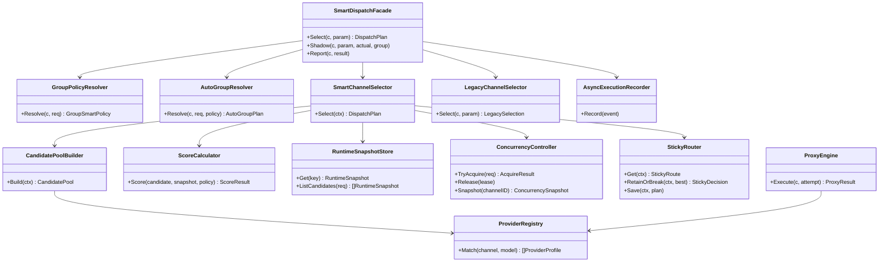
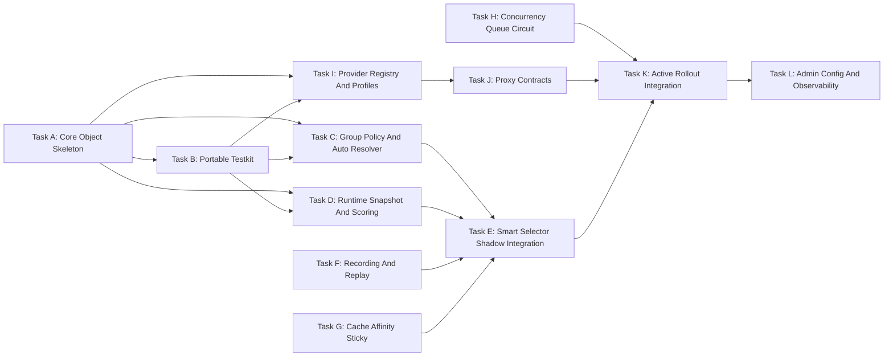

# 按分组启用的智能调度与模型代理整合方案

## 1. 背景与目标

当前项目已经具备比较完整的 AI API 网关能力，包括多上游渠道、模型映射、计费、重试、失败避让、并发冷却、性能聚合、Codex 兼容模式、`auto` 分组调度、`channel_affinity` 缓存亲和等能力。现阶段不建议直接全局替换现有主链路，而是新增一个相对独立、可插拔的智能调度与模型代理模块，在分组维度按策略开启。

本方案目标是建立：

```text
分组策略解析 -> 智能调度引擎 -> 模型代理中转 -> 上游渠道商 -> 异步观测记录
```

并与现有链路融合为：

```text
现有 middleware/controller/relay 主链路
  -> 分组策略判断 off/shadow/active
  -> off: 完全走现有渠道选择逻辑
  -> shadow: 现有逻辑真实选路，新智能调度只旁路评分记录
  -> active: 智能调度选择渠道，失败或不支持时回退现有逻辑
```

核心目标：

- 建立独立、可插拔的智能调度标准模块，默认不影响现有分组。
- 建立独立、可插拔的模型代理中转标准模块，先服务 Codex-compatible 模型扩展。
- 智能调度按分组策略开启，支持 `off`、`shadow`、`active` 三种模式。
- 兼容现有 `auto` 分组调度，默认保持当前顺序选择语义。
- 在策略开启时支持 `auto` 分组融合评分，以及非 `auto` 分组的跨分组候选融合。
- 跨分组融合必须受现有用户可用分组约束，不突破 `GetUserUsableGroups`、`GetUserAutoGroup`、`group_special_usable_group` 规则。
- 支持按 `模型 + 渠道 + 分组 + endpoint + 能力指纹` 进行多维度动态调度。
- 调度综合考虑渠道成功率、用户响应速度、渠道负载、渠道成本、分组优先级、同用户轻锁定。
- 只做 cache-aware 调度，不在网关层自建 prompt cache、semantic cache 或跨渠道 KV cache。
- 将渠道并发量、熔断、冷却、队列等待纳入统一调度模型，解决高并发下直接失败或无序重试的问题。
- 将标准 OpenAI Codex、MiMo、DeepSeek V4 Pro 纳入首批标准大模型 profile，统一支持 Codex `/v1/responses` 能力。
- 为后续更多标准大模型预留 profile 注册、能力声明、协议代理和调度评分扩展点。
- 所有调度选择、代理转换、上游尝试都可观测、可解释、可回放。

## 2. 总体架构

新增 `pkg/modelgateway` 作为相对独立的智能调度与模型代理模块，按职责拆为：

```text
pkg/modelgateway/
  core/        # 统一执行上下文、尝试上下文、结果、错误、生命周期
  policy/      # 分组策略解析、auto 分组解析、跨分组候选约束
  scheduler/   # 候选枚举、能力匹配、动态评分、轻锁定、冷却隔离、队列选择
  proxy/       # 协议桥接与模型代理中转
  provider/    # 上游渠道商 profile，描述能力、模型版本、协议特性
  recording/   # attempt 级记录、实时聚合、score breakdown、请求摘要
  integration/ # 对接现有 service.CacheGetRandomSatisfiedChannel 与 relay 链路
  testkit/     # 便携测试夹具、场景 runner、mock/fake、golden 断言
  testdata/    # 调度、auto 分组、profile、proxy 的可复用测试用例
```

与现有主链路的融合原则：

- `middleware/distributor.go`：保留当前职责。初始选路处增加智能选择器包装调用；分组策略为 `off` 或智能选择器不支持时继续调用现有 `service.CacheGetRandomSatisfiedChannel`。
- `controller/relay.go`：保留当前重试、计费、日志与响应主流程。重试选路处复用同一个智能选择器包装调用，避免初始选路和 retry 选路出现两套策略。
- `service/channel_select.go`：现有 `CacheGetRandomSatisfiedChannel`、`GetChannelFailoverPlan`、`GetConcurrencyLimitFailoverPlan` 继续作为兼容基线和 fallback。智能调度不直接删除这些函数。
- `service/group.go`：现有 `GetUserUsableGroups`、`GroupInUserUsableGroups`、`GetUserAutoGroup` 作为分组权限与 `auto` 候选源的唯一依据。
- `service/channel_concurrency.go`：现有并发租约和冷却能力作为 V1 状态源，后续在智能调度开启的分组内逐步增强为队列等待、熔断和半开探测。
- `setting/ratio_setting/group_ratio.go`：现有计费倍率继续用于计费；新增调度分组优先级必须与计费倍率解耦。
- `relay/channel/*`：保留为低层上游传输适配层。只有 MiMo、DeepSeek V4 Pro 等需要 Codex Responses 桥接的 profile 进入 `proxy` 模块。

### 2.1 面向对象封装原则

Go 没有传统 class 关键字，本方案采用“结构体 + 接口 + 组合 + 构造函数”的面向对象写法，而不是继续堆全局函数。核心要求：

- 每个核心能力必须有一个稳定对象承载状态和依赖，例如 `SmartDispatchFacade`、`DefaultSmartChannelSelector`、`DefaultGroupPolicyResolver`、`DefaultAutoGroupResolver`。
- 外部只依赖接口，内部通过构造函数注入依赖，避免调度代码直接调用散落的全局函数。
- 现有函数能力通过 Adapter 包装成对象，例如 `LegacyChannelSelector` 包装 `service.CacheGetRandomSatisfiedChannel`。
- 不把调度规则写成巨型 if/else，评分策略、候选构建、sticky、熔断、队列、provider proxy 都拆成可替换对象。
- 对象拥有自己的职责边界、输入输出和测试面，方便后续按对象做单测。
- 核心对象必须能脱离 Gin 主链路在 `testkit` 中独立构造，便于做便携回归测试。

### 2.2 对象关系总览



对象职责：

- `SmartDispatchFacade`：对现有链路暴露的门面对象，负责 `off/shadow/active` 分流、fallback、上下文回写和记录投递。
- `GroupPolicyResolver`：把全局配置、分组配置、用户分组和请求分组解析成一个 `GroupSmartPolicy`。
- `AutoGroupResolver`：封装现有 `auto` 语义，解析当前 auto 分组、起始 index、force next、cross group retry。
- `CandidatePoolBuilder`：根据分组计划、模型、endpoint、能力要求构建候选池。
- `SmartChannelSelector`：调度选择对象，串联硬过滤、评分、sticky、并发/队列判断，输出 `DispatchPlan`。
- `ScoreCalculator`：评分策略对象，支持 `balanced`、`speed_first`、`cost_first`、`stability_first` 多态替换。
- `RuntimeSnapshotStore`：运行时快照对象，只提供本地只读数据给调度链路。
- `ConcurrencyController`：并发、队列、熔断、冷却的统一对象，只在开启策略的分组内增强。
- `StickyRouter`：同用户轻锁定和 cache-aware sticky 的对象化封装。
- `ProviderRegistry`：provider profile 注册表，负责按渠道和模型匹配 `ProviderProfile`。
- `ProxyEngine`：协议代理对象，按 profile/proxy mode 执行 `NativeProxy` 或 `ResponsesViaChatProxy`。
- `LegacyChannelSelector`：旧逻辑适配器，统一封装现有 `service.CacheGetRandomSatisfiedChannel` 作为 fallback。
- `AsyncExecutionRecorder`：异步记录对象，负责 attempt 事件落库和实时指标投递。

### 2.3 Go 对象落地骨架

```go
type SmartDispatchFacade struct {
    policyResolver GroupPolicyResolver
    autoResolver   AutoGroupResolver
    selector       SmartChannelSelector
    legacySelector LegacyChannelSelector
    recorder       ExecutionRecorder
}

func NewSmartDispatchFacade(deps SmartDispatchDeps) *SmartDispatchFacade {
    return &SmartDispatchFacade{
        policyResolver: deps.PolicyResolver,
        autoResolver:   deps.AutoResolver,
        selector:       deps.Selector,
        legacySelector: deps.LegacySelector,
        recorder:       deps.Recorder,
    }
}

func (f *SmartDispatchFacade) Select(c *gin.Context, param *service.RetryParam) (*DispatchPlan, bool, *types.NewAPIError) {
    req := NewDispatchRequestFromGin(c, param)
    policy := f.policyResolver.Resolve(c, req)
    if policy.Mode == "off" {
        return nil, false, nil
    }
    if policy.Mode == "shadow" {
        return nil, false, nil
    }
    return f.selector.Select(c, param, policy)
}
```

`middleware/distributor.go` 和 `controller/relay.go` 不直接组装调度细节，只调用门面对象：

```go
plan, handled, apiErr := modelgateway.DefaultFacade.Select(c, retryParam)
if apiErr != nil {
    return nil, "", apiErr
}
if handled {
    return plan.Channel, plan.SelectedGroup, nil
}
return service.CacheGetRandomSatisfiedChannel(retryParam)
```

### 2.4 设计模式映射

- 门面模式：`SmartDispatchFacade` 对外隐藏策略解析、候选构建、评分、fallback。
- 策略模式：`ScoreCalculator` 根据 `policy.Strategy` 切换 `BalancedScorer`、`SpeedFirstScorer`、`CostFirstScorer`。
- 适配器模式：`LegacyChannelSelector` 包装现有渠道选择函数；`ChannelAffinitySignalAdapter` 包装现有 `channel_affinity`。
- 注册表模式：`ProviderRegistry` 管理 `openai_codex`、`mimo_codex_chat`、`deepseek_v4_pro_codex_chat`。
- 模板方法：`BaseProviderProfile` 提供通用错误分类、能力匹配、usage 提取，具体 profile 覆盖差异方法。
- 组合模式：`DispatchContext` 聚合 policy、auto plan、candidate pool、snapshot、sticky decision，避免在 Gin context 里塞满临时状态。

### 2.5 专门测试用例模块

新增 `pkg/modelgateway/testkit` 和 `pkg/modelgateway/testdata`，作为智能调度和模型代理的便携测试模块。目标是后续每次开发改进都能用同一套 fixture 跑回归，降低调度策略、分组融合、provider profile、proxy 转换改动带来的隐性问题。

目录建议：

```text
pkg/modelgateway/
  testkit/
    harness.go              # 组装 SmartDispatchFacade 与核心 fake/mock 对象
    scenario_runner.go      # 执行 JSON/YAML 场景用例
    golden_assert.go        # 对 score、selected channel、context 写回做 golden 断言
    fake_snapshot_store.go  # 可控 RuntimeSnapshotStore
    fake_legacy_selector.go # 可控旧逻辑 fallback
    fake_provider.go        # 可控 ProviderProfile 与上游响应
    fake_recorder.go        # 捕获 recording 事件
    replay.go               # 将线上脱敏记录转为可回放 case
  testdata/
    dispatch/
      group_off.json
      group_shadow.json
      auto_sequential.json
      auto_fusion.json
      cross_group_fusion.json
      sticky_cache_affinity.json
      queue_circuit_cooldown.json
    proxy/
      openai_codex_responses_stream.json
      mimo_responses_via_chat.json
      deepseek_v4_reasoning.json
    golden/
      dispatch/*.golden.json
      proxy/*.golden.json
```

核心对象：

```go
type DispatchTestHarness struct {
    Facade         *SmartDispatchFacade
    SnapshotStore *FakeRuntimeSnapshotStore
    Legacy        *FakeLegacyChannelSelector
    Recorder      *FakeExecutionRecorder
    Providers     *DefaultProviderRegistry
}

type DispatchScenario struct {
    Name             string
    Request          DispatchRequestFixture
    Policy           GroupSmartPolicyFixture
    AutoGroups       []string
    UsableGroups     []string
    Channels         []ChannelFixture
    RuntimeSnapshots []RuntimeSnapshotFixture
    StickyState      *StickyFixture
    Expected         DispatchExpected
}

type DispatchExpected struct {
    Handled          bool
    SelectedChannelID int
    SelectedGroup    string
    ProviderProfile  string
    ProxyMode        string
    FallbackUsed     bool
    ContextKeys      map[string]any
    ScoreBreakdown   map[string]float64
    RecordFields     map[string]any
}
```

测试模块要求：

- 所有 scenario 都是纯文件数据，尽量不依赖真实 DB、Redis、外部 API。
- `DispatchTestHarness` 通过依赖注入装配对象，不访问全局默认实例。
- 线上问题可以脱敏导出为 replay case，只保留模型、分组、渠道、耗时、错误码、分数、上下文 key，不保存 prompt 和敏感 header。
- golden 文件只记录稳定输出：最终渠道、最终分组、是否 fallback、关键 score breakdown、上下文写回、recording 事件摘要。
- 每个新 provider profile 必须补充 proxy contract case。
- 每次调整评分权重、auto 逻辑、跨分组融合、熔断/队列策略时，必须更新或确认对应 golden。

便携测试命令建议：

```bash
go test ./pkg/modelgateway/... -run 'TestPortable'
go test ./pkg/modelgateway/... -run 'TestDispatchScenarios'
go test ./pkg/modelgateway/... -run 'TestProxyContracts'
```

## 3. 核心接口

### 3.1 SmartDispatchFacade

```go
type SmartDispatchFacadeInterface interface {
    Select(c *gin.Context, param *service.RetryParam) (*DispatchPlan, bool, *types.NewAPIError)
    Shadow(c *gin.Context, param *service.RetryParam, actual *model.Channel, actualGroup string)
    Report(c *gin.Context, result *AttemptResult)
}
```

`Select` 返回值中的 `bool` 表示智能调度是否接管本次选择：

- `false`：调用方继续执行现有 `service.CacheGetRandomSatisfiedChannel`。
- `true`：使用 `DispatchPlan.Channel` 和 `DispatchPlan.SelectedGroup`。

该接口不负责替代整个 relay 执行链路，只负责“选哪个渠道、用哪个 profile、是否需要排队/熔断/降权”。

推荐实现类：

```go
type SmartDispatchFacade struct {
    policyResolver GroupPolicyResolver
    autoResolver   AutoGroupResolver
    selector       SmartChannelSelector
    legacySelector LegacyChannelSelector
    recorder       ExecutionRecorder
}
```

它是唯一被现有 `middleware/controller` 直接调用的对象。其它调度对象都通过它间接工作。

### 3.2 DefaultGroupPolicyResolver

```go
type GroupPolicyResolver interface {
    Resolve(c *gin.Context, req *DispatchRequest) GroupSmartPolicy
}

type GroupSmartPolicy struct {
    RequestedGroup       string
    UserGroup            string
    Mode                 string // off | shadow | active
    Strategy             string // balanced | speed_first | cost_first | stability_first
    AutoMode             string // auto_sequential | auto_fusion
    CrossGroupFusion     bool
    CandidateGroups      []string
    CacheAffinityEnabled bool
    QueueEnabled         bool
    CircuitBreakerEnabled bool
}
```

策略解析优先级：

1. 请求实际分组策略。
2. 用户分组 + 请求分组的组合策略。
3. 全局默认策略。
4. 未命中时固定为 `off`。

推荐实现类：

```go
type DefaultGroupPolicyResolver struct {
    settings SchedulerSettingsProvider
}
```

`DefaultGroupPolicyResolver` 只负责策略解析，不枚举渠道，不计算分数。

### 3.3 DefaultAutoGroupResolver

```go
type AutoGroupResolver interface {
    Resolve(c *gin.Context, req *DispatchRequest, policy GroupSmartPolicy) AutoGroupPlan
}

type AutoGroupPlan struct {
    RequestedGroup  string
    UserGroup       string
    CandidateGroups []string
    CurrentGroup    string
    StartIndex      int
    CrossGroupRetry bool
    ForceNextGroup  bool
    Mode            string // auto_sequential | auto_fusion
}
```

`AutoGroupResolver` 必须复用现有语义：

- `TokenGroup == "auto"` 时，候选分组来自 `service.GetUserAutoGroup(userGroup)`。
- 默认 `auto_sequential` 模式保持现有顺序分组选择行为。
- 继续尊重 `ContextKeyAutoGroup`、`ContextKeyAutoGroupIndex`、`ContextKeyAutoGroupRetryIndex`、`ContextKeyForceNextAutoGroup`、`ContextKeyTokenCrossGroupRetry`。
- 只有分组策略显式开启 `auto_fusion` 时，才把多个 auto 分组合并成一个候选池进行统一评分。

推荐实现类：

```go
type DefaultAutoGroupResolver struct {
    groupService GroupPermissionService
}
```

`GroupPermissionService` 是对现有 `service.GetUserUsableGroups`、`service.GetUserAutoGroup`、`service.GroupInUserUsableGroups` 的对象化包装，便于测试时替换。

### 3.4 DefaultSmartChannelSelector

```go
type SmartChannelSelector interface {
    Select(c *gin.Context, param *service.RetryParam, policy GroupSmartPolicy) (*DispatchPlan, bool, *types.NewAPIError)
}

type DispatchPlan struct {
    Channel         *model.Channel
    SelectedGroup   string
    RequestedGroup  string
    ProviderProfile string
    ProxyMode       string
    ScoreTotal      float64
    ScoreBreakdown  map[string]float64
    QueueWaitMs     int
    SelectedReason  string
}
```

调用方使用 `DispatchPlan` 后必须回写上下文：

- `SelectedGroup` 用于日志、计费倍率、quota 结算、失败记录。
- `TokenGroup == "auto"` 时，必须设置 `ContextKeyAutoGroup` 和对应 index。
- 非 `auto` 但开启跨分组融合时，必须保留原始 requested group，同时把真实执行分组写入 `UsingGroup/SelectedGroup` 相关上下文，确保 `helper.HandleGroupRatio` 和 `service.GetUserGroupRatio` 使用正确分组。
- 调用 `middleware.SetupContextForSelectedChannel` 前，必须已经确定最终渠道和最终执行分组。

推荐实现类：

```go
type DefaultSmartChannelSelector struct {
    candidateBuilder CandidatePoolBuilder
    snapshotStore    RuntimeSnapshotStore
    scorerFactory    ScoreCalculatorFactory
    stickyRouter     StickyRouter
    concurrency      ConcurrencyController
    providerRegistry ProviderRegistry
}
```

`DefaultSmartChannelSelector` 本身不保存长期统计数据，只读取 `RuntimeSnapshotStore`，把状态写入交给 `Report` 和 recorder。

### 3.5 DefaultDispatchEngine

```go
type DispatchEngine interface {
    Select(ctx context.Context, exec *ExecutionContext) (*DispatchPlan, *types.NewAPIError)
    Report(ctx context.Context, result *AttemptResult)
}
```

`Select` 只允许读取本地实时快照，不允许在主请求链路同步访问 Redis 或数据库。

`Report` 接收 attempt 结果，用于触发本地状态更新、失败降权、轻锁定清理或续期。

推荐实现类：

```go
type DefaultDispatchEngine struct {
    candidateBuilder CandidatePoolBuilder
    scorerFactory    ScoreCalculatorFactory
    snapshotStore    RuntimeSnapshotStore
    stickyRouter     StickyRouter
}
```

`DispatchEngine` 是 selector 内部的纯调度对象，便于后续从 Gin 中剥离做单元测试。

### 3.6 DefaultProxyEngine

```go
type ProxyEngine interface {
    Execute(c *gin.Context, attempt *AttemptContext) (*ProxyResult, *types.NewAPIError)
}
```

`proxy` 层负责协议中转，不负责调度决策。

推荐实现类：

```go
type DefaultProxyEngine struct {
    registry ProviderRegistry
    clients  UpstreamClientFactory
}
```

`DefaultProxyEngine` 根据 `DispatchPlan.ProviderProfile` 和 `DispatchPlan.ProxyMode` 选择具体代理对象。

### 3.7 ProviderProfile 对象族

```go
type ProviderProfile interface {
    Name() string
    Match(channel *model.Channel) bool
    Capabilities(channel *model.Channel, model string) CapabilitySet
    BuildUpstreamRequest(*AttemptContext) (*UpstreamRequest, error)
    TranslateResponse(*AttemptContext, *http.Response) (*ProxyResult, *types.NewAPIError)
    HandleUpstreamError(*AttemptContext, error) *types.NewAPIError
}
```

`HandleUpstreamError` 用于统一包装上游连接错误、超时、流式中断、特殊 header 错误信息。

推荐对象族：

```go
type BaseProviderProfile struct {
    name         string
    family       string
    capabilities CapabilitySet
}

type OpenAICodexProfile struct {
    BaseProviderProfile
}

type MiMoCodexChatProfile struct {
    BaseProviderProfile
}

type DeepSeekV4ProCodexChatProfile struct {
    BaseProviderProfile
}
```

公共能力放在 `BaseProviderProfile`，差异点由具体 profile 覆盖。

### 3.8 DefaultProviderRegistry

所有标准大模型通过 `ProviderRegistry` 注册，调度和代理层不直接写死某个模型或渠道。

```go
type ProviderRegistry interface {
    Register(profile ProviderProfile)
    Match(channel *model.Channel, model string) []ProviderProfile
    Get(name string) (ProviderProfile, bool)
}
```

首批注册 profile：

```text
openai_codex
mimo_codex_chat
deepseek_v4_pro_codex_chat
```

后续接入更多标准大模型时，新增对应 `ProviderProfile` 并声明能力即可。

推荐实现类：

```go
type DefaultProviderRegistry struct {
    profiles []ProviderProfile
}
```

注册发生在模块初始化阶段，调度和代理执行阶段只读 registry。

## 4. 调度引擎设计

### 4.0 评分时机

智能调度采用“后台预聚合 + 请求时动态评分”的组合方式。

- 后台线程或异步 worker 负责采集并刷新本地 `RuntimeSnapshotStore`，包括成功率、TTFT、TPS、并发量、队列深度、熔断状态、冷却状态、成本倍率和 cache affinity 统计。
- 用户请求进入时，`SmartChannelSelector.Select` 基于当前请求的模型、分组、endpoint、能力要求和本地快照做一次轻量动态评分。
- 请求链路内不访问数据库，不同步访问 Redis，不做复杂历史聚合。
- `shadow` 模式下也执行同样评分，但只记录智能调度建议，不改变现有真实选路。
- `active` 模式下才使用评分结果作为真实渠道选择。

这样既能让调度选择响应实时负载与失败率变化，又不会把评分计算做成全局后台固定排序，避免不同请求能力、分组、成本策略和缓存亲和被提前抹平。

### 4.1 调度最小维度

调度和统计以以下维度作为最小单元：

```text
requested_model + upstream_model + channel_id + group + endpoint_type + capability_fingerprint
```

这样可以避免只按渠道全局均值调度导致的误判。例如同一渠道的不同模型表现不同，或者同一模型在 tool call / non-tool call 场景表现不同，都可以被独立统计和降权。

### 4.2 分组候选解析

智能调度必须先解析“本次请求允许在哪些分组里选择渠道”，再枚举渠道候选。分组候选永远不能突破用户授权范围。

#### 普通分组

当 `TokenGroup != "auto"` 时，默认候选只有当前分组：

```text
candidate_groups = [requested_group]
```

如果该分组策略开启 `cross_group_fusion`，则候选分组为：

```text
candidate_groups =
  policy.candidate_groups
  ∩ service.GetUserUsableGroups(userGroup)
```

同时必须满足：

- `requested_group` 本身必须是用户可用分组，或等于用户自身分组。
- `policy.candidate_groups` 为空时，不做跨分组扩大。
- 被 `group_special_usable_group` 移除的分组不得重新进入候选。
- 选择到非 requested group 时，日志和记录必须同时保留 `requested_group` 与 `selected_group`。
- 计费结算使用最终 `selected_group` 的组间倍率，但审计记录需要保留跨分组来源。

#### auto 分组默认兼容

当 `TokenGroup == "auto"` 且策略未开启 `auto_fusion` 时，保持当前顺序选择语义：

```text
auto_groups = service.GetUserAutoGroup(userGroup)
start_index = ContextKeyAutoGroupIndex or current ContextKeyAutoGroup
按 auto_groups 顺序选择当前分组内满足条件的渠道
当前分组没有可用渠道时再进入下一个 auto 分组
```

该模式称为 `auto_sequential`，是 V1 默认模式，也是兼容基线。它应尽量复用现有 `service.CacheGetRandomSatisfiedChannel` 的行为，智能调度只做 shadow 记录或在同一分组内做排序增强。

#### auto 分组融合评分

当 `TokenGroup == "auto"` 且分组策略显式开启 `auto_fusion` 时，智能调度可以把多个 auto 分组融合为一个候选池：

```text
candidate_groups = service.GetUserAutoGroup(userGroup)
```

再按 `模型 + 渠道 + 分组 + endpoint + 能力指纹` 进行统一评分。

融合模式规则：

- 候选分组仍然只能来自 `GetUserAutoGroup(userGroup)`。
- `ContextKeyForceNextAutoGroup` 为 true 时，优先尊重现有“切到后续分组”的 retry 语义，可从当前 index 之后的 auto 分组开始融合。
- `ContextKeyTokenCrossGroupRetry` 为 false 时，retry 不应主动跳过当前已选 auto 分组，除非当前分组没有可用候选或触发并发/熔断/冷却。
- 选择完成后必须写回 `ContextKeyAutoGroup` 和 `ContextKeyAutoGroupIndex`。
- `selected_group` 进入计费、日志、quota、失败记录，`requested_group` 保持为 `auto`。

#### 与现有 auto 逻辑的融合边界

V1 不删除现有 `auto` 调度逻辑，而是在智能调度入口按策略分流：

```text
off:
  直接调用 service.CacheGetRandomSatisfiedChannel

shadow:
  先调用 service.CacheGetRandomSatisfiedChannel 得到真实渠道
  再调用 SmartChannelSelector.Shadow 计算建议渠道并记录差异

active + auto_sequential:
  复用 AutoGroupResolver 得到当前 auto 分组
  在当前分组内智能评分
  当前分组不可用时再按现有顺序进入后续 auto 分组

active + auto_fusion:
  将允许的 auto 分组融合成候选池统一评分
  失败时回退 service.CacheGetRandomSatisfiedChannel
```

### 4.3 硬过滤

候选渠道先经过硬过滤，再参与评分。

硬过滤条件：

- 渠道禁用。
- 模型不支持。
- endpoint 不支持。
- Codex 工具能力不满足。
- 上游协议 profile 不匹配。
- 失败避让激活。
- 限流冷却激活。
- 强制隔离激活。
- 熔断打开。
- 当前并发达到上限且不允许排队。
- 队列已满或预计等待时间超过请求允许等待时间。

硬过滤失败的渠道不参与 `TotalScore` 计算。

### 4.4 默认评分公式

所有子分数标准化为 `0.0 ~ 1.0`。

```text
TotalScore =
  SuccessScore * 0.32 +
  SpeedScore   * 0.28 +
  LoadScore    * 0.20 +
  CostScore    * 0.15 +
  GroupScore   * 0.05
```

默认策略为 `balanced`。后续可扩展：

- `speed_first`：提高 `SpeedScore` 权重。
- `cost_first`：提高 `CostScore` 权重。
- `stability_first`：提高 `SuccessScore` 权重。

### 4.5 SuccessScore

成功率按 `模型 + 渠道 + 分组 + endpoint + 能力指纹` 统计。

统计窗口：

- `1m`：快速感知故障和限流。
- `5m`：主评分窗口。
- `30m`：冷启动和低样本兜底。

计为失败的情况：

- 上游 5xx。
- 上游 429。
- 网络错误。
- 协议转换失败。
- 流式中断。
- 上游返回无法解析的响应。

不计入渠道失败率的情况：

- 客户端参数错误。
- 用户余额不足。
- 用户权限不足。
- 客户端主动断开且上游未报错。

连续失败进行指数降权，连续成功逐步恢复。

### 4.6 SpeedScore

速度评分关注用户实际体验。

流式请求：

```text
SpeedScore = TTFTScore * 0.70 + TPSScore * 0.30
```

非流式请求：

```text
SpeedScore = DurationScore
```

记录指标：

- `ttft_ms`：首 token / 首事件耗时。
- `duration_ms`：完整请求耗时。
- `tokens_per_second`：输出速率。

低样本回退顺序：

1. `ModelExecutionRecord` 近期数据。
2. `PerfMetric` 聚合数据。
3. `Channel.ResponseTime`。
4. 系统默认值。

### 4.7 LoadScore

负载评分用于避免所有请求压向当前最快渠道。

输入指标：

- 当前活跃并发。
- 渠道最大并发。
- `active_concurrency / max_concurrency`。
- 当前等待队列长度。
- 队列预计等待时间。
- 最近 429 密度。
- 最近并发冷却次数。
- 请求排队或租约获取失败次数。
- 熔断状态与半开探测状态。

并发未达到上限但负载较高时降分。并发达到上限时先进入队列策略判断：允许短等待且队列有容量时进入等待队列，否则硬过滤并尝试其他候选渠道。

### 4.8 并发、队列、熔断与冷却

并发控制在智能调度开启的分组内从单纯的 `TryAcquireChannelConcurrency` 增强为统一 `ConcurrencyController`。未开启智能调度的分组继续使用现有并发限制逻辑。

```go
type ConcurrencyController interface {
    TryAcquire(ctx context.Context, req *AcquireRequest) (*AcquireResult, error)
    Release(lease *ChannelLease)
    Report(result *AttemptResult)
    Snapshot(channelID int) ConcurrencySnapshot
}
```

`TryAcquire` 的结果分为：

```text
acquired       # 已获得并发租约，可立即请求上游
queued         # 已进入等待队列，等待租约
rejected       # 队列满、超时、熔断或策略拒绝
cooldown       # 渠道正在冷却
circuit_open   # 渠道熔断打开
```

#### 并发量

每个渠道维护以下状态：

- `active_concurrency`：当前正在执行的上游请求数。
- `max_concurrency`：渠道配置的最大并发。
- `load_ratio`：`active_concurrency / max_concurrency`。
- `inflight_by_model`：按模型拆分的执行中请求数。
- `inflight_by_group`：按分组拆分的执行中请求数。

当 `active_concurrency < max_concurrency` 时直接发放租约；当达到上限时进入队列策略。

#### 队列等待

队列用于解决瞬时并发过高时“直接失败或过度切换”的问题。

队列维度：

```text
channel_id + requested_model + endpoint_type
```

默认策略：

- 仅对非实时短等待启用。
- 默认最大等待时间 `2s`。
- 默认队列长度 `min(max_concurrency * 2, 64)`。
- 客户端断开时立即退出队列。
- 流式请求可以等待租约，但一旦开始输出就不再重试。

队列排序：

- 同用户轻锁定命中的请求优先。
- 高分组优先级请求优先。
- 等待时间越长优先级逐步提升，避免饥饿。
- 已经重试过的请求优先级略低，避免挤压新请求。

队列出队条件：

- 有并发租约释放。
- 请求等待超时。
- 上下文取消。
- 渠道进入熔断或冷却。

排队失败后，scheduler 可以继续尝试其他候选渠道；如果所有候选都队列满或不可用，再返回限流错误。

#### 熔断

熔断用于处理渠道在短时间内连续失败、429 激增或流式中断激增的情况。

状态：

```text
closed    # 正常
open      # 熔断打开，硬过滤
half_open # 半开探测，只允许少量探测请求
```

触发条件：

- 最近 `1m` 失败率超过阈值且样本数达到最小要求。
- 连续失败次数超过阈值。
- 429 密度超过阈值。
- 流式中断连续出现。
- 上游连接错误或超时连续出现。

恢复策略：

- `open` 持续一个冷却周期后进入 `half_open`。
- `half_open` 只允许少量探测请求。
- 探测成功达到阈值后恢复 `closed`。
- 探测失败立即回到 `open`，并指数增加冷却时间。

#### 冷却

冷却用于处理明确的限流、并发限制或熔断后的暂停窗口。

冷却来源：

- 上游 `429`。
- `retry-after` 或等价 header。
- 本地并发学习判断。
- 熔断打开后的暂停窗口。
- 连续失败避让。

冷却期间渠道被硬过滤，不参与评分，也不允许排队。

#### V1 落地边界

V1 阶段先把现有 `TryAcquireChannelConcurrency`、`IsChannelConcurrencyFull`、`getChannelConcurrencyCooldownSet` 纳入智能调度快照，避免改动过大。

增强顺序：

1. `shadow` 模式记录并发满、冷却、失败避让对智能评分的影响。
2. `active` 分组内启用智能硬过滤，但并发租约仍由现有 relay 执行前获取。
3. 对明确开启 `queue_enabled` 的分组启用短等待队列。
4. 对明确开启 `circuit_breaker_enabled` 的分组启用熔断与半开探测。

这样不会改变未开启智能调度分组的并发行为，也能避免队列和熔断一次性侵入所有渠道。

### 4.9 CostScore

成本评分只在可用且稳定的候选之间参与排序，不允许让明显不稳定渠道因低成本优先。

成本来源：

1. 渠道配置中的 `channel_cost_ratio`。
2. 现有模型价格/倍率体系。
3. 默认成本系数 `1.0`。

成本越低，`CostScore` 越高。

### 4.10 GroupScore

新增 `scheduler_setting.group_priority_ratio`，用于表达分组调度优先级。

该配置与现有计费 `group_ratio` 解耦，避免“计费倍率”直接影响“调度优先级”。

分组优先级用于调度排序，不改变用户分组权限，也不改变账单倍率。跨分组融合时，`GroupScore` 可用于表达运营希望优先使用哪个执行分组。

### 4.11 同用户轻锁定

轻锁定用于短时间内保持同用户同模型的渠道稳定，提升连续请求体验和上游缓存命中概率。

锁定 key：

```text
user_id/token_id + group + model + endpoint + capability_fingerprint
```

跨分组融合开启时，`group` 使用最终 `selected_group`；如果请求来自 `auto`，则额外保留 `requested_group=auto` 作为审计维度。这样可以避免用户在不同实际执行分组之间被过度粘住。

默认 TTL：`180s`。

存储策略：

- 本地 cache 优先。
- Redis 仅作为多节点兜底。
- 调度主链路优先读本地，不同步等待 Redis。

保留锁定条件：

- 锁定渠道仍支持当前模型与能力。
- 锁定渠道未进入失败避让。
- 锁定渠道未进入 cooldown。
- 锁定渠道并发未满，或允许在可接受时间内排队。
- 锁定渠道未熔断。
- 锁定渠道分数 `>= bestScore * 0.85`。

打破锁定条件：

- 渠道禁用。
- 能力不匹配。
- 并发已满且队列不可用或预计等待过长。
- 失败避让或 cooldown 激活。
- 熔断打开。
- 成功率明显下降。
- TTFT 或总耗时明显变差。
- 分数落后最佳候选超过 `15%`。

### 4.12 Cache-Aware 调度

本项目 V1 不自建 prompt cache、response cache、semantic cache，也不尝试跨渠道复用上游 KV cache。调度器只识别请求中的缓存语义，并尽量保持同一渠道，以保护上游 Provider 自身的 prompt/KV cache 命中。

缓存语义信号：

- `prompt_cache_key`。
- `previous_response_id`。
- Codex / Claude / CLI 会话 header。
- `session_id`、`conversation_id` 等可配置字段。
- 现有 `channel_affinity` 规则命中的 key。

处理原则：

- 将现有 `channel_affinity` 抽象为 `CacheAffinitySignal`。
- 命中缓存语义时，提高 sticky 保留优先级。
- 如果原渠道健康、未冷却、未熔断、并发可用或可短等待，则优先保留原渠道。
- 如果原渠道进入熔断、冷却、失败避让、并发不可用或明显变慢，则允许切换渠道。
- 切换渠道时记录缓存亲和被打破的原因，因为上游缓存大概率无法跨渠道命中。

与普通 sticky 的区别：

- 普通 sticky 主要面向同用户短时间稳定体验。
- cache-aware sticky 主要面向上游 prompt/KV cache 命中。
- cache-aware sticky 的保留阈值更强，默认要求锁定渠道分数 `>= bestScore * 0.75` 即可保留。
- 健康状态和能力匹配仍然高于缓存亲和。

该设计复用现有 `channel_affinity` 能力：当前项目已经支持 `/v1/responses` 的 `prompt_cache_key` 亲和，并会统计 cached tokens 命中情况。智能调度模块只将其提升为 scheduler 的标准输入信号。

## 5. RuntimeSnapshotStore

调度器只读取本地 `RuntimeSnapshotStore`。

```go
type RuntimeSnapshotStore interface {
    Get(key RuntimeKey) RuntimeSnapshot
    ListCandidates(req *DispatchRequest) []RuntimeSnapshot
}
```

快照来源：

- `ModelExecutionRecord` 近期数据。
- 现有 `PerfMetric`。
- `Channel.ResponseTime`。
- 当前活跃并发。
- 当前等待队列长度。
- 队列预计等待时间。
- 熔断状态。
- 并发冷却状态。
- 失败避让状态。
- 轻锁定状态。
- cache affinity 状态。
- cached token 命中统计。

刷新策略：

- 本地内存快照每 `500ms` 更新一次。
- Redis 可用时异步同步跨节点状态。
- Redis 不可用时本地继续工作。
- DB 仅用于历史恢复和长期分析，不参与同步调度路径。

## 6. Proxy 与 Provider 设计

### 6.1 Proxy 类型

```text
NativeProxy
ResponsesViaChatProxy
ChatViaResponsesProxy
```

- `NativeProxy`：原生协议直通，适用于已有 OpenAI Codex、OpenAI/Claude/Gemini/DeepSeek Chat 等常规请求。
- `ResponsesViaChatProxy`：Codex `/v1/responses` 转 Chat Completions，用于 MiMo、DeepSeek V4 Pro 等 Chat-only 上游。
- `ChatViaResponsesProxy`：保留现有反向兼容能力，用于 Chat 请求走 Responses 上游。

### 6.2 ProxyResult

```go
type ProxyResult struct {
    Usage             *dto.Usage
    ResponseModel     string
    ReasoningContent  string
    StreamInterrupted bool
    DeliveredTokens   int
}
```

`ReasoningContent` 用于抹平不同上游的 reasoning/thinking 字段差异。

### 6.3 标准大模型 Profile 规范

每个标准大模型 profile 必须声明：

- `profile_name`：稳定唯一名称。
- `provider_family`：如 `openai`、`mimo`、`deepseek`。
- `model_patterns`：支持的模型名或模型前缀。
- `wire_protocol`：原生协议，如 `responses`、`chat_completions`、`claude_messages`。
- `proxy_modes`：可用代理模式，如 `native`、`responses_via_chat`。
- `capabilities`：输入输出模态、tool call、web search、reasoning、image generation、streaming。
- `cost_profile`：成本系数或成本回退策略。
- `failure_classifier`：429、5xx、流式中断、协议错误的归类方式。

调度层只读取 profile 的能力声明和运行时状态，不理解具体协议细节；协议细节全部交给 proxy/provider 层。

### 6.4 OpenAI Codex Profile

OpenAI Codex 作为标准大模型 profile 纳入网关，不再只作为零散的特殊渠道逻辑存在。

建议 profile 名称：

```text
openai_codex
```

承载方式：

- 复用现有 `ChannelTypeCodex` 和 `APITypeCodex`。
- 支持原生 `/backend-api/codex/responses`。
- 支持 `/backend-api/codex/responses/compact`。
- 作为 Codex Responses 原生能力的基准 profile。

能力：

- 原生 Codex `/v1/responses`。
- 原生 Responses stream。
- Responses compact。
- Codex tool capability 声明。
- Codex image generation tool 能力探测结果接入 capability set。
- 作为其它 Codex-compatible profile 的对照基准，用于测试 MiMo/DeepSeek 桥接行为。

调度要求：

- `openai_codex` 与 `mimo_codex_chat`、`deepseek_v4_pro_codex_chat` 一样进入 scheduler 候选集。
- 同样记录成功率、TTFT、TPS、负载、成本、队列、熔断、冷却、sticky 命中。
- 原生 Codex Responses 支持优先通过 `NativeProxy` 执行，不走 `ResponsesViaChatProxy`。
- 当用户请求需要原生 Codex 特有能力且其它 profile 不支持时，只允许匹配 `openai_codex`。

### 6.5 MiMo Profile

MiMo V1 作为 OpenAI-compatible channel + `proxy_profile` 接入，不新增独立 `ChannelType`。

建议 profile 名称：

```text
mimo_codex_chat
```

能力：

- OpenAI-compatible Chat。
- Codex Responses via Chat。
- `reasoning_content` 回传。
- MiMo `web_search` 工具映射。

### 6.6 DeepSeek V4 Pro Profile

DeepSeek V4 Pro 复用现有 DeepSeek 渠道。

建议 profile 名称：

```text
deepseek_v4_pro_codex_chat
```

能力：

- V4 thinking suffix 解析。
- Responses via Chat。
- reasoning/thinking 标准化输出。
- 保持现有 DeepSeek Chat / Claude 路径兼容。

### 6.7 后续标准大模型扩展

后续新增标准大模型时，不直接修改调度主逻辑，而是按以下步骤扩展：

1. 新增 `ProviderProfile`。
2. 声明模型匹配规则和能力集。
3. 选择 `NativeProxy` 或新增 proxy mode。
4. 实现请求构造、响应转换、错误分类。
5. 加入 profile registry。
6. 增加 profile 级调度、流式、tool、reasoning 测试。

候选 profile 示例：

- OpenAI-compatible coding models。
- Claude coding / computer-use 类模型。
- Gemini coding 类模型。
- Moonshot/Kimi coding 类模型。
- Doubao/VolcEngine coding 类模型。
- 其它支持 Responses 或可桥接到 Responses 的模型。

### 6.8 参考开源项目的策略

参考 `7as0nch/mimo2codex` 的协议映射行为，但不直接并入其代码。

理由：

- 当前需求不是 MiMo 单点兼容，而是要把 MiMo、DeepSeek V4 Pro、OpenAI Codex 和后续标准大模型纳入统一 profile 体系。
- 需要与现有计费、调度、重试、日志、冷却、分组和 `auto` 体系做受控融合。
- 自主实现更容易保持项目内 Go 风格、接口边界和测试覆盖一致，同时避免引入难以维护的外部协议分叉。

## 7. 流式异常与计费

定义专用错误：

```go
var ErrUpstreamStreamInterrupted = errors.New("upstream stream interrupted")
```

当上游已经输出部分 token 后发生 EOF、连接断开、429、5xx 或协议错误：

- 不做 controller 层重试，因为客户端已经收到部分数据。
- attempt 记录为失败。
- scheduler 对该 `模型 + 渠道` 维度降权。
- `ProxyResult.StreamInterrupted = true`。
- `ProxyResult.DeliveredTokens` 记录已成功推送的 token 数量。
- 计费按已成功推送 token 截断结算。

## 8. 数据记录与观测

### 8.1 ModelExecutionRecord

新增 attempt 级记录表：

```text
id
created_at
request_id
attempt_index
user_id
token_id
requested_group
using_group
selected_group
requested_model
billing_model
upstream_model
response_model
channel_id
channel_type
channel_name
endpoint_type
capability_fingerprint
proxy_profile
proxy_mode
provider_profile
is_stream
success
status_code
error_code
error_type
duration_ms
ttft_ms
tokens_per_second
delivered_tokens
active_concurrency
max_concurrency
load_ratio
queue_wait_ms
queue_depth
queue_rejected
circuit_state
cooldown_remaining_ms
estimated_cost
cost_ratio
score_total
score_breakdown
policy_mode
auto_mode
cross_group_fusion
candidate_groups
sticky_key_fp
sticky_hit
sticky_retained
cache_affinity_key_fp
cache_affinity_hit
cache_affinity_retained
cache_affinity_broken_reason
cached_tokens
prompt_cache_hit_tokens
stream_interrupted
request_meta
```

`request_meta` 只保存：

- 模型版本。
- 工具类型。
- 推理模式。
- 协议模式。
- 是否 Codex-like 请求。
- 是否 Responses via Chat。
- provider profile 名称。
- 是否命中 cache-aware 调度信号。

不保存原始 prompt，不保存敏感 header，不保存完整请求正文。

### 8.2 异步 recording

`recording` 模块使用异步队列 + worker pool。

原则：

- 主链路只投递事件，不同步落库。
- 队列满时允许采样普通成功请求。
- 失败、429、流式中断、协议转换失败必须保留。
- worker 写入失败时记录系统日志，不阻塞请求。

### 8.3 Log 与 PerfMetric

现有 `Log` 和 `PerfMetric` 保留。

`Log.Other.admin_info` 增加：

```text
gateway.dispatch.score_breakdown
gateway.dispatch.runtime_snapshot
gateway.dispatch.selected_reason
gateway.proxy.profile
gateway.proxy.mode
gateway.attempts
gateway.sticky
gateway.cache_affinity
```

`PerfMetric` 继续服务模型广场和历史聚合；调度实时读取以 `RuntimeSnapshotStore` 为主。

## 9. 配置设计

新增 `scheduler_setting`：

```json
{
  "enabled": false,
  "default_mode": "off",
  "rollout_percent": 0,
  "default_strategy": "balanced",
  "snapshot_refresh_ms": 500,
  "sticky_ttl_seconds": 180,
  "sticky_keep_score_ratio": 0.85,
  "cache_affinity_enabled": true,
  "cache_affinity_keep_score_ratio": 0.75,
  "queue_enabled": true,
  "queue_default_timeout_ms": 2000,
  "queue_max_depth_per_channel": 64,
  "queue_depth_multiplier": 2,
  "circuit_breaker_enabled": true,
  "circuit_failure_threshold": 0.5,
  "circuit_min_samples": 10,
  "circuit_open_seconds": 30,
  "circuit_half_open_probe_count": 3,
  "cooldown_max_seconds": 600,
  "success_weight": 0.32,
  "speed_weight": 0.28,
  "load_weight": 0.20,
  "cost_weight": 0.15,
  "group_weight": 0.05,
  "group_priority_ratio": {},
  "group_policies": {
    "codex-pro": {
      "mode": "shadow",
      "strategy": "balanced",
      "auto_mode": "auto_sequential",
      "cross_group_fusion": false,
      "candidate_groups": [],
      "cache_affinity_enabled": true,
      "queue_enabled": false,
      "circuit_breaker_enabled": false
    },
    "auto": {
      "mode": "shadow",
      "strategy": "balanced",
      "auto_mode": "auto_sequential",
      "cross_group_fusion": false,
      "candidate_groups": [],
      "cache_affinity_enabled": true,
      "queue_enabled": false,
      "circuit_breaker_enabled": false
    }
  },
  "failure_fast_window_seconds": 60,
  "failure_main_window_seconds": 300,
  "failure_fallback_window_seconds": 1800
}
```

配置原则：

- `enabled=false` 时整个智能调度模块不参与真实选路，也不做 shadow。
- `enabled=true` 但分组未配置时，分组默认 `off`。
- `default_mode` 必须默认为 `off`，避免升级后无意影响现有分组。
- `group_policies.<group>.mode=shadow` 时，真实选路仍为旧逻辑，只记录智能建议。
- `group_policies.<group>.mode=active` 时，该分组真实使用智能调度；智能调度不可用时回退旧逻辑。
- `auto_mode` 默认 `auto_sequential`，只有显式设置 `auto_fusion` 才允许融合 auto 分组。
- `candidate_groups` 只表达策略希望参与融合的分组，最终候选必须与 `service.GetUserUsableGroups(userGroup)` 求交集。
- `queue_enabled`、`circuit_breaker_enabled` 均按分组开启，不做全局默认打开。

跨分组融合示例：

```json
{
  "group_policies": {
    "vip": {
      "mode": "active",
      "strategy": "balanced",
      "cross_group_fusion": true,
      "candidate_groups": ["vip", "svip-lowcost", "codex-pro"],
      "cache_affinity_enabled": true,
      "queue_enabled": true,
      "circuit_breaker_enabled": true
    },
    "auto": {
      "mode": "active",
      "auto_mode": "auto_fusion",
      "strategy": "speed_first",
      "cache_affinity_enabled": true,
      "queue_enabled": true,
      "circuit_breaker_enabled": true
    }
  }
}
```

实际候选计算：

```text
vip 请求:
  candidate_groups = ["vip", "svip-lowcost", "codex-pro"] ∩ GetUserUsableGroups(userGroup)

auto 请求:
  candidate_groups = GetUserAutoGroup(userGroup)
```

扩展 `ChannelOtherSettings`：

```go
type ChannelDispatchSettings struct {
    ProxyProfile       string             `json:"proxy_profile,omitempty"`
    ChannelCostRatio   float64            `json:"channel_cost_ratio,omitempty"`
    GroupPriorityRatio map[string]float64 `json:"group_priority_ratio,omitempty"`
    QueueEnabled       *bool              `json:"queue_enabled,omitempty"`
    QueueTimeoutMs     int                `json:"queue_timeout_ms,omitempty"`
    QueueMaxDepth      int                `json:"queue_max_depth,omitempty"`
    CircuitEnabled     *bool              `json:"circuit_enabled,omitempty"`
    CircuitOpenSeconds int                `json:"circuit_open_seconds,omitempty"`
    CostBias           float64            `json:"cost_bias,omitempty"`
    SpeedBias          float64            `json:"speed_bias,omitempty"`
    StickyEligible     *bool              `json:"sticky_eligible,omitempty"`
}
```

## 10. 多任务开发拆分

为了支持多人或多 worker 并行开发，实施时按任务包拆分。每个任务包有明确写入范围，避免多个任务同时改同一批文件导致冲突。

### 10.1 任务依赖图



### 10.2 任务包定义

#### Task A：核心对象骨架

写入范围：

- `pkg/modelgateway/core`
- `pkg/modelgateway/integration`
- `pkg/modelgateway/policy` 的接口定义
- `setting` 中 `scheduler_setting` 的基础结构

交付物：

- `SmartDispatchFacade`
- `SmartDispatchDeps`
- `DispatchRequest`
- `DispatchPlan`
- `AttemptResult`
- `LegacyChannelSelector`
- `GroupPermissionService`
- 默认 no-op 实现，确保不改变现有链路

依赖：无。

验收：

- 默认 `enabled=false` 时没有行为变化。
- 对象可通过构造函数装配，不依赖全局 mutable 状态。

#### Task B：便携测试模块

写入范围：

- `pkg/modelgateway/testkit`
- `pkg/modelgateway/testdata`

交付物：

- `DispatchTestHarness`
- `FakeRuntimeSnapshotStore`
- `FakeLegacyChannelSelector`
- `FakeExecutionRecorder`
- scenario runner
- golden assertion
- 首批 dispatch/proxy fixture

依赖：Task A 的核心类型。

验收：

```bash
go test ./pkg/modelgateway/... -run 'TestPortable|TestDispatchScenarios|TestProxyContracts'
```

#### Task C：分组策略与 auto resolver

写入范围：

- `pkg/modelgateway/policy`
- `pkg/modelgateway/testdata/dispatch`

交付物：

- `DefaultGroupPolicyResolver`
- `DefaultAutoGroupResolver`
- `auto_sequential`
- `auto_fusion`
- `cross_group_fusion`
- 对现有 `GetUserUsableGroups`、`GetUserAutoGroup`、`GroupInUserUsableGroups` 的适配

依赖：Task A、Task B。

验收：

- `group_off`
- `group_shadow`
- `auto_sequential`
- `auto_fusion`
- `cross_group_fusion`

#### Task D：运行时快照与评分策略

写入范围：

- `pkg/modelgateway/scheduler`
- `pkg/modelgateway/core`
- `pkg/modelgateway/testdata/dispatch`

交付物：

- `RuntimeSnapshotStore`
- `DefaultRuntimeSnapshotStore`
- `ScoreCalculator`
- `BalancedScorer`
- `SpeedFirstScorer`
- `CostFirstScorer`
- `StabilityFirstScorer`
- 成功率、速度、负载、成本、分组优先级评分

依赖：Task A、Task B。

验收：

- 评分不访问 Redis/DB。
- 同一 fixture 输出稳定 `score_breakdown`。

#### Task E：Smart selector shadow 接入

写入范围：

- `pkg/modelgateway/scheduler`
- `pkg/modelgateway/integration`
- `middleware/distributor.go`
- `controller/relay.go`

交付物：

- `DefaultSmartChannelSelector`
- `SmartDispatchFacade.Select`
- `Shadow` 记录入口
- 初始选路与 retry 选路的包装调用
- `off` 和 `shadow` 模式真实路径仍走旧逻辑

依赖：Task A、Task C、Task D、Task F。

验收：

- shadow 模式不改变真实渠道。
- old selector fallback 始终可用。

#### Task F：记录、观测与 replay

写入范围：

- `pkg/modelgateway/recording`
- `model` 中 `ModelExecutionRecord`
- `pkg/modelgateway/testkit/replay.go`

交付物：

- `AsyncExecutionRecorder`
- `ModelExecutionRecord` migration
- attempt 事件队列
- replay 脱敏导出/导入
- `Log.Other.admin_info` 的调度摘要

依赖：Task A、Task B。

验收：

- 落库失败不阻塞请求。
- replay case 不包含 prompt、敏感 header 或完整请求正文。

#### Task G：Cache affinity 与 sticky router

写入范围：

- `pkg/modelgateway/scheduler`
- `service/channel_affinity.go` 的适配层，不直接重写现有逻辑
- `pkg/modelgateway/testdata/dispatch`

交付物：

- `StickyRouter`
- `CacheAffinitySignalAdapter`
- sticky retain/break 规则
- `prompt_cache_key`、`previous_response_id`、session/conversation 信号提取

依赖：Task A、Task B、Task D。

验收：

- cache-aware sticky 能保留健康渠道。
- 渠道熔断、冷却、能力不匹配时能打破 sticky。

#### Task H：并发、队列、熔断、冷却

写入范围：

- `pkg/modelgateway/scheduler`
- `service/channel_concurrency.go` 的适配层
- `pkg/modelgateway/testdata/dispatch`

交付物：

- `ConcurrencyController`
- `QueueManager`
- `CircuitBreaker`
- `CooldownState`
- 对现有并发满与冷却状态的快照化接入

依赖：Task A、Task B、Task D。

验收：

- 未开启 `queue_enabled`、`circuit_breaker_enabled` 的分组行为不变。
- 队列等待取消、超时、出队无资源泄露。

#### Task I：Provider registry 与 profile 对象

写入范围：

- `pkg/modelgateway/provider`
- `pkg/modelgateway/core`
- `pkg/modelgateway/testdata/proxy`

交付物：

- `DefaultProviderRegistry`
- `BaseProviderProfile`
- `OpenAICodexProfile`
- `MiMoCodexChatProfile`
- `DeepSeekV4ProCodexChatProfile`
- capability fingerprint 生成

依赖：Task A、Task B。

验收：

- 三个首批 profile 可按渠道、模型、endpoint 匹配。
- 新 profile 不需要修改 scheduler 主逻辑。

#### Task J：Proxy engine 与协议契约

写入范围：

- `pkg/modelgateway/proxy`
- `pkg/modelgateway/provider`
- `pkg/modelgateway/testdata/proxy`

交付物：

- `DefaultProxyEngine`
- `NativeProxy`
- `ResponsesViaChatProxy`
- reasoning/thinking 标准化
- 流式中断识别
- OpenAI Codex、MiMo、DeepSeek V4 Pro proxy contract

依赖：Task I、Task B。

验收：

- proxy contract golden 通过。
- 流式中断返回 `StreamInterrupted` 和 `DeliveredTokens`。

#### Task K：active 模式和分组灰度

写入范围：

- `pkg/modelgateway/integration`
- `middleware/distributor.go`
- `controller/relay.go`
- 必要的日志/trace glue

交付物：

- `active` 真实选路
- `auto_sequential` active
- `auto_fusion` active
- `cross_group_fusion` active
- fallback 和快速回退

依赖：Task E、Task H、Task J。

验收：

- 只影响配置为 `active` 的分组。
- `enabled=false` 或 `mode=off` 立即回退旧逻辑。

#### Task L：admin 配置与观测展示

写入范围：

- 后端配置读写接口
- 前端配置页面
- 日志/监控展示

交付物：

- 分组策略配置 UI/API
- score breakdown 查看
- selected reason 查看
- queue/circuit/cooldown 状态查看
- shadow 新旧选路差异查看

依赖：Task F、Task K。

验收：

- 管理员可以按分组打开 `shadow/active`。
- 能看到每次调度为什么选中或打破 sticky。

### 10.3 并行开发建议

第一批可并行：

- Task A：核心对象骨架
- Task B：便携测试模块骨架
- Task I：provider/profile 草案

第二批可并行：

- Task C：分组策略与 auto resolver
- Task D：运行时快照与评分
- Task F：记录、观测与 replay
- Task J：proxy engine 与协议契约

第三批可并行：

- Task G：cache affinity 与 sticky
- Task H：并发、队列、熔断、冷却
- Task E：shadow 接入

最后串联：

- Task K：active 模式和分组灰度
- Task L：admin 配置与观测展示

协作规则：

- 每个任务先补 testkit fixture，再写实现。
- 每个任务只改自己的写入范围，跨范围改动先在任务说明中声明。
- `middleware/distributor.go`、`controller/relay.go` 属于高冲突文件，只由 Task E 和 Task K 修改。
- provider/proxy 任务不修改 scheduler 主流程。
- scheduler 任务不写具体 MiMo/DeepSeek 协议转换。
- 所有任务最终必须通过便携回归测试和现有相关测试。

## 11. 实施计划

本方案按“独立模块先行、分组策略开启、旧逻辑兜底”的节奏实施。默认所有分组 `off`，不改变现有线上行为。

### 阶段 1：核心类型与配置

- 新建 `pkg/modelgateway` 目录与核心对象骨架。
- 新建 `pkg/modelgateway/testkit` 与 `pkg/modelgateway/testdata`，先落便携测试模块骨架。
- 实现 `DispatchTestHarness`、`FakeRuntimeSnapshotStore`、`FakeLegacyChannelSelector`、`FakeExecutionRecorder`。
- 实现 `SmartDispatchFacade`、`DefaultGroupPolicyResolver`、`DefaultAutoGroupResolver`、`DefaultSmartChannelSelector` 的空实现和构造函数。
- 实现 `LegacyChannelSelector` 适配器，封装现有 `service.CacheGetRandomSatisfiedChannel`。
- 实现 `GroupPermissionService` 适配器，封装现有 `service.GetUserUsableGroups`、`service.GetUserAutoGroup`、`service.GroupInUserUsableGroups`。
- 建立 `SmartDispatchDeps` 依赖注入结构，不在对象内部直接 new 复杂依赖。
- 新增 `scheduler_setting`。
- 增加全局开关：`enabled`、`default_mode`、`rollout_percent`。
- 增加 `group_policies`，支持按分组配置 `off`、`shadow`、`active`。
- 不改变线上默认路径。

### 阶段 1.5：便携测试基线

- 建立 scenario runner，支持从 `testdata/dispatch/*.json` 加载用例。
- 建立 golden assertion，断言 selected channel、selected group、fallback、context keys、score breakdown。
- 写入首批 dispatch golden：
  - `group_off`
  - `group_shadow`
  - `auto_sequential`
  - `auto_fusion`
  - `cross_group_fusion`
  - `sticky_cache_affinity`
  - `queue_circuit_cooldown`
- 建立 proxy contract runner，支持 OpenAI Codex、MiMo、DeepSeek V4 Pro 的请求/响应转换断言。
- CI 或本地最小回归命令固定为 `go test ./pkg/modelgateway/... -run 'TestPortable|TestDispatchScenarios|TestProxyContracts'`。

### 阶段 2：分组策略与 auto 解析

- 实现 `GroupPolicyResolver`。
- 实现 `AutoGroupResolver`。
- 接入 `service.GetUserUsableGroups(userGroup)`、`service.GetUserAutoGroup(userGroup)`、`GroupInUserUsableGroups`。
- 默认 `auto_mode=auto_sequential`，行为对齐现有 `CacheGetRandomSatisfiedChannel`。
- 增加 `auto_fusion` 的候选解析，但只在策略开启时生效。
- 增加非 `auto` 分组的 `cross_group_fusion` 候选解析，候选必须与用户可用分组求交集。
- 每完成一种分组模式，先补充或更新对应 `testkit` scenario，再接入真实链路。

### 阶段 3：旁路记录

- 新增 `ModelExecutionRecord`。
- 新增异步 recording 队列和 worker pool。
- 在旧链路旁路采集 attempt 数据。
- 不参与真实选路。

### 阶段 4：RuntimeSnapshotStore

- 实现本地实时快照。
- 聚合成功率、时延、TTFT、TPS、负载、成本。
- 聚合 active concurrency、queue depth、queue wait、circuit state、cooldown remaining。
- 按 provider profile 维度聚合标准大模型运行状态。
- 聚合 channel affinity usage cache stats，将 cached tokens 和 prompt cache hit tokens 写入调度快照。
- Redis 异步同步，多节点兜底。
- 调度器只读本地快照，验证 `Select` 请求链路不访问 Redis/DB。

### 阶段 5：SmartChannelSelector Shadow

- 实现 `SmartChannelSelector`。
- 在 `middleware/distributor.go` 初始选路处增加包装调用。
- 在 `controller/relay.go` retry 选路处复用同一包装调用。
- `off` 分组直接走旧逻辑。
- `shadow` 分组旧逻辑真实选路，智能调度只记录建议渠道、分数和差异。
- 校验 shadow 结果不改变任何上下文、计费、日志和响应行为。

### 阶段 6：Cache-Aware Scheduler Signal

- 将现有 `channel_affinity` 包装为 `CacheAffinitySignal`。
- 支持从 `prompt_cache_key`、`previous_response_id`、session/conversation 字段中提取缓存亲和 key。
- 将 cached tokens、prompt cache hit tokens 纳入调度观测，不做网关自建缓存。
- 在调度日志中记录 cache affinity 命中、保留、打破原因。

### 阶段 7：分组 active 选路

- 对单个低风险分组开启 `active`。
- `active + 普通分组`：默认只在当前分组内智能评分。
- `active + auto_sequential`：保持现有 auto 顺序语义，只在当前 auto 分组内增强排序。
- `active + auto_fusion`：显式开启时跨 auto 分组融合评分。
- `active + cross_group_fusion`：显式开启时在授权分组集合内融合评分。
- 智能调度返回不可用或异常时回退 `service.CacheGetRandomSatisfiedChannel`。

### 阶段 8：并发、队列、熔断增强

- 先把现有并发满、冷却、失败避让作为硬过滤和降分输入。
- 对开启 `queue_enabled` 的分组实现渠道级短等待队列。
- 对开启 `circuit_breaker_enabled` 的分组实现熔断、冷却和半开探测。
- 未开启智能调度或未开启对应能力的分组继续保持现有并发行为。

### 阶段 9：NativeProxy

- 实现常规请求的原生代理。
- OpenAI Codex 作为 `openai_codex` profile 基准，优先走原生 Responses 能力。
- 保持现有计费和响应行为不变。

### 阶段 10：ResponsesViaChatProxy

- 实现 Codex `/v1/responses` 到 Chat Completions 的桥接。
- 接入 `OpenAICodexProfile` 作为原生 Codex Responses 基准 profile。
- 接入 `MiMoProfile`。
- 接入 `DeepSeekV4ProProfile`。
- 支持非流式、流式、tool call、reasoning/thinking。

### 阶段 11：分组灰度扩大

分组 rollout 节奏：

```text
off -> shadow -> active 1% -> active 5% -> active 20% -> active 50% -> active 100%
```

优先范围：

- 小模型。
- 非核心分组。
- 低风险渠道。
- 非高峰期。

出现异常时：

- 将对应分组 `mode` 改回 `shadow` 或 `off`。
- 必要时关闭 `scheduler_setting.enabled`。
- 保留 shadow 和 recording。
- 回退旧链路。

## 12. 测试计划

### 12.1 便携测试模块

专门测试模块必须作为后续开发的默认回归入口，优先覆盖智能调度核心行为。

测试层级：

- 对象单测：直接测试 `DefaultGroupPolicyResolver`、`DefaultAutoGroupResolver`、`DefaultSmartChannelSelector`、`ScoreCalculator`。
- 场景测试：通过 `DispatchTestHarness` 加载 `testdata/dispatch/*.json`，断言完整调度结果。
- 代理契约测试：通过 `testdata/proxy/*.json` 断言 OpenAI Codex、MiMo、DeepSeek V4 Pro 的请求/响应转换。
- 回放测试：将线上脱敏 `ModelExecutionRecord` 转成 replay case，验证修复前后的调度选择差异。

场景文件必须覆盖：

- 分组 `off` 不接管。
- 分组 `shadow` 只记录建议。
- `auto_sequential` 与现有 auto 语义一致。
- `auto_fusion` 只融合授权 auto 分组。
- `cross_group_fusion` 不突破用户可用分组。
- sticky 与 cache affinity 保留和打破。
- 并发满、队列等待、熔断、冷却。
- 低成本但高失败率渠道不会被优先。
- 流式中断被记录为失败并影响后续评分。

推荐命令：

```bash
go test ./pkg/modelgateway/... -run 'TestPortable'
go test ./pkg/modelgateway/... -run 'TestDispatchScenarios'
go test ./pkg/modelgateway/... -run 'TestProxyContracts'
```

准入要求：

- 每个新增 provider profile 必须新增 proxy contract case。
- 每个新增调度策略必须新增 dispatch scenario。
- 每次调整评分权重必须更新对应 golden，或者证明旧 golden 仍然合理。
- replay case 不得包含原始 prompt、敏感 header、完整请求正文。

### 12.2 调度测试

- 分组 `off` 时完全调用现有 `service.CacheGetRandomSatisfiedChannel`。
- 分组 `shadow` 时真实渠道等于旧逻辑结果，智能建议只写记录。
- 分组 `active` 时才使用智能评分结果。
- 成功率高的渠道优先。
- 失败率高的渠道实时降权。
- 流式请求优先 TTFT 更低的渠道。
- 非流式请求优先总耗时更低的渠道。
- 高负载渠道降分。
- 并发满渠道硬过滤。
- 并发满但队列可用时进入短等待。
- 队列过长或预计等待过久时切换其他候选。
- 熔断打开渠道硬过滤。
- 半开状态只允许探测流量。
- 成本接近时选择更便宜渠道。
- 成功率明显差时低成本不应优先。
- 分组优先级影响最终排序。
- 多维冲突时输出可解释 `score_breakdown`。

### 12.3 分组与 auto 兼容测试

- `TokenGroup != auto` 且未开启 `cross_group_fusion` 时只在当前分组选路。
- `cross_group_fusion` 开启后，候选分组等于 `policy.candidate_groups ∩ GetUserUsableGroups(userGroup)`。
- 用户不可用分组不会进入候选。
- `group_special_usable_group` 移除的分组不会进入候选。
- `TokenGroup == auto` 且 `auto_mode=auto_sequential` 时选择顺序与现有 auto 行为一致。
- `TokenGroup == auto` 且 `auto_mode=auto_fusion` 时只融合 `GetUserAutoGroup(userGroup)` 返回的分组。
- `ContextKeyForceNextAutoGroup`、`ContextKeyAutoGroupIndex`、`ContextKeyTokenCrossGroupRetry` 行为保持兼容。
- 选择完成后正确写回 `ContextKeyAutoGroup` 和最终 `selected_group`。
- 跨分组调度后，计费、quota、日志使用最终执行分组，同时保留 requested group 供审计。

### 12.4 轻锁定测试

- 同用户同模型短时间命中轻锁定。
- 不同用户互不影响。
- 不同模型互不影响。
- 不同 endpoint 互不影响。
- 锁定渠道健康且分数接近时保留。
- 锁定渠道故障、冷却、并发满或明显变慢时切换。
- TTL 到期后重新自由调度。

### 12.5 Cache-Aware 调度测试

- 请求携带 `prompt_cache_key` 时优先保留原渠道。
- 请求携带 `previous_response_id` 时优先保留原渠道。
- 命中现有 `channel_affinity` 时转换为 `CacheAffinitySignal`。
- 原渠道健康且分数不低于 `bestScore * 0.75` 时保留。
- 原渠道熔断、冷却、失败避让、能力不匹配时切换。
- 原渠道并发满但队列可短等待时保留并排队。
- 切换渠道时记录 `cache_affinity_broken_reason`。
- cached tokens 和 prompt cache hit tokens 被记录到 attempt 与调度观测中。
- 不产生网关自建 prompt cache、semantic cache 或 response cache。

### 12.6 生命周期测试

- 正常响应后释放 attempt context。
- 重试后释放旧 attempt context。
- 客户端断开后 cancel attempt。
- 上游连接错误后关闭 body。
- 队列等待中客户端断开后立即移除排队项。
- 队列等待超时后释放所有关联资源。
- SSE 中断后记录 `stream_interrupted`。
- recording worker 不阻塞主请求。

### 12.7 Proxy 测试

- OpenAI Codex `/v1/responses` 非流式。
- OpenAI Codex `/v1/responses` 流式。
- OpenAI Codex `/v1/responses/compact`。
- OpenAI Codex tool capability 声明与 image generation tool 探测结果。
- MiMo `/v1/responses` 非流式。
- MiMo `/v1/responses` 流式。
- MiMo `web_search` 工具映射。
- DeepSeek V4 Pro `/v1/responses` 非流式。
- DeepSeek V4 Pro `/v1/responses` 流式。
- DeepSeek V4 thinking suffix。
- reasoning/thinking 标准化输出。
- tool call / tool result 回环。

### 12.8 兼容测试

- 现有 OpenAI Chat 行为不变。
- 现有 OpenAI Responses 行为不变。
- 现有 Codex channel 行为不变，并可作为 `openai_codex` 标准 profile 被调度。
- 现有 DeepSeek Chat 行为不变。
- 现有 Claude/Gemini 路径不回退。
- 现有计费、日志、PerfMetric、channel affinity、失败避让、并发冷却不丢失。
- 未配置 `group_policies` 的分组行为不变。
- 关闭 `scheduler_setting.enabled` 后行为立即回到旧逻辑。

### 12.9 数据库测试

- `ModelExecutionRecord` migration 兼容 SQLite、MySQL、PostgreSQL。
- 索引命中常见查询。
- 写入失败不阻塞主链路。
- 清理任务可删除过期数据。

### 12.10 性能测试

- `scheduler.Select` 不访问 Redis/DB。
- 高并发只读本地快照。
- 快照刷新不阻塞请求。
- 队列入队、出队、取消在高并发下无死锁。
- 熔断状态切换不阻塞主请求。
- recording 队列满时降级策略生效。
- Redis 不可用时本地继续调度。

## 13. 验收标准

- 存在独立 `pkg/modelgateway/testkit` 与 `pkg/modelgateway/testdata`，可脱离真实 DB、Redis、外部 API 跑核心调度回归。
- `go test ./pkg/modelgateway/... -run 'TestPortable|TestDispatchScenarios|TestProxyContracts'` 可作为后续开发的最小便携回归命令。
- 首批 dispatch scenario 覆盖 `off`、`shadow`、`auto_sequential`、`auto_fusion`、`cross_group_fusion`、sticky/cache affinity、队列/熔断/冷却。
- 首批 proxy contract 覆盖 `openai_codex`、`mimo_codex_chat`、`deepseek_v4_pro_codex_chat`。
- replay case 生成规则明确，且不保存 prompt、敏感 header 或完整请求正文。
- 智能调度模块在 shadow 模式下可稳定运行并记录新旧选路差异。
- 默认配置下所有分组行为与现有逻辑一致。
- 仅配置为 `active` 的分组使用智能调度，其它分组不受影响。
- `auto_sequential` 模式与现有 `auto` 分组顺序选择语义一致。
- `auto_fusion` 只在显式开启时生效，且候选不超过 `GetUserAutoGroup(userGroup)`。
- 跨分组融合只在显式开启时生效，且候选不超过用户可用分组。
- `scheduler.Select` p99 耗时保持在低毫秒级。
- OpenAI Codex、MiMo 与 DeepSeek V4 Pro 可作为标准 profile 被 scheduler 统一调度。
- MiMo 与 DeepSeek V4 Pro 可通过 Codex `/v1/responses` 完成非流式与流式请求。
- OpenAI Codex 原生 Responses 与 compact 能力保持可用。
- 请求带缓存语义时，调度器能保护上游缓存亲和并记录命中/保留/打破原因。
- 方案不引入网关自建 prompt cache、semantic cache 或 response cache。
- 调度日志能解释每次选择的成功率、速度、负载、成本、分组、轻锁定因素。
- 失败、429、流式中断能实时影响后续调度。
- 并发过高时请求可以按策略进入短等待队列，而不是直接失败。
- 熔断、冷却、半开探测状态可以被观测并影响后续调度。
- 出现异常时可通过分组 `mode=off` 或全局 `enabled=false` 快速回退旧链路。

## 14. 关键假设

- V1 是相对独立的功能模块增强，不全局替换现有主链路。
- 默认所有分组为 `off`，只有显式配置的分组才进入 `shadow` 或 `active`。
- 默认调度策略为 `balanced`。
- 成功率和用户响应速度优先于成本。
- 轻锁定是软锁，永远不能压过健康状态、能力匹配、限流冷却和明显性能劣化。
- 现有 `auto` 分组顺序逻辑是兼容基线，`auto_fusion` 是显式增强能力。
- 跨分组融合永远不能突破用户可用分组和特殊可用分组规则。
- 旧渠道选择函数长期保留为 fallback，不能在 V1 中删除。
- OpenAI Codex 作为首批标准大模型 profile 纳入统一调度和观测。
- MiMo 先通过 OpenAI-compatible channel + `proxy_profile` 接入，不新增独立 `ChannelType`。
- V1 只做 cache-aware 调度，不自建 prompt/response/semantic cache。
- 新记录表不保存原始 prompt，只保存调度、协议、模型版本和能力摘要。
