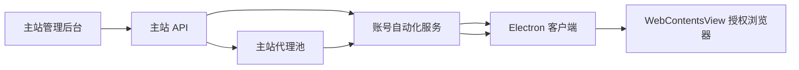

# 账号授权自动化客户端完善规划

## 目标

把 Electron 客户端建设成账号授权、登录、修复、代理分配和日常运营操作的桌面自动化控制台。主站负责账号、代理、任务和策略数据；客户端负责本地浏览器会话、多代理隔离、人工介入和自动化执行。

## 产品视角

- 首页看板：展示待处理、运行中、待人工、成功、失败，以及当前执行器状态和活跃任务数。
- 账号任务列表：按状态、关键词、渠道账号定位授权异常任务，展示当前阶段、错误、尝试次数和更新时间。
- 失效账号池：从主站同步失效池脱敏列表，支持搜索、查看归档原因，并一键恢复账号后投递重新授权任务。
- 连接配置：自动读取本地 `dev/pro` 环境，默认填充自动化服务地址、桌面 token、worker id、并发和回调端口。
- 本地诊断：检测 automation 服务、桌面接口、主站 callback 接口、主站内部接口版本、回调端口和环境文件，明确显示哪段链路异常。
- 代理资源：从主站同步代理资源到本地客户端，展示主站/本地来源、地区、出口 IP、启停、失败、冷却状态。
- 代理健康策略：客户端按主站健康数据和本地执行结果计算健康分，自动选择可用代理；运营可在重跑时看到分数和原因。
- 任务处理台：任务详情弹层展示任务信息、账号定位、尝试记录、事件时间线、输入和结果。
- 运营动作：支持待人工恢复、取消任务、清理本地账号浏览器会话、失败/终态任务指定代理重跑，以及按任务定位移入失效池/废弃池。
- 批量处理：支持选择多条任务后批量重跑、恢复、取消、清理本地会话、移入失效池和移入废弃池。
- 账号画像：详情页展示账号身份、最近错误、最近事件和处置建议标签。
- 自动化能力面板：统一展示授权、运维、账号池、诊断、安全接管能力，区分已接入、部分接入、规划中和待配置状态。
- 浏览器授权：每个账号独立 `session partition`，支持独立代理 IP，避免账号间 Cookie、存储和代理污染。
- 人工介入：遇到验证码、风控、SSO 或平台保护时进入待人工状态，客户端保留浏览器窗口让运营处理。

## 技术架构

- 主站新增内部接口：`GET /api/internal/token-account-automation/proxies`、`POST /api/internal/token-account-automation/account-pools/invalid/archive`、`POST /api/internal/token-account-automation/account-pools/discarded/archive`。
- 自动化服务新增桌面代理同步接口：`GET /api/desktop/proxies/sync`。
- 自动化服务新增桌面能力模板接口：`GET /api/desktop/action-templates`。
- 自动化服务新增桌面账号池动作：`POST /api/desktop/jobs/{job_id}/archive-invalid`、`POST /api/desktop/jobs/{job_id}/archive-discarded`。
- 自动化服务新增失效池运营接口：`GET /api/desktop/account-pools/invalid`、`POST /api/desktop/account-pools/invalid/{id}/reauthorize`。
- Electron 客户端通过桌面 token 调用自动化服务，自动化服务再用 callback token 拉取主站代理。
- Electron 客户端本地诊断会同时探测 automation `/health`、桌面 API、主站内部代理接口和主站失效池接口；当主站仍是旧版本时显示 404/未发布提示。
- 客户端本地使用 `safeStorage` 加密保存配置和代理缓存。
- OAuth 浏览器使用 `session.fromPartition("persist:<account>")` 隔离账号环境。
- 代理由 `session.setProxy({ mode: "fixed_servers", proxyRules })` 绑定到单账号授权窗口。
- 代理选择由本地 `SecureStore.nextProxy()` 统一计算：禁用/冷却代理排除，剩余代理按近期成功、近期失败、失败次数、主站来源、地理检测状态和使用次数排序。
- 授权成功后客户端记录代理成功并清理本地错误；授权失败时记录失败、错误摘要和递增冷却时间。

## 运营流程

1. 主站账号列表或调度链路标记账号 `auth_error`。
2. 管理员点击“同步授权异常”，主站把异常账号投递到自动化服务。
3. Electron 客户端同步代理资源，并启动执行器。
4. 客户端领取 `desktop_session` 任务，按账号打开独立浏览器窗口。
5. 登录成功后，客户端换取新 token 并提交给自动化服务。
6. 自动化服务写回主站指定渠道账号，并清理授权异常/自动禁用状态。
7. 运营看成功/失败/待人工列表，对失败账号重试、换代理、清理会话、移入失效池或移入废弃池。
8. 对失败任务打开详情，查看事件时间线和错误，用指定代理重跑；必要时先清理账号本地浏览器会话。
9. 移入账号池动作只使用任务绑定的渠道账号定位，自动化服务记录 `account_pool_archived` 事件，主站负责归档落库和渠道账号重排。
10. 运营在失效账号池里搜索账号，点击“重新授权”，主站恢复账号为禁用待授权状态并投递新的桌面授权任务。

## 功能路线

- 阶段 1：已完成基础链路
  - 桌面执行器、独立浏览器 session、OAuth 回调、凭据写回。
  - 主站授权异常同步入口。
  - 主站代理同步到客户端。
  - 桌面客户端 dev/pro 环境启动配置和本地环境诊断。

- 阶段 2：已完成单任务运营闭环
  - 任务详情弹层：查看任务、目标账号、事件时间线、尝试记录、输入和结果。
  - 单任务操作：待人工恢复、取消任务、清理本地账号会话、指定代理重跑。
  - 桌面 token 权限隔离：只能领取和操作 `desktop_session` 任务。

- 阶段 3：已完成客户端批量运营增强
  - 批量操作：批量重试、批量取消、批量清理会话、批量指定代理策略。
  - 账号画像：渠道账号定位、provider/subject、最近失败原因和事件上下文。
  - 处置建议：按错误类型提示换代理、清理会话、等待执行、人工接管或重新授权。
  - 本地诊断：拆分展示 automation、桌面 API、主站 callback、主站内部接口、回调端口和环境文件状态。

- 阶段 4：主站联动和代理策略增强
  - 已完成：主站账号池动作联动，从客户端按任务 locator 一键移入失效池或废弃池，支持批量操作和任务事件审计。
  - 已完成：失效池脱敏列表同步到客户端，支持搜索和从客户端发起重新授权任务。
  - 已完成：代理健康评分和自动选择，重跑下拉展示代理分数、状态和推荐原因。
  - 已完成：自动化能力模板 API 和客户端侧栏能力面板，统一表达产品价值、技术入口、运营备注和接入状态。
  - 已完成：任务详情可投递账号探活和资料校验子任务，桌面执行器按任务类型分流，避免诊断任务误走网页登录授权。
  - 待增强：失效池恢复到渠道但不重授权、废弃池只读审计、恢复前后的运营确认流。
  - 主站账号画像增强：同步 brand/provider/account type、最近登录时间、健康状态和失败标签。
  - 主站代理健康检测结果同步到客户端。
  - 代理分配策略增强：按 brand、国家、账号历史绑定优先级和授权站点风险进一步加权。
  - 本地环境采集：系统、Electron 版本、IP、回调端口占用、网络探测、代理连通性。

- 阶段 5：自动化能力扩展
  - 将账号探活从桌面本地诊断扩展到主站/上游真实权限探活，补齐 token、订阅、风控、模型权限和代理连通性结果。
  - 将资料校验从本地快照扩展到 provider profile schema，并写回主站账号画像。
  - 密码/二次验证/人工接管事件标准化。
  - 账号失效池、废弃池、恢复队列联动。

## 风险和边界

- 客户端只能辅助合法授权和人工登录，不绕过验证码、风控或平台保护。
- 代理完整地址只通过内部 token 链路传给自动化服务和桌面端，不在普通管理接口回显。
- 本地浏览器 profile 和 token 缓存属于敏感数据，需加密存储并支持一键清理。
- 多账号并发要受代理资源、账号风控和上游限流共同约束。
